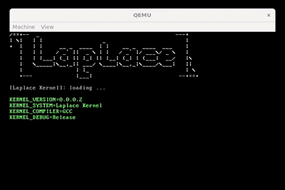

# LplKernel

Kernel of the Laplace project

## Description

This is the kernel of the Laplace project.



## Dependencies

```sh
sudo apt update
sudo apt install build-essential bison flex libgmp3-dev libmpc-dev libmpfr-dev texinfo

mkdir -p ~/src
cd ~/src
wget http://ftp.gnu.org/gnu/binutils/binutils-2.36.tar.gz
tar -xvf binutils-2.36.tar.gz
wget http://ftp.gnu.org/gnu/gcc/gcc-10.2.0/gcc-10.2.0.tar.gz
tar -xvf gcc-10.2.0.tar.gz

mkdir -p ~/src/build-binutils
cd ~/src/build-binutils
../binutils-2.36/configure --target=i686-elf --prefix=/usr/local/i686-elf --disable-nls --disable-werror
make
sudo make install

mkdir -p ~/src/build-gcc
cd ~/src/build-gcc
../gcc-10.2.0/configure --target=i686-elf --prefix=/usr/local/i686-elf --disable-nls --enable-languages=c,c++ --without-headers
make all-gcc
make all-target-libgcc
sudo make install-gcc
sudo make install-target-libgcc

echo 'export PATH=/usr/local/i686-elf/bin:$PATH' >> ~/.bashrc
source ~/.bashrc
```

## Build

```sh
cd LplKernel

./clean.sh
./iso.sh
```

## Run

```sh
./qemu.sh 4 # 4 cores to build
```

### Running using nix

```sh
nix run github:MasterLaplace/LplKernel
```

## Debugging

The project is configured for VSCode debugging with GDB and QEMU integration.

### Quick Start

Press **F5** in VSCode to:
1. Build the kernel automatically
2. Launch QEMU with GDB server (`-s -S`)
3. Connect GDB and set breakpoints at kernel startup (`kernel_main`, `kernel_initialize`)
4. Start debugging with full source-level debugging support

### Available Tasks

Use `Ctrl+Shift+P` → "Tasks: Run Task" to access:

- **Build Kernel** - Compile the kernel (`./build.sh`)
- **Launch QEMU with GDB** - Start QEMU in debug mode (background task)
- **Run QEMU (No Debug)** - Run kernel without debugging
- **Build ISO** - Create bootable ISO image
- **Kill QEMU** - Stop running QEMU instances

### Custom GDB Commands

The `.gdbinit` file provides kernel-specific debugging helpers:

```gdb
dump_pd [address]     # Dump page directory entries with flags
dump_gdt              # Display GDT information (segments, base, limit, flags)
show_mode             # Show CPU mode (protected, paging, PAE, interrupts)
```

### Debug Output Files

When debugging, QEMU generates log files in the project root:

- **`serial.log`** - Serial output from the kernel (COM1)
- **`qemu.log`** - QEMU debug logs (interrupts, CPU resets)

### Manual GDB Connection

If you need to connect GDB manually:

```sh
# Terminal 1: Start QEMU with GDB server
qemu-system-i386 -cdrom lpl.iso -s -S

# Terminal 2: Connect GDB
i686-elf-gdb kernel/lpl.kernel
(gdb) target remote localhost:1234
(gdb) break kernel_main
(gdb) continue
```

### Debugging Tips

- **Breakpoints**: Set breakpoints on functions before hardware initialization
- **Watchpoints**: Use `watch variable` to track memory changes
- **Page Tables**: Use `dump_pd` to inspect paging structures
- **GDT/Segments**: Use `dump_gdt` to verify segmentation setup
- **CPU State**: Use `show_mode` to check protected mode, paging, interrupts
- **Registers**: All CPU registers are displayed automatically at each breakpoint

### Requirements

- Cross-compiler at `/usr/local/i686-elf/bin/i686-elf-gcc` (or update `.vscode/c_cpp_properties.json`)
- QEMU installed (`qemu-system-i386`)
- GDB with i686-elf support

## Roadmap

The kernel development and its objectives are listed in the project roadmap. Consult the roadmap to see the planned features, progress status, and next steps:

[ROADMAP](docs/ROADMAP.md)

## References

- [OSDev Wiki](https://wiki.osdev.org/Main_Page)
- [OSDev Notes](https://github.com/dreamportdev/Osdev-Notes/tree/master)

## License

This project is licensed under the GPL-3.0 License - see the [LICENSE](LICENSE) file for details.

## Author

This project is authored by [Master Laplace](https://github.com/MasterLaplace).
