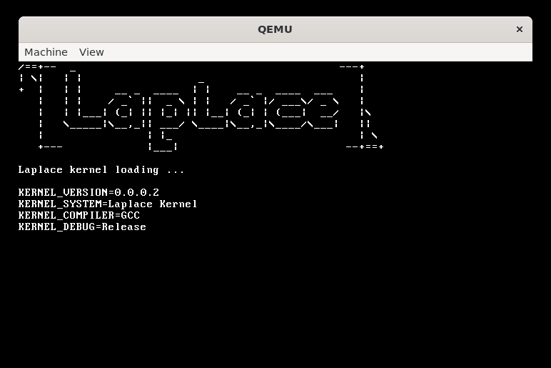

# LplKernel

Kernel of the Laplace project

## Description

This is the kernel of the Laplace project.



## Dependencies

```sh
sudo apt update
sudo apt install build-essential bison flex libgmp3-dev libmpc-dev libmpfr-dev texinfo

mkdir -p ~/src
cd ~/src
wget http://ftp.gnu.org/gnu/binutils/binutils-2.36.tar.gz
tar -xvf binutils-2.36.tar.gz
wget http://ftp.gnu.org/gnu/gcc/gcc-10.2.0/gcc-10.2.0.tar.gz
tar -xvf gcc-10.2.0.tar.gz

mkdir -p ~/src/build-binutils
cd ~/src/build-binutils
../binutils-2.36/configure --target=i686-elf --prefix=/usr/local/i686-elf --disable-nls --disable-werror
make
sudo make install

mkdir -p ~/src/build-gcc
cd ~/src/build-gcc
../gcc-10.2.0/configure --target=i686-elf --prefix=/usr/local/i686-elf --disable-nls --enable-languages=c,c++ --without-headers
make all-gcc
make all-target-libgcc
sudo make install-gcc
sudo make install-target-libgcc

echo 'export PATH=/usr/local/i686-elf/bin:$PATH' >> ~/.bashrc
source ~/.bashrc
```

## Build

```sh
cd LplKernel

./clean.sh
./iso.sh
```

## Run

```sh
./qemu.sh
```

## References

- [OSDev Wiki](https://wiki.osdev.org/Main_Page)
- [OSDev Notes](https://github.com/dreamportdev/Osdev-Notes/tree/master)

## License

This project is licensed under the GPL-3.0 License - see the [LICENSE](LICENSE) file for details.

## Author

This project is authored by [Master Laplace](https://github.com/MasterLaplace).
