# LplKernel — Architecture d'un Moteur Déterministe FullDive

## *De la gestion mémoire noyau aux interfaces cerveau-ordinateur*

---

> *« Le véritable défi de l'ingénierie moderne n'est pas de faire fonctionner un système ;*
> *c'est de le faire fonctionner de manière identique, à chaque exécution, sur chaque machine,*
> *tout en orchestrant des flux de données dont la latence se mesure en microsecondes. »*

---

# Préambule

## Vision du Projet

Le projet LplKernel est né d'une ambition singulière : concevoir, à partir de zéro (*from scratch*), un moteur client-serveur déterministe capable de supporter des expériences de Réalité Virtuelle immersive, allant même jusqu'au concept théorique du *FullDive*, où l'interface entre le cerveau humain et la machine s'efface entièrement.

Cette ambition impose de maîtriser simultanément des domaines habituellement cloisonnés : l'architecture des systèmes d'exploitation, la gestion mémoire temps réel, l'arithmétique déterministe, le rendu graphique bas niveau, la synchronisation réseau, le traitement du signal neuronal et même les fondements théoriques de l'informatique quantique. Ce livre constitue la synthèse exhaustive de ces recherches ; un document de référence unique fusionnant les analyses techniques, les formules mathématiques, les exemples de code et les sources académiques qui ont guidé chaque décision architecturale du projet.

## Comment Lire ce Livre

Ce livre est organisé en **cinq parties** suivant une progression logique des couches les plus basses (noyau, mémoire) vers les abstractions les plus élevées (BCI, quantum). Cependant, selon votre profil, différents parcours de lecture sont recommandés :

| Profil | Parcours Recommandé |
|:---|:---|
| **Architecte Système / Kernel** | Ch. 1 → Ch. 2 → Ch. 3 → Ch. 9 → Ch. 10 |
| **Développeur Moteur de Jeu** | Ch. 1 → Ch. 3 → Ch. 4 → Ch. 5 → Ch. 6 |
| **Ingénieur Réseau / Multijoueur** | Ch. 3 → Ch. 6 → Ch. 2 → Ch. 10 |
| **Chercheur en BCI / Neurosciences** | Ch. 7 → Ch. 2 (Lock-Free) → Ch. 5 (Rendu VR) |
| **Ingénieur Embarqué / IoT** | Ch. 9 → Ch. 2 → Ch. 3 (Soft-Float) → Ch. 7 |
| **Lecture Exhaustive** | Séquentielle : Ch. 1 à Ch. 10 |

## Conventions

- **Code source** : Tous les exemples sont en C++17 ou supérieur, présentés dans des blocs fenced avec coloration syntaxique.
- **Formules mathématiques** : Notation LaTeX, avec les formules en ligne entre `$...$` et les équations en display entre `$$...$$`.
- **Sources** : Numérotées en notes de bas de page `[^n]` à la fin de chaque chapitre, regroupées dans l'Index des Sources en Annexe C.
- **Acronymes** : Définis à leur première occurrence, puis listés dans le Glossaire (Annexe B).

---

# PARTIE I — FONDATIONS SYSTÈME

---

# Chapitre 1 : Anatomie d'un Noyau — OS vs Moteur

## 1.1 Introduction : Deux Mondes, Un Même Mot

Le terme « noyau » (*kernel*) est employé dans deux contextes radicalement différents en ingénierie logicielle, et cette ambiguïté terminologique est la source de confusions fondamentales pour quiconque entreprend la conception d'un moteur de jeu *from scratch*.

D'un côté, le **noyau de système d'exploitation** (OS Kernel) — Linux, Windows NT, les micro-noyaux comme seL4 ou QNX — est le composant logiciel qui gère directement le matériel : allocation de mémoire physique, ordonnancement des processus, pilotes de périphériques, gestion des interruptions. C'est le gardien absolu des ressources matérielles, opérant en mode superviseur (Ring 0 sur x86) avec un accès illimité à la totalité de l'espace d'adressage.[^1]

De l'autre, le **noyau d'un moteur de jeu** (Engine Kernel/Core) désigne la boucle centrale de simulation — le *heartbeat* du moteur — qui orchestre chaque tick de la logique de jeu : lecture des entrées, simulation physique, mise à jour de l'état du monde, rendu graphique. Ce « noyau » opère en espace utilisateur (Ring 3), soumis aux contraintes et aux abstractions imposées par le système d'exploitation sous-jacent.[^2]

La distinction est cruciale : le noyau OS **gère le temps** (ordonnancement, interruptions d'horloge, timers), tandis que le noyau moteur **consomme le temps** selon une cadence qu'il s'impose lui-même. Comprendre cette dualité est le prérequis absolu avant de plonger dans les mécanismes d'allocation mémoire, de déterminisme ou de synchronisation réseau.

## 1.2 Le Noyau OS : Architectures et Compromis

### 1.2.1 Monolithique vs Micro-noyau

L'architecture d'un noyau OS se situe sur un spectre entre deux extrêmes :

- **Noyau monolithique** (Linux, FreeBSD) : L'ensemble des services système — ordonnanceur, système de fichiers, pile réseau, pilotes — s'exécute dans un espace d'adressage unique en mode privilégié. L'avantage est la performance brute : les appels entre sous-systèmes sont de simples appels de fonctions, sans surcoût de changement de contexte ni de passage de messages. L'inconvénient est la fragilité : un bogue dans un pilote graphique peut provoquer un *Kernel Panic*, arrêtant instantanément la machine entière.[^3]

- **Micro-noyau** (QNX, seL4, L4) : Le noyau est réduit au minimum vital — gestion de la mémoire virtuelle, ordonnancement des threads et mécanisme de communication inter-processus (IPC) par passage de messages. Les pilotes, systèmes de fichiers et piles réseau s'exécutent en espace utilisateur, isolés les uns des autres. La robustesse est supérieure : un pilote défaillant peut être redémarré sans affecter le système. Le coût est un surcoût de latence lié au passage de messages IPC entre les services.[^4]

- **Noyau hybride** (Windows NT, macOS/XNU) : Un compromis pragmatique où certains services critiques (pilotes graphiques, système de fichiers) sont intégrés dans l'espace noyau pour la performance, tandis que d'autres restent en espace utilisateur pour l'isolation.

Pour un projet de moteur de jeu, le choix de l'architecture sous-jacente a des implications directes. Un noyau monolithique comme Linux offre une latence d'appel système minimale et un accès direct aux primitives de mémoire partagée, mais expose le moteur aux instabilités des pilotes tiers. Un système basé sur un RTOS (Real-Time Operating System) micro-noyau comme QNX garantit des latences bornées — indispensable pour les interfaces matérielles BCI — au prix d'un écosystème de pilotes plus restreint.

### 1.2.2 Le Système d'Exploitation en Temps Réel (RTOS)

Les RTOS méritent une attention particulière dans le contexte du FullDive. Contrairement aux OS à temps partagé (Linux, Windows) où l'ordonnanceur vise l'équité (*fairness*) entre les processus, un RTOS garantit des **bornes temporelles strictes** (hard real-time) ou moyennes (soft real-time) sur le temps de réponse.

#### L'Ordonnancement Hard Real-Time (EDF)

Au-delà de la simple préemption, un moteur FullDive exige un déterminisme absolu sur les délais d'exécution. L'algorithme canonique pour ces garanties est l'**EDF (Earliest Deadline First)**. Le théorème fondamental de Liu & Layland (1973) démontre que sur un processeur unique, EDF peut atteindre une utilisation de 100 % du CPU tout en respectant toutes les échéances, à condition que la somme des utilisations des tâches soit $\le 1$.

Cependant, le passage aux architectures multi-cœurs (SMP) introduit l'**anomalie de Dhall** : dans un ordonnancement EDF global (GEDF), une tâche à très faible utilisation peut faire échouer l'exécution d'une tâche critique, ruinant les garanties temporelles.

> **Architecture LplKernel — Partitioned-EDF**
>
> Pour contourner l'anomalie de Dhall, LplKernel s'oriente vers un modèle **Partitioned-EDF** (ou semi-partitionné). Les tâches critiques (comme la boucle de rendu VR ou l'acquisition BCI) sont *épinglées* (pinned) sur des cœurs physiques dédiés. La granularité du recalibrage temporel est assurée par le timer de l'APIC en mode **TSC-Deadline**, offrant une précision au cycle d'horloge près, indispensable pour éviter le jitter dans le traitement des signaux neuronaux.

| Caractéristique | OS à Temps Partagé (Linux) | RTOS (QNX, FreeRTOS) |
|:---|:---|:---|
| **Objectif** | Équité entre les processus | Respect des délais stricts |
| **Ordonnancement** | CFS (Completely Fair Scheduler) | Priorité fixe avec préemption |
| **Latence d'interruption** | ~10-100 µs (variable) | ~1-10 µs (bornée) |
| **Changement de contexte** | ~1-10 µs (variable) | ~0.5-2 µs (déterministe) |
| **Cas d'usage** | Serveurs, desktops, mobiles | Automobile, médical, aérospatial |

Pour le matériel BCI (OpenBCI, Galea), la communication avec les ADC (convertisseurs analogique-numérique) requiert une cadence d'échantillonnage stable. Un jitter (gigue) sur la lecture des échantillons EEG de seulement 2 ms peut introduire des artefacts spectraux parasites dans les bandes Mu (8-12 Hz) et Beta (13-30 Hz), faussant totalement la classification des états cognitifs.[^5] C'est pourquoi les systèmes d'acquisition BCI professionnels s'appuient généralement sur des RTOS ou, à défaut, sur des threads noyau hautement prioritaires avec isolation complète sur un cœur CPU dédié (*CPU pinning*).

## 1.3 Le Noyau Moteur : La Boucle de Simulation

### 1.3.1 La Boucle de Jeu Fondamentale

Au cœur de tout moteur de jeu se trouve la *Game Loop* — une boucle infinie qui répète inlassablement trois opérations :

```
while (running) {
    ProcessInput();
    UpdateSimulation(dt);
    Render();
}
```

La question fondamentale est : **quelle valeur donner à `dt` ?** La réponse à cette question détermine si le moteur sera déterministe ou non, et par extension, s'il sera capable de supporter une synchronisation réseau fiable.

### 1.3.2 Le Pas de Temps Fixe (Fixed Timestep)

Dans une boucle naïve, `dt` est le temps écoulé depuis la dernière itération — un pas de temps variable (*variable timestep*). Cette approche est catastrophique pour le déterminisme : la simulation physique produira des résultats légèrement différents selon le framerate, rendant impossibles les techniques de synchronisation réseau comme le *Lockstep* ou le *Rollback Netcode*.

La solution canonique est le **pas de temps fixe** : la simulation logique avance par incréments constants (par exemple, `dt = 1/60 s = 16.667 ms`), indépendamment du framerate de rendu. L'implémentation standard utilise un accumulateur de temps :

```cpp
const double FIXED_DT = 1.0 / 60.0;  // 60 ticks par seconde
double accumulator = 0.0;
double previousTime = GetTime();

while (running) {
    double currentTime = GetTime();
    double frameTime = currentTime - previousTime;
    previousTime = currentTime;

    // Limiter le frameTime pour éviter la "spirale de la mort"
    if (frameTime > 0.25) frameTime = 0.25;

    accumulator += frameTime;

    ProcessInput();

    // Simulation à pas fixe
    while (accumulator >= FIXED_DT) {
        SimulateFixedStep(FIXED_DT);
        accumulator -= FIXED_DT;
    }

    // Interpolation pour le rendu (entre deux états de simulation)
    double alpha = accumulator / FIXED_DT;
    Render(alpha);
}
```

Le garde-fou `if (frameTime > 0.25)` est crucial : si une frame prend exceptionnellement longtemps (par exemple, lors d'un chargement d'asset), l'accumulateur pourrait accumuler des secondes entières de retard, forçant le moteur à exécuter des dizaines de ticks de simulation consécutifs pour « rattraper » — c'est la **spirale de la mort** (*death spiral*), où le temps de simulation dépasse le temps réel, entraînant un effondrement total des performances.[^6]

### 1.3.3 Découplage Simulation/Rendu

Le pas de temps fixe introduit une propriété architecturale fondamentale : **la simulation et le rendu sont découplés**. La simulation tourne à une fréquence fixe (60 Hz, 120 Hz), tandis que le rendu peut tourner à n'importe quelle fréquence (30 FPS sur mobile, 144 FPS sur un écran gaming, 90 Hz imposé par un casque VR).

Pour éviter les saccades visuelles entre deux ticks de simulation, le moteur effectue une **interpolation** de l'état visuel en utilisant le facteur `alpha` (le ratio d'avancement dans le tick courant). L'état rendu est ainsi une combinaison linéaire entre l'état précédent et l'état courant :

$$\text{position}_{rendu} = \text{position}_{t-1} \times (1 - \alpha) + \text{position}_{t} \times \alpha$$

Ce découplage est la pierre angulaire qui permet de séparer les préoccupations : la logique de simulation peut être testée de manière isolée (sans rendu), rejouée déterministement (replay system), et synchronisée sur le réseau — trois propriétés essentielles pour un moteur multijoueur déterministe.

## 1.4 Le Modèle Client-Serveur et le Tick Autoritaire

### 1.4.1 L'Architecture Autoritaire

Dans un jeu multijoueur, la question de l'autorité est fondamentale : **qui décide de l'état du monde ?**

- **Client autoritaire** : Chaque client simule localement et informe le serveur. Simple mais vulnérable à la triche (le client peut mentir sur sa position, ses dégâts, etc.).
- **Serveur autoritaire** : Le serveur est la seule source de vérité. Les clients envoient leurs *inputs* (commandes), le serveur les applique dans sa simulation et renvoie l'état résultant. La triche est drastiquement réduite, mais la latence réseau introduit un retard perceptible.[^7]

Le modèle retenu pour LplKernel est le **serveur autoritaire**, où le serveur exécute la simulation à pas fixe et diffuse l'état à tous les clients. Les clients effectuent une **prédiction locale** (ils simulent immédiatement l'effet de leurs propres inputs) puis **réconcilient** leur état avec celui du serveur lorsqu'ils reçoivent une mise à jour.

### 1.4.2 Trois Modèles de Synchronisation

| Modèle | Principe | Latence Perçue | Complexité | Usage Typique |
|:---|:---|:---|:---|:---|
| **Lockstep Déterministe** | Tous les clients exécutent les mêmes inputs au même tick. Attente mutuelle. | Élevée (dépend du joueur le plus lent) | Moyenne | RTS (StarCraft, AoE) |
| **Serveur Autoritaire + Prédiction** | Le client prédit localement, le serveur corrige. | Faible (masquée par la prédiction) | Haute | FPS, Action (Overwatch) |
| **Rollback Netcode** | Simulation locale immédiate. Si un input distant arrive en retard, rollback + resimulation. | Très faible | Très haute | Jeux de combat (GGPO) |

Le Lockstep impose que la simulation soit **parfaitement déterministe**, plus précisément, une séquence d'inputs identique doit produire un état bit-à-bit identique sur toutes les machines. Cette exigence a des conséquences architecturales profondes qui seront détaillées au Chapitre 3 (arithmétique à virgule fixe) et au Chapitre 6 (infrastructure réseau).

Le Rollback Netcode, utilisé dans les jeux de combat compétitifs, combine le meilleur des deux mondes : il permet une simulation locale immédiate (zéro latence perçue) tout en gérant les désynchronisations en « revenant en arrière » (*rollback*) pour rejouer les ticks avec les inputs corrigés. Ce mécanisme exige à la fois le déterminisme strict et la capacité de sauvegarder/restaurer des snapshots d'état à très haute fréquence, ce qui est une opération qui impose des contraintes sévères sur la gestion mémoire (Chapitre 2).

### 1.4.3 Le Contrat de Timer Déterministe

Quel que soit le modèle de synchronisation retenu, le tick autoritaire requiert un signal temporel fiable et prédictible — un **contrat de propriété du timer** qui détermine quelle source matérielle génère les interruptions périodiques.

LplKernel implémente ce contrat via une couche d'abstraction `clock_*` indépendante du backend matériel :

| API | Rôle |
|:---|:---|
| `clock_initialize()` | Sélectionne le backend timer selon le profil et les capacités matérielles |
| `clock_get_tick_hz()` | Retourne la fréquence de tick effective (ex: 100 Hz) |
| `clock_get_tick_count()` | Retourne le compteur monotone de ticks depuis le boot |
| `clock_read_walltime()` | Lecture horloge murale (RTC, polling uniquement) |

**Politique par profil** : En Phase 3 du noyau, les deux profils (client et serveur) utilisent **PIT IRQ0** comme propriétaire du tick à 100 Hz. Cette fréquence de bring-up est verrouillée intentionnellement pour la continuité déterministe. La RTC fournit l'heure murale en mode polling uniquement — elle n'est *jamais* propriétaire du tick scheduler.

**Migration APIC** : Le backend APIC est disponible en tant que chemin expérimental :
1. Late-init : mapping MMIO du LAPIC après init du paging/PMM.
2. Calibration : mesure de fréquence du timer APIC via référence PIT.
3. Handoff : transfert de propriété du tick vers l'APIC en mode périodique, masquage de PIT IRQ0.

Le design-clé est que le code moteur/runtime ne doit **jamais** référencer directement les symboles PIT/RTC/PIC — seules les APIs `clock_*` sont contractuelles. Lors de la migration vers APIC ou SMP, le backend change mais l'interface reste identique.

## 1.5 Synthèse : Le Cahier des Charges Architectural

L'analyse des noyaux OS et moteur révèle un ensemble de contraintes non négociables pour l'architecture de LplKernel :

| Contrainte | Origine | Conséquence Architecturale |
|:---|:---|:---|
| **Pas de temps fixe** | Déterminisme réseau | Boucle de simulation découplée du rendu |
| **Latence bornée** | Matériel BCI (EEG) | Thread d'acquisition isolé, CPU pinning |
| **Autorité serveur** | Anti-triche, cohérence | Prédiction client + réconciliation |
| **Snapshot rapide** | Rollback Netcode | Allocateurs mémoire déterministes (Ch. 2) |
| **Bit-exact** | Lockstep | Arithmétique à virgule fixe (Ch. 3) |
| **Isolation des pannes** | Stabilité production | Architecture modulaire (Ch. 4) |

Ces contraintes forment la fondation sur laquelle reposent tous les chapitres suivants. Le chapitre 2 abordera la première d'entre elles en profondeur : comment allouer et gérer la mémoire de manière à satisfaire simultanément les exigences de performance, de déterminisme et de latence bornée.

### Notes de bas de page — Chapitre 1

[^1]: L'architecture x86 définit 4 niveaux de privilège (Ring 0 à Ring 3). Le noyau OS s'exécute en Ring 0 avec un accès complet au matériel, tandis que les applications utilisateur s'exécutent en Ring 3 avec des permissions restreintes.

[^2]: La distinction entre « kernel » OS et « kernel » moteur est un piège récurrent dans la littérature technique anglophone, où le même terme est utilisé sans qualification.

[^3]: Le noyau Linux, bien que monolithique, supporte les modules chargeables (*Loadable Kernel Modules*) qui permettent d'ajouter ou de retirer des pilotes sans recompiler le noyau. Cela atténue certains inconvénients du monolithisme, sans pour autant offrir l'isolation d'un micro-noyau.

[^4]: Les micro-noyaux modernes comme seL4 ont été formellement vérifiés — c'est-à-dire qu'une preuve mathématique garantit l'absence de certaines classes de bogues (déréférenciation de pointeur nul, débordement de tampon, etc.).

[^5]: Le théorème de Nyquist-Shannon impose que la fréquence d'échantillonnage soit au minimum le double de la fréquence maximale du signal d'intérêt. Pour capturer la bande Beta (jusqu'à 30 Hz), une fréquence d'échantillonnage de 250 Hz est le minimum théorique. La carte OpenBCI Cyton opère à 250 Hz sur 8 canaux.

[^6]: Gaffer on Games, « Fix Your Timestep! » — Article de référence sur l'implémentation correcte d'une boucle à pas de temps fixe avec accumulateur et interpolation.

[^7]: Gabriel Gambetta, « Fast-Paced Multiplayer » — Série d'articles détaillant l'architecture client-serveur avec prédiction et réconciliation, considérée comme une référence dans l'industrie.

---

# Chapitre 2 : Gestion Mémoire — Du Noyau au Moteur

## 2.1 Introduction : Pourquoi la Mémoire Est le Premier Goulot d'Étranglement

La gestion de la mémoire est, sans exagération, le facteur déterminant entre un moteur capable de maintenir un framerate stable à 90 Hz (exigence minimale de la Réalité Virtuelle) et un moteur sujet à des micro-saccades (*hitches*) qui détruisent l'immersion et provoquent des nausées chez l'utilisateur.

Le problème fondamental est le suivant : l'allocation dynamique de mémoire via `malloc()` (ou `new` en C++) est une opération dont le temps d'exécution est **imprévisible**. Selon l'état de fragmentation du tas (*heap*), un appel à `malloc()` peut prendre quelques nanosecondes… ou plusieurs millisecondes, si l'allocateur doit parcourir des listes chaînées de blocs libres, fusionner des fragments adjacents, ou réclamer de la mémoire auprès du système d'exploitation via `mmap()`. Dans un budget de frame de 11 ms (90 Hz), une allocation qui prend 2 ms est catastrophique.[^1]

Ce chapitre explore la gestion mémoire sur trois niveaux de profondeur : le niveau noyau OS (comment le système d'exploitation gère la mémoire physique), le niveau moteur (les allocateurs personnalisés utilisés en espace utilisateur), et le niveau matériel (alignement cache, NUMA, mémoire épinglée pour le GPU).

## 2.2 Niveau Noyau : Les Allocateurs du Système d'Exploitation

### 2.2.1 L'Allocateur de Pages — Le Buddy System

Au niveau le plus bas, le noyau OS gère la mémoire physique par **pages** — des blocs de taille fixe (typiquement 4 Ko sur x86). Lorsque le noyau doit allouer une page physique (par exemple, lors d'un défaut de page dans le sous-système de mémoire virtuelle), il utilise un *allocateur de cadres de pages* (*page-frame allocator*).

Le mécanisme dominant depuis des décennies est le **Buddy System** (système des copains), inventé par Knowlton en 1965 et popularisé par Knuth. Son principe est élégant :

1. La mémoire physique est divisée en blocs dont la taille est une puissance de 2 (4 Ko, 8 Ko, 16 Ko, …, jusqu'à plusieurs mégaoctets).
2. Chaque taille est gérée par une liste chaînée de blocs libres.
3. Pour allouer une page de taille $2^k$ : si un bloc de taille $2^k$ est disponible, le retourner. Sinon, prendre un bloc de taille $2^{k+1}$ et le **diviser** en deux « copains » de taille $2^k$.
4. À la libération, si le « copain » d'un bloc est également libre, les deux sont **fusionnés** (*coalesced*) en un bloc de taille supérieure.[^2]

**Avantage** : La fusion rapide limite la fragmentation externe. La complexité est $O(\log n)$ dans le pire cas.

**Inconvénient** : La fragmentation interne est élevée. Une demande de 5 Ko nécessite l'allocation d'un bloc de 8 Ko, gaspillant 3 Ko. De plus, les allocations de blocs physiquement contigus de grande taille deviennent difficiles lorsque la mémoire est fragmentée — un problème critique pour le DMA (Direct Memory Access) des périphériques GPU et BCI.

> **Implémentation LplKernel — PMM Double Stratégie**
>
> LplKernel implémente un PMM (*Physical Memory Manager*) à **double stratégie**, sélectionnée à la compilation par le flag `REALTIME_MODE` :
>
> - **Client** (`REALTIME_MODE=1`) : Une **pile LIFO de pages libres** (*free-list*) offrant un alloc/free en $O(1)$ déterministe absolu. Le PMM client couvre les pages 1 Mo–16 Mo (boot mapping), extensibles via `physical_memory_manager_extend_mapping()`. Aucune opération de fusion (*coalescing*) n'est effectuée — la prédictibilité temporelle prime sur l'optimisation de la fragmentation.
> - **Serveur** (`REALTIME_MODE=0`) : Un **Buddy Allocator complet** avec API d'ordre (`allocate_order(n)`, `free_order(addr, n)`) pour allouer des blocs de $2^n$ pages physiquement contigus. La fusion automatique des copains est active, instrumentée par un histogramme d'ordres libres (o0..o18), des watermarks haut/bas, un ratio de fragmentation, et des compteurs de garde (rejected-free, double-free).
>
> Les deux chemins partagent une couche de **détection UAF** (*Use-After-Free*) : le compteur `pmm_uaf_detection_count` est incrémenté lorsqu'un motif empoisonné (`0xDEADBEEF` / `0xFEEDFACE`) est détecté dans une page censée être libre, signalant un accès post-libération. L'ensemble est validé par 8 smoke tests (coalescing, stress, order, watermark, fragmentation, UAF).

### 2.2.2 L'Allocateur d'Objets — SLAB, SLUB, SLOB

Le Buddy System est trop grossier pour les petites allocations fréquentes du noyau (structures `inode`, tampons de socket, descripteurs de processus). C'est Jeff Bonwick qui introduisit, en 1994 pour SunOS, le concept de **Slab Allocation** : des caches d'objets pré-initialisés, triés par taille, qui éliminent le coût de l'initialisation répétée.[^3]

Le noyau Linux a connu trois implémentations successives :

| Allocateur | Principe | Points Forts | Limitations |
|:---|:---|:---|:---|
| **SLAB** (original) | Caches avec files d'attente per-CPU et per-nœud NUMA | Réutilisation d'objets efficace | Complexité excessive sur les systèmes multi-cœurs |
| **SLUB** (défaut depuis 2.6.23) | Simplification : suppression des files, gestion directe par page | Scalabilité supérieure, métadonnées réduites | Latence variable en « chemin lent » (*slow path*) |
| **SLOB** | Liste simple de blocs (style K&R) | Empreinte mémoire minimale | Fragmentation pathologique |

Le SLUB est devenu l'allocateur par défaut grâce à sa scalabilité sur les architectures multi-cœurs modernes. Chaque CPU possède sa propre *freelist* (liste de blocs libres) locale, réduisant la contention inter-processeurs.[^4]

### 2.2.3 Évolution Récente : Les Sheaves (Linux 6.18)

Entre 2024 et 2026, le développement du noyau Linux a introduit les **Sheaves** (« gerbes ») dans le mécanisme SLUB — une innovation majeure fusionnée dans la version 6.18. L'objectif : éliminer les couches de mise en cache redondantes que de nombreux sous-systèmes (pile réseau, pilotes) construisaient par-dessus l'allocateur de slab pour compenser ses limitations de performance.[^5]

Une *sheaf* consiste en un tableau de taille fixe de pointeurs d'objets provenant de slabs existants. Chaque processeur se voit attribuer **deux sheaves** : une principale pour les allocations courantes et une de réserve pour éviter les interruptions lors du remplissage ou du vidage. Les opérations d'allocation et de libération deviennent quasi-atomiques via la primitive `local_trylock_t`, minimisant la contention globale.

Un composant essentiel est le **barn** (« grange ») — un cache par nœud NUMA qui agit comme réservoir de second niveau pour les sheaves vides ou pleines, facilitant la réutilisation locale des objets sans solliciter l'allocateur de pages. Les mesures indiquent une amélioration de performance d'allocation pouvant atteindre **20 %** dans les environnements virtualisés et les piles réseau intensives.[^5]

### 2.2.4 Les Indicateurs GFP et les Contextes d'Allocation

Le comportement de l'allocateur noyau est guidé par les **GFP flags** (*Get Free Pages*), qui expriment les contraintes du contexte d'allocation :

- `GFP_KERNEL` : Allocation standard. Le processus appelant autorise le noyau à le mettre en sommeil (*sleep*) si la mémoire est insuffisante, déclenchant une réclamation directe (*direct reclaim*) pour libérer des pages.
- `GFP_NOWAIT` / `GFP_ATOMIC` : Allocation depuis un contexte atomique (gestionnaire d'interruption matérielle). Le sommeil est interdit — l'allocation échoue si aucun bloc n'est immédiatement disponible.
- `GFP_DMA` : L'allocation doit provenir d'une zone de mémoire accessible par les contrôleurs DMA (typiquement les premiers 16 Mo sur les vieilles architectures x86).[^6]

Cette distinction entre allocations « dormantes » et « atomiques » est un concept fondamental qui se retrouve, sous une forme transformée, dans la gestion mémoire des moteurs temps réel : les allocations à latence variable sont acceptables pendant le chargement, mais absolument interdites pendant la simulation.

### 2.2.5 Sécurité : KFENCE et Allocateurs par Buckets

La sécurité des allocateurs noyau est un champ de bataille permanent. Les techniques d'exploitation modernes (Use-After-Free, heap spraying, Slab-out-of-bounds) tirent parti de la prévisibilité de la disposition mémoire dans le tas noyau.[^7]

Le noyau Linux 6.19 a introduit un allocateur de slab dédié par **buckets** (seaux) pour isoler les objets dans des compartiments spécifiques, réduisant la probabilité qu'un attaquant puisse manipuler la disposition mémoire. En complément, **KFENCE** (*Kernel Electric-Fence*) est un détecteur d'erreurs mémoire basé sur l'échantillonnage statistique : il insère des pages de garde (*guard pages*) autour d'un échantillon aléatoire d'objets alloués, détectant les accès hors limites et les use-after-free avec un surcoût négligeable (~1 %) en production.[^8]

> **Implémentation LplKernel — KFENCE Zéro-Coût**
>
> Pour sécuriser le tas du noyau sans introduire la latence d'un outil lourd comme KASAN, LplKernel s'inspire du modèle KFENCE en pré-allouant un pool fixe d'objets où chaque objet est entouré de pages de garde non mappées (via `PROT_NONE`). En alignant aléatoirement les allocations à l'extrême gauche ou à l'extrême droite de la page physique, tout dépassement de tampon (Buffer Overflow) déborde instantanément sur la page non mappée, déclenchant un *Page Fault* matériel (zéro instruction de vérification logicielle dans le chemin critique).

### 2.2.6 Implémentation LplKernel : `kmalloc` à Double Profil

Le noyau LplKernel implémente son propre allocateur `kmalloc`/`kfree` dont la stratégie diverge radicalement selon le profil de compilation :

**Profil Client** (`REALTIME_MODE=1`) — Stratégie `slab+first-fit-client` :
- **Pool de boot fixe** : 8 pages physiques pré-allouées à l'initialisation du tas. Aucune croissance du pool via PMM en cours d'exécution.
- **Caches Slab déterministes** ($O(1)$) : trois classes de taille (16 B, 64 B, 256 B), chacune protégée par un *free-cookie* anti-double-free (`0x534C4131`).
- **First-fit** pour les tailles restantes, alimenté exclusivement par les pages de boot.
- **Règle de la Hot Loop** : `kmalloc` est **interdit** pendant la boucle chaude de simulation. L'API d'enforcement (`kernel_heap_hot_loop_enter()` / `kernel_heap_hot_loop_leave()`) trace la profondeur d'imbrication et incrémente un compteur de violations si une allocation est tentée en zone interdite. Cette règle est validée par un smoke test dédié.

**Profil Serveur** (`REALTIME_MODE=0`) — Stratégie `sizeclass+first-fit-server` :
- **Buckets de taille** ($O(1)$) : 7 free-lists par taille (8, 16, 32, 64, 128, 256, 512 B), avec compteurs de hit et de remplissage par classe.
- **First-fit fallback** pour les allocations hors-bucket.
- **Allocations larges** ($>$ `PAGE_SIZE`) redirigées vers l'allocateur buddy à ordre.
- **Domaines d'allocation** : le serveur supporte un *scaffold* multi-domaines où le sélecteur de domaine est piloté par le slot logique CPU (APIC ID compacté en slot stable). Chaque domaine possède ses propres compteurs de refill, fallback, sonde distante et hit distant — préparant le sharding per-CPU puis per-NUMA sans modifier le comportement actuel.

**Gardes partagés** (les deux profils) : validation magic du header sur chaque chemin, compteur de free rejeté, compteur de double-free, canary par objet sensible, patterns de poison (`0xFEEDFACE`) activables en build debug.

## 2.3 Niveau Moteur : Allocateurs Personnalisés

Les allocateurs du noyau OS sont conçus pour la généralité. Un moteur de jeu performant les contourne autant que possible en pré-allouant de vastes blocs de mémoire au démarrage, puis en les subdivisant avec des **allocateurs personnalisés** dont le comportement est totalement prévisible.

### 2.3.1 L'Allocateur Linéaire (Arena Allocator)

L'allocateur le plus simple et le plus performant est l'**Arena Allocator** (ou *Linear Allocator*, *Bump Allocator*). Son principe est trivial :

1. Au démarrage, réserver un bloc monolithique de mémoire (par exemple, 64 Mo via `mmap()`).
2. Maintenir un pointeur `current` initialisé au début du bloc.
3. Pour allouer $n$ octets : retourner `current`, puis incrémenter `current` de $n$ (aligné).
4. Pour tout libérer : réinitialiser `current` au début du bloc.

```cpp
class ArenaAllocator {
    uint8_t* m_buffer;
    size_t   m_capacity;
    size_t   m_offset;

public:
    explicit ArenaAllocator(size_t size)
        : m_buffer(static_cast<uint8_t*>(std::aligned_alloc(64, size)))
        , m_capacity(size)
        , m_offset(0) {}

    ~ArenaAllocator() { std::free(m_buffer); }

    void* Allocate(size_t size, size_t alignment = 16) {
        // Aligner l'offset
        size_t aligned = (m_offset + alignment - 1) & ~(alignment - 1);
        if (aligned + size > m_capacity) return nullptr; // Épuisé

        void* ptr = m_buffer + aligned;
        m_offset = aligned + size;
        return ptr;
    }

    void Reset() { m_offset = 0; } // Libération O(1)
};
```

La complexité d'allocation est **$O(1)$** — une simple addition et comparaison. La libération est également $O(1)$ : un reset du pointeur. Il n'y a aucune fragmentation externe possible, aucune liste chaînée à parcourir, aucun verrou à acquérir.[^9]

L'Arena est idéal pour les données **éphémères à durée de vie de frame** : données de culling, résultats de raycast, commandes de rendu. À chaque début de frame, l'arène est réinitialisée, libérant instantanément toute la mémoire de la frame précédente. Cette approche temporelle de la mémoire — où la validité des données est intrinsèquement liée à un cycle de temps spécifique (la frame) plutôt qu'au cycle de vie d'un objet individuel — est l'antithèse philosophique du `new`/`delete` C++ traditionnel.

### 2.3.2 Le Pool Allocator

Le **Pool Allocator** (allocateur de pool) gère des blocs de **taille fixe**. Il est conçu pour les entités qui sont fréquemment créées et détruites (projectiles, particules, PNJ temporaires) :

1. Au démarrage, pré-allouer un tableau de $N$ blocs de taille fixe $S$.
2. Maintenir une **liste chaînée intrusive** (*intrusive linked list*) des blocs libres — le pointeur `next` est stocké *dans* le bloc libre lui-même, évitant toute allocation de métadonnées.
3. Pour allouer : détacher la tête de la liste (*pop*). $O(1)$.
4. Pour libérer : réattacher le bloc en tête de la liste (*push*). $O(1)$.

```cpp
class PoolAllocator {
    struct FreeNode { FreeNode* next; };

    uint8_t*  m_buffer;
    FreeNode* m_freeList;
    size_t    m_blockSize;

public:
    PoolAllocator(size_t blockSize, size_t blockCount)
        : m_blockSize(std::max(blockSize, sizeof(FreeNode)))
    {
        m_buffer = static_cast<uint8_t*>(
            std::aligned_alloc(64, m_blockSize * blockCount));

        // Construire la liste chaînée intrusive
        m_freeList = nullptr;
        for (size_t i = blockCount; i > 0; --i) {
            auto* node = reinterpret_cast<FreeNode*>(
                m_buffer + (i - 1) * m_blockSize);
            node->next = m_freeList;
            m_freeList = node;
        }
    }

    void* Allocate() {
        if (!m_freeList) return nullptr;
        FreeNode* node = m_freeList;
        m_freeList = m_freeList->next;
        return node;
    }

    void Free(void* ptr) {
        auto* node = static_cast<FreeNode*>(ptr);
        node->next = m_freeList;
        m_freeList = node;
    }
};
```

La liste chaînée intrusive est une technique fondamentale : en stockant le ponteur `next` directement dans la mémoire du bloc libre, le Pool n'a besoin d'aucune structure de données externe. Le coût mémoire des métadonnées est **nul** — la mémoire de métadonnées et la mémoire de données se superposent temporellement (les métadonnées existent quand le bloc est libre ; les données les écrasent quand le bloc est alloué).[^10]

### 2.3.3 Le Stack Allocator

Le **Stack Allocator** est un Arena amélioré qui supporte la libération **dans l'ordre inverse** de l'allocation (LIFO — Last In, First Out). Il est idéal pour les données scopées :

```cpp
class StackAllocator {
    uint8_t* m_buffer;
    size_t   m_offset;

public:
    using Marker = size_t;

    Marker GetMarker() const { return m_offset; }

    void* Allocate(size_t size, size_t alignment = 16) {
        size_t aligned = (m_offset + alignment - 1) & ~(alignment - 1);
        void* ptr = m_buffer + aligned;
        m_offset = aligned + size;
        return ptr;
    }

    void FreeToMarker(Marker marker) { m_offset = marker; }
};
```

Le pattern d'utilisation classique est le *scope guard* :

```cpp
auto marker = stack.GetMarker();
// Allocations temporaires pour un calcul intermédiaire
auto* tempData = stack.Allocate(1024);
ProcessData(tempData);
// Libération automatique à la fin du scope
stack.FreeToMarker(marker);
```

### 2.3.4 Le Ring Buffer (Tampon Circulaire)

Le **Ring Buffer** est une structure de données cruciale pour la communication inter-threads, en particulier entre le thread d'acquisition BCI et le thread de traitement du signal. Sa mémoire est un tableau circulaire avec deux pointeurs : `head` (écriture) et `tail` (lecture).

```cpp
template <typename T, size_t Capacity>
class RingBuffer {
    alignas(64) std::atomic<size_t> m_head{0}; // Ligne de cache séparée
    alignas(64) std::atomic<size_t> m_tail{0}; // Évite le false sharing
    T m_data[Capacity];

public:
    bool Push(const T& item) {
        size_t head = m_head.load(std::memory_order_relaxed);
        size_t next = (head + 1) % Capacity;
        if (next == m_tail.load(std::memory_order_acquire))
            return false; // Buffer plein
        m_data[head] = item;
        m_head.store(next, std::memory_order_release);
        return true;
    }

    bool Pop(T& item) {
        size_t tail = m_tail.load(std::memory_order_relaxed);
        if (tail == m_head.load(std::memory_order_acquire))
            return false; // Buffer vide
        item = m_data[tail];
        m_tail.store((tail + 1) % Capacity, std::memory_order_release);
        return true;
    }
};
```

L'utilisation de `std::atomic` avec des ordres mémoire explicites (`acquire`/`release`) garantit l'absence de data races **sans aucun mutex**. Le `alignas(64)` sur `m_head` et `m_tail` place chaque compteur sur sa propre **ligne de cache** (64 octets sur la plupart des architectures), évitant le phénomène de **false sharing** — où deux variables atomiques indépendantes partagent la même ligne de cache, provoquant des invalidations de cache parasites entre les cœurs du processeur qui les modifient concurremment.[^11]

Cette implémentation SPSC (*Single-Producer, Single-Consumer*) est plus performante qu'un `boost::lockfree::spsc_queue` dans les cas simples, et elle est la structure de choix pour le transfert de données EEG entre le thread d'acquisition et le thread de traitement.

## 2.4 Allocateurs Temps Réel Déterministes

Les allocateurs ci-dessus (Arena, Pool, Stack) éliminent l'allocation dynamique pendant la simulation en la remplaçant par de la pré-allocation. Cependant, certains sous-systèmes nécessitent des allocations de taille variable pendant l'exécution (par exemple, des buffers de données réseau dont la taille dépend du nombre de joueurs). Pour ces cas, des allocateurs **déterministes** à complexité garantie sont indispensables.

### 2.4.1 TLSF — Two-Level Segregated Fit

L'allocateur **TLSF** (*Two-Level Segregated Fit*) est spécifiquement conçu pour les systèmes temps réel. Son architecture repose sur une structure de listes ségréguées à deux niveaux qui garantit une complexité de **$O(1)$** pour les opérations `malloc` et `free` :[^12]

- **Premier niveau** : Sépare les blocs par classes de taille correspondant à des puissances de deux ($2^4, 2^5, 2^6, \ldots$).
- **Second niveau** : Divise chaque classe de puissance de deux en sous-classes linéaires (typiquement 16 ou 32 subdivisions), permettant un ajustement précis à la taille demandée.

En utilisant des instructions matérielles de recherche de bit (`ffs`, `clz` — *Find First Set*, *Count Leading Zeros*), TLSF identifie le bloc libre optimal en un maximum de **168 instructions** sur architecture x86.[^12]

| Métrique | TLSF | Pool (blocs fixes) | malloc (glibc) |
|:---|:---|:---|:---|
| **Complexité temporelle** | $O(1)$ constant | $O(1)$ constant | Variable ($O(n)$ pire cas) |
| **Fragmentation interne** | Faible (ajustement fin) | Élevée | Faible |
| **Fragmentation externe** | < 25 % maximum | Nulle | Variable |
| **Tailles supportées** | Variables | Fixe unique | Variables |

### 2.4.2 O1Heap — Allocateur Half-Fit pour l'Embarqué

L'allocateur **o1heap**, basé sur l'algorithme *Half-Fit* d'Ogasawara, offre des garanties similaires à TLSF avec une implémentation encore plus compacte, ciblant les microcontrôleurs. Sur un Cortex-M4, il garantit qu'une opération d'allocation ou de désallocation nécessite invariablement environ **165 cycles d'horloge**, avec une variance de quelques cycles.[^13]

Ce contrôle absolu et déterministe du temps d'exécution est le prérequis pour un moteur FullDive où chaque microseconde compte : si l'allocateur prend 2 ms au lieu de 2 µs, c'est 18 % du budget de frame à 90 Hz qui s'évaporent.

## 2.5 Considérations Matérielles

### 2.5.1 Alignement Cache et False Sharing

Les processeurs modernes accèdent à la mémoire par **lignes de cache** (typiquement 64 octets). L'alignement des données sur ces lignes est critique pour éviter deux problèmes :

1. **Accès non alignés** : Un accès qui chevauche deux lignes de cache nécessite deux lectures au lieu d'une, doublant la latence.
2. **False sharing** : Lorsque deux threads modifient des variables indépendantes qui résident sur la même ligne de cache, le protocole de cohérence de cache (MESI) force des invalidations inutiles entre les cœurs, effondrant les performances.[^14]

Ce phénomène est particulièrement destructeur dans les structures Lock-Free inter-cœurs, comme les **SPSC Ring Buffers (BipBuffer)** utilisés pour router les événements matériels vers la simulation. Si le pointeur de lecture atomique (`read_index`) et le pointeur d'écriture atomique (`write_index`) résident sur la même ligne de 64 octets, le producteur invalidera continuellement le cache du consommateur, divisant la bande passante par dix.

```cpp
// MAUVAIS : les deux atomiques partagent la même ligne de cache
struct SharedData {
    std::atomic<int> writerCounter;  // Offset 0
    std::atomic<int> readerCounter;  // Offset 4 — même ligne de cache !
};

// BON : chaque atomique sur sa propre ligne de cache
struct AlignedData {
    alignas(64) std::atomic<int> writerCounter;
    alignas(64) std::atomic<int> readerCounter;
};
```

### 2.5.2 Architectures NUMA

Sur les serveurs multi-socket, l'accès à la mémoire n'est **pas uniforme** (NUMA — *Non-Uniform Memory Access*). Chaque processeur possède sa propre banque de mémoire locale ; accéder à la mémoire d'un autre processeur impose un coût de latence supplémentaire (typiquement 1.5× à 2× plus lent).

Pour un serveur de build LplKernel gérant des milliers de connexions, chaque instance de la simulation doit être liée (*pinned*) à un nœud NUMA spécifique via `numactl --cpunodebind=0 --membind=0`, garantissant que les accès mémoire les plus fréquents s'effectuent sur les banques locales.[^15]

L'évolution récente des Sheaves SLUB intègre cette conscience NUMA via les **barns** (granges) par nœud — les objets libérés sur un nœud NUMA sont préférentiellement recyclés sur ce même nœud.

> **Implémentation LplKernel — SMP, Topologie CPU et NUMA**
>
> Le serveur LplKernel implémente une infrastructure SMP progressive :
>
> 1. **Topologie CPU** : Le sous-système `cpu_topology` découvre les cœurs via parsing MADT (ACPI), enregistre chaque APIC ID découvert, les compacte en slots logiques stables (supportant les APIC ID non contigus), et maintient un bitmap d'état en ligne (*online*) par slot avec un compteur de CPU actifs. Le BSP (*Bootstrap Processor*) est automatiquement marqué en ligne à l'initialisation.
> 2. **Démarrage AP** (*Application Processors*) : Un trampoline en mémoire basse est installé au vecteur SIPI `0x08`. Le BSP dispatch une séquence INIT/SIPI vers chaque AP découvert, validée par un marqueur d'acquittement (`ack_word=0x4150`) et un handoff en mode protégé/paginé vers le point d'entrée C de l'AP (`application_processor_startup_initialize_cpu`). La télémétrie enregistre les tentatives, retransmissions, et timeouts par AP.
> 3. **Domaines d'allocation** : Chaque slot CPU est lié à un domaine d'allocation via `cpu_topology_bind_slot_to_domain()`. Le heap serveur route les allocations à travers cette table de binding, permettant une politique de placement local-first. Des compteurs par domaine suivent les refills, fallbacks, sondes distantes et hits distants.
> 4. **IPI et TLB Shootdown** : Un chemin IPI basique est présent pour la synchronisation des métadonnées mémoire et l'invalidation TLB inter-cœurs. Le mode x2APIC est supporté avec fallback xAPIC.
> 5. **Feuille de route NUMA** : Extension des domaines d'allocation en domaines par nœud NUMA, politique de placement local-first explicite, chemin de fallback cross-node avec télémétrie local-vs-remote, et compteurs de hit rate par nœud.

### 2.5.3 Huge Pages

La traduction d'adresses virtuelles en adresses physiques s'effectue via les tables de pages, avec un cache matériel dédié : le **TLB** (*Translation Lookaside Buffer*). Avec des pages de 4 Ko, un TLB de 1024 entrées ne couvre que 4 Mo de mémoire — insuffisant pour un moteur qui manipule des gigaoctets de données de géométrie et de textures.[^16]

Les **Huge Pages** (2 Mo ou 1 Go sur x86) augmentent considérablement la couverture du TLB :

| Configuration | Couverture TLB (1024 entrées) |
|:---|:---|
| Pages 4 Ko | 4 Mo |
| Huge Pages 2 Mo | 2 Go |
| Huge Pages 1 Go | 1 To |

- **Transparent Huge Pages (THP)** : Gérées automatiquement par le noyau, mais peuvent introduire des latences imprévisibles lors de la défragmentation en arrière-plan par le thread `khugepaged`.
- **HugeTLBfs** : Allocation statique et *pinning* au démarrage. Pour un moteur FullDive, cette méthode est impérative pour les framebuffers et les données de géométrie, garantissant l'absence de fautes de page pendant le rendu.

### 2.5.4 Mémoire Épinglée (Pinned Memory) pour le GPU

Le transfert de données entre la RAM système et la VRAM du GPU via le bus PCIe nécessite que les pages source soient **épinglées** (*pinned*) — c'est-à-dire non échangeables (*non-swappable*). Sans épinglage, le système d'exploitation pourrait déplacer une page pendant un transfert DMA, provoquant une corruption ou un crash.

Les API modernes (Vulkan, CUDA) fournissent des fonctions d'allocation de mémoire épinglée (`vkAllocateMemory` avec le flag `VK_MEMORY_PROPERTY_HOST_VISIBLE_BIT`, `cudaMallocHost`). Ces allocations sont coûteuses (elles verrouillent les pages physiques, réduisant la flexibilité du gestionnaire de mémoire virtuelle), et doivent donc être effectuées au démarrage, jamais pendant la simulation.[^17]

### 2.5.5 CDMM — Coordination GPU/CPU via NVIDIA

Pour le client FullDive, le mode **CDMM** (*Coherent Driver-based Memory Management*) de NVIDIA permet au pilote GPU de gérer directement la mémoire vidéo sans qu'elle soit exposée comme un nœud NUMA logiciel au noyau. Cela réduit les frais de migration de pages et facilite le partage direct des buffers entre les pipelines de simulation CPU et de rendu GPU, contribuant à une latence *motion-to-photon* (MTP) ultra-basse.[^18]

## 2.6 Blueprints Architecturaux

### 2.6.1 Architecture Serveur (Build Server)

| Couche | Choix Technologique | Justification |
|:---|:---|:---|
| **Allocateur noyau** | SLUB + Sheaves (Linux 6.18+) | Débit maximal par CPU, réduction de contention NUMA |
| **Mémoire virtuelle** | HugeTLBfs, pages 2 Mo | Couverture TLB pour caches d'état des clients |
| **Concurrence** | Boucles `epoll` liées aux nœuds NUMA + RCU | Lectures massives sans verrou |
| **Réseau** | `io_uring` | Minimisation des transitions user/kernel |

### 2.6.2 Architecture Client (FullDive/Embarqué)

| Couche | Choix Technologique | Justification |
|:---|:---|:---|
| **Allocateur de tas** | TLSF | Latence $O(1)$ pour toute allocation dynamique |
| **Données de frame** | Arena Allocator (reset par frame) | Zéro fragmentation, zéro Free() |
| **Entités** | Pool Allocator (intrusive freelist) | Recyclage $O(1)$ des projectiles, particules |
| **Transfert BCI** | Ring Buffer SPSC lock-free | Zéro mutex entre acquisition et traitement |
| **GPU** | Mémoire épinglée via CDMM | Latence MTP minimale |

> **Règles Mémoire Client LplKernel — Enforcement Temps Réel**
>
> La règle non négociable du client est : **zéro allocation dynamique dans la hot loop**. En dehors de la boucle chaude, seuls les caches slab client (16/64/256 B) et le small pool first-fit sur pages de boot fixes sont autorisés. En boucle chaude, seuls les allocateurs pré-alloués (frame arena, pool, ring buffer) sont permis — aucun site d'appel `kmalloc`/`kfree`.
>
> L'enforcement runtime est assuré par :
> - La profondeur hot-loop doit revenir à 0 après chaque étape de frame.
> - Le compteur de violations hot-loop doit rester stable en boucle nominale.
> - Les compteurs de garde du heap ne doivent pas augmenter en boucle nominale.
>
> **Allocateurs spécialisés validés** : Frame Arena (bump allocator, 2 KiB bootstrap, reset-per-frame, 5 smoke tests), Pool Allocator (64 B, 32 slots, free-list $O(1)$, 2 smoke tests), Ring Buffer SPSC (32 B slots, 32 entrées, FIFO déterministe, 2 smoke tests), Stack Allocator (push/pop_all LIFO, 1 smoke test), TLSF (segregated fit $O(1)$, WCET borné ≤ 168 instructions x86, 4 smoke tests). Au total, **47 smoke tests** validés en QEMU couvrant les deux profils.

### 2.6.3 Paging Runtime : De `boot.s` à l'API Dynamique

L'implémentation du paging runtime dans LplKernel illustre un piège classique des noyaux higher-half et mérite un traitement détaillé en tant que leçon d'architecture.

**Le Problème Initial** : La première implémentation de `paging_init()` commettait plusieurs erreurs fondamentales :
1. **Structures non portables** : Des unions imbriquées avec bitfields ne respectaient pas l'alignement strict 32-bit requis par le CPU. Les entrées de Page Directory et Page Table doivent faire exactement 4 octets.
2. **Écrasement du paging de boot** : La fonction re-mappait toute la mémoire en identity mapping (1:1), détruisant le mapping higher-half (0xC0000000) configuré par `boot.s`.
3. **Confusion virt/phys** : L'opérateur `&` en C retourne une adresse *virtuelle* (≥ 0xC0000000 dans un noyau higher-half), mais les entrées PDE/PTE exigent des adresses *physiques*. L'écriture directe de `&entries[...]` dans les entrées provoquait un triple fault immédiat.
4. **Rechargement CR3 inutile** : Recharger CR3 après le boot invalide le TLB et écrase le page directory déjà actif.

**La Solution Correcte** :

```c
// Types conformes Intel/OSDev — pas de bitfields, juste uint32_t + macros
typedef uint32_t PageDirectoryEntry_t;
typedef uint32_t PageTableEntry_t;

#define PAGE_PRESENT        0x001
#define PAGE_WRITE          0x002
#define PAGE_USER           0x004
#define PAGE_DIRECTORY_INDEX(v) (((uint32_t)(v) >> 22) & 0x3FF)
#define PAGE_TABLE_INDEX(v)    (((uint32_t)(v) >> 12) & 0x3FF)
#define PAGE_FRAME_ADDR(e)     ((e) & 0xFFFFF000)

// Initialisation : récupérer le PD de boot.s, ne PAS recharger CR3
void paging_init_runtime(void) {
    current_page_directory = boot_page_directory; // Symbole exporté par boot.s
}

// Conversion explicite virt→phys (fondamentale en higher-half)
static inline uint32_t virt_to_phys(uint32_t virt) {
    return (virt >= KERNEL_VIRTUAL_BASE) ? virt - KERNEL_VIRTUAL_BASE : virt;
}
```

L'API runtime (`paging_map_page()`, `paging_unmap_page()`) gère la création dynamique de page tables quand un PDE est absent, avec réclamation automatique des page tables vides lors du démappage. L'instruction `invlpg` invalide le TLB pour une seule page, évitant le coût d'un flush complet du TLB (`mov cr3, cr3`).

**Concepts clés du Higher-Half** :
- L'entrée 768 du Page Directory (3 Go / 4 Mo = 768) mappe l'espace noyau.
- Au boot, un identity mapping temporaire coexiste avec le mapping higher-half pour que le code de transition puisse s'exécuter. Il est retiré après le `jmp` vers l'espace higher-half.
- Le TLB cache les traductions virt→phys. Toute modification d'une PTE *doit* être suivie d'un `invlpg` sous peine d'utiliser une traduction périmée.

## 2.7 Synthèse

La hiérarchie complète de la gestion mémoire dans LplKernel forme une pyramide :

```
                    ┌──────────────────┐
                    │   Application    │
                    │  Arena/Pool/Stack│  ← Allocateurs moteur O(1)
                    ├──────────────────┤
                    │  TLSF / O1Heap   │  ← Allocations dynamiques déterministes
                    ├──────────────────┤
                    │  SLUB + Sheaves  │  ← Allocateur slab noyau
                    ├──────────────────┤
                    │  Buddy System    │  ← Allocateur de pages physiques
                    ├──────────────────┤
                    │  Matériel        │
                    │  (NUMA, Cache,   │  ← Contraintes physiques
                    │   TLB, PCIe)     │
                    └──────────────────┘
```

Le principe directeur est clair : **aucune allocation dynamique non déterministe ne doit se produire entre le premier et le dernier tick de simulation d'une frame**. Toute la mémoire nécessaire est soit pré-allouée (Pool, Arena), soit allouée avec des garanties $O(1)$ (TLSF). Les allocations « lentes » (chargement d'assets, création de monde) sont confinées aux phases de chargement, isolées de la boucle de simulation.

### Notes de bas de page — Chapitre 2

[^1]: Un budget de frame de 11.11 ms (90 Hz) ou 16.67 ms (60 Hz) laisse typiquement 2-3 ms pour toute la logique gameplay. Une allocation `malloc()` qui prend 100 µs est déjà 3-5 % de ce budget.

[^2]: D. E. Knuth, *The Art of Computer Programming, Volume 1: Fundamental Algorithms*, 3e édition, section 2.5 « Dynamic Storage Allocation ».

[^3]: J. Bonwick, "The Slab Allocator: An Object-Caching Kernel Memory Allocator", *Proceedings of the Summer 1994 USENIX Technical Conference*.

[^4]: Oracle Linux Blog, "Linux SLUB Allocator Internals and Debugging", 2023.

[^5]: FOSDEM 2026, "Update on the SLUB allocator sheaves", présentation technique.

[^6]: Linux Kernel Documentation, "Memory Allocation Guide", `docs.kernel.org/core-api/memory-allocation.html`.

[^7]: sam4k.com, "Linternals: The Slab Allocator" — Analyse des techniques d'exploitation des allocateurs slab du noyau Linux.

[^8]: Linux Kernel Documentation, "Kernel Electric-Fence (KFENCE)", `docs.kernel.org/dev-tools/kfence.html`.

[^9]: Jennifer Chukwu, "Memory Management in Game Engines: What I've Learned (So Far)", jenniferchukwu.com.

[^10]: La liste chaînée intrusive est une technique où le pointeur `next` est stocké dans la mémoire de l'objet lui-même — et non dans un nœud de liste externe. Lorsque l'objet est « actif » (alloué), ses données écrasent le pointeur `next`, qui n'est plus nécessaire. Lorsqu'il est « libre », le pointeur `next` est restauré.

[^11]: Boost C++ Libraries, `boost::lockfree::spsc_queue` — File SPSC sans verrou utilisée comme référence pour les systèmes temps réel BCI.

[^12]: TLSF project page, `gii.upv.es/tlsf/` — Documents techniques de l'allocateur Two-Level Segregated Fit.

[^13]: Pavel Kirienko (OpenCyphal), o1heap — Allocateur déterministe à complexité constante pour systèmes embarqués. Reddit r/embedded.

[^14]: H. Sutter, "Eliminate False Sharing", *Dr. Dobb's Journal*, 2008.

[^15]: Wikipedia, "Non-uniform memory access" — Description de l'architecture NUMA et de ses implications pour les serveurs multi-socket.

[^16]: Evan Jones, "Huge Pages are a Good Idea", evanjones.ca — Analyse de l'impact des Huge Pages sur les performances TLB.

[^17]: NVIDIA Developer Blog, "Understanding Memory Management on Hardware-Coherent Platforms".

[^18]: NVIDIA Developer Blog, "Understanding Memory Management on Hardware-Coherent Platforms" — Présentation du mode CDMM.

---

# Chapitre 3 : Déterminisme & Arithmétique à Virgule Fixe

## 3.1 Pourquoi le Déterminisme Est Non-Négociable

Le Chapitre 1 a introduit les modèles de synchronisation réseau — Lockstep, Rollback — qui exigent que la simulation produise des résultats **bit-à-bit identiques** sur chaque machine. Le Chapitre 2 a montré comment les allocateurs personnalisés éliminent une source d'indéterminisme (l'ordre et l'adresse des allocations). Mais la source d'indéterminisme la plus insidieuse ne réside pas dans la mémoire : elle se cache dans les **calculs eux-mêmes**.

Deux machines exécutant le même code physique avec les mêmes entrées produiront-elles le même résultat ? La réponse, si l'on utilise l'arithmétique à virgule flottante standard, est un **non** catégorique.[^1]

## 3.2 Les Pièges de l'Arithmétique à Virgule Flottante (IEEE 754)

### 3.2.1 La Norme IEEE 754

Les nombres à virgule flottante (*floating-point*) sont représentés selon la norme IEEE 754 sous la forme :

$$(-1)^s \times 1.m \times 2^{e - \text{biais}}$$

Où $s$ est le bit de signe, $m$ la mantisse (23 bits pour `float`, 52 bits pour `double`) et $e$ l'exposant (8 ou 11 bits). Cette représentation offre une plage dynamique colossale (de $\sim 10^{-38}$ à $\sim 10^{38}$ pour `float`), mais au prix de compromis critiques.[^2]

### 3.2.2 Les Sources d'Indéterminisme

| Source | Mécanisme | Impact sur le Déterminisme |
|:---|:---|:---|
| **Précision étendue x87** | Le FPU x87 d'Intel utilise des registres internes de 80 bits, provoquant des arrondis différents lors du *spill* en mémoire (64 bits) | Résultats différents selon le registre utilisé par le compilateur |
| **FMA (Fused Multiply-Add)** | L'instruction `a * b + c` peut être fusionnée en une seule opération avec un seul arrondi (au lieu de deux) | Résultats différents selon que le compilateur utilise FMA ou non |
| **Réassociation** | $a + (b + c) \neq (a + b) + c$ en virgule flottante | Un compilateur avec `-ffast-math` peut réordonner les opérations |
| **Mode d'arrondi** | Quatre modes définis par IEEE 754 (au plus près, vers zéro, vers $+\infty$, vers $-\infty$) | Peut varier entre le serveur Linux et le client Windows |
| **Fonctions transcendantes** | `sin()`, `cos()`, `sqrt()` ne sont pas spécifiées bit-exact par IEEE 754 | Implémentations différentes entre glibc, MSVC et musl |

Un exemple concret : sur une simulation de 1000 ticks avec un seul calcul de position par tick, une différence d'arrondi de $2^{-23}$ (1 ULP pour `float`) au tick 0 peut s'amplifier exponentiellement par propagation d'erreur. Après 1000 ticks d'une simulation chaotique (physique avec contacts), les positions divergent de manière macroscopique — un joueur voit un projectile là où un autre ne voit rien.[^3]

### 3.2.3 Contre-Mesures en Virgule Flottante

Il est possible de contraindre le compilateur pour réduire (mais pas éliminer) l'indéterminisme float :

```cpp
// Forcer le SSE2 au lieu du x87 (précision stricte 32/64 bits)
// GCC/Clang : -msse2 -mfpmath=sse
// MSVC : /fp:strict

// Interdire la réassociation et les FMA implicites
// GCC/Clang : -fno-fast-math (défaut)
// MSVC : /fp:strict (pas /fp:fast !)

// Définir le mode d'arrondi au démarrage
#include <cfenv>
fesetround(FE_TONEAREST);
```

Cependant, ces mesures ne garantissent pas le déterminisme **cross-platform** (x86 vs ARM). Les instructions NEON d'ARM et SSE d'Intel n'implémentent pas les opérations de la même manière à l'ULP près. Pour un déterminisme absolu cross-platform, il n'existe qu'une seule solution fiable : l'**arithmétique à virgule fixe**.

## 3.3 L'Arithmétique à Virgule Fixe (Fixed-Point)

### 3.3.1 Principe et Notation Q

Un nombre à **virgule fixe** est un entier dont une fraction fixe des bits représente la partie fractionnaire. La **notation Q** spécifie cette répartition :

- **Q16.16** : 16 bits pour la partie entière (signée), 16 bits pour la partie fractionnaire. Plage : $[-32768, +32767.999985]$. Résolution : $2^{-16} \approx 0.0000153$.
- **Q8.24** : 8 bits entiers, 24 bits fractionnaires. Plus de précision, moins de plage.
- **Q32.32** : 32 bits + 32 bits, stocké dans un `int64_t`. Plage massive avec haute précision.

La conversion est triviale : pour stocker la valeur $x$ en format Q16.16, on calcule $\text{fixed} = (int32\_t)(x \times 2^{16})$. Pour reconvertir : $x = \text{fixed} / 2^{16}$.

```cpp
struct Fixed32 {
    static constexpr int FRAC_BITS = 16;
    static constexpr int32_t ONE = 1 << FRAC_BITS;  // 65536

    int32_t raw;

    static Fixed32 FromFloat(float f) { return {(int32_t)(f * ONE)}; }
    static Fixed32 FromInt(int i)     { return {i << FRAC_BITS}; }
    float ToFloat() const { return (float)raw / ONE; }

    // Addition et soustraction : directes
    Fixed32 operator+(Fixed32 b) const { return {raw + b.raw}; }
    Fixed32 operator-(Fixed32 b) const { return {raw - b.raw}; }
};
```

### 3.3.2 Multiplication et Division

La multiplication de deux nombres Q16.16 nécessite un intermédiaire 64 bits pour éviter le débordement, puis un décalage pour réaligner le point fixe :

$$\text{result} = \frac{a \times b}{2^{16}}$$

```cpp
Fixed32 operator*(Fixed32 b) const {
    // Promotion en 64 bits pour éviter le débordement
    int64_t temp = (int64_t)raw * b.raw;
    return {(int32_t)(temp >> FRAC_BITS)};
}

Fixed32 operator/(Fixed32 b) const {
    // Pré-décalage du dividende pour maintenir la précision
    int64_t temp = ((int64_t)raw << FRAC_BITS);
    return {(int32_t)(temp / b.raw)};
}
```

La division est l'opération la plus coûteuse en virgule fixe — l'instruction `IDIV` sur x86 prend 20 à 90 cycles selon la taille des opérandes (contre 3-5 cycles pour une multiplication). C'est pourquoi les moteurs déterministes évitent la division autant que possible, la remplaçant par des multiplications par l'inverse pré-calculé ou par des tables de correspondance (LUT).[^4]

### 3.3.3 Saturation vs Wrapping

Que se passe-t-il lors d'un débordement ? Deux comportements sont possibles :

- **Wrapping** (défaut en C pour les types non signés) : Le résultat « boucle » — $32767 + 1 = -32768$. Silencieux et catastrophique.
- **Saturation** : Le résultat est limité à la valeur maximale (ou minimale). Plus sûr mais nécessite des vérifications explicites.

```cpp
Fixed32 SaturatingAdd(Fixed32 a, Fixed32 b) {
    int64_t result = (int64_t)a.raw + b.raw;
    if (result > INT32_MAX) return {INT32_MAX};
    if (result < INT32_MIN) return {INT32_MIN};
    return {(int32_t)result};
}
```

Les processeurs ARM disposent d'instructions de saturation matérielles (`QADD`, `QSUB`), rendant la saturation pratiquement gratuite sur les plateformes mobiles et embarquées.

## 3.4 Fonctions Trigonométriques : CORDIC et LUT

### 3.4.1 L'Algorithme CORDIC

Les fonctions `sin()`, `cos()`, `atan2()` de la bibliothèque standard sont implémentées en virgule flottante et ne sont pas déterministes cross-platform. Pour la virgule fixe, l'algorithme **CORDIC** (*COordinate Rotation DIgital Computer*), inventé par Volder en 1959, calcule les fonctions trigonométriques par une série de rotations itératives utilisant uniquement des additions, soustractions et décalages de bits — aucune multiplication ni division.[^5]

Le principe : pour calculer $\sin(\theta)$ et $\cos(\theta)$, CORDIC part du vecteur $(1, 0)$ et applique $N$ rotations d'angles pré-calculés $\alpha_i = \arctan(2^{-i})$ :

$$x_{i+1} = x_i - \sigma_i \cdot 2^{-i} \cdot y_i$$
$$y_{i+1} = y_i + \sigma_i \cdot 2^{-i} \cdot x_i$$

Où $\sigma_i = +1$ ou $-1$ selon le signe de l'angle restant. Après $N$ itérations, $(x_N, y_N)$ converge vers $(\cos\theta, \sin\theta)$ multiplié par un facteur constant $K = \prod \frac{1}{\sqrt{1+2^{-2i}}} \approx 0.6073$.

Avec 16 itérations, CORDIC atteint une précision de 16 bits — parfait pour un format Q16.16.

### 3.4.2 Tables de Correspondance (LUT)

Pour les cas où la performance prime sur la flexibilité, une **Look-Up Table** (LUT) pré-calcule les valeurs en virgule fixe pour toutes les entrées possibles :

```cpp
// Table de sinus pour 4096 angles (résolution de 360/4096 ≈ 0.088°)
static constexpr int32_t SIN_TABLE[4096] = { /* pré-calculé */ };

Fixed32 FixedSin(Fixed32 angle) {
    // Normaliser l'angle en index [0, 4095]
    int index = (angle.raw >> 4) & 0xFFF; // Masque 12 bits
    return {SIN_TABLE[index]};
}
```

L'accès à la LUT est $O(1)$ — un simple accès mémoire indexé. Le compromis est la mémoire consommée (4096 × 4 octets = 16 Ko pour une table) et la résolution angulaire finie. L'interpolation linéaire entre deux entrées de la table améliore la précision avec un surcoût minimal.

## 3.5 SIMD et Virgule Fixe

Les instructions **SIMD** (*Single Instruction, Multiple Data*) permettent de traiter 4, 8 ou 16 valeurs entières en parallèle dans un seul registre vectoriel. Les opérations en virgule fixe étant des opérations entières, elles bénéficient naturellement de la vectorisation SIMD.

```cpp
#include <immintrin.h>

// Multiplication de 8 valeurs Q16.16 en parallèle (AVX2)
__m256i FixedMul8(__m256i a, __m256i b) {
    // Extraire les parties basse et haute de la multiplication 32×32→64
    __m256i lo = _mm256_mullo_epi32(a, b);  // 32 bits bas
    __m256i hi = _mm256_mulhi_epi32(a, b);  // 32 bits hauts (non standard)
    // Note : implémentation simplifiée — en pratique, utiliser
    // _mm256_mul_epi32 pour les 64 bits complets puis recombiner
    return _mm256_srli_epi32(lo, 16); // Décalage pour réaligner
}
```

Sur les processeurs modernes, les opérations entières SIMD ont une latence comparable aux opérations flottantes SIMD. La différence principale est l'absence d'instructions FMA (*Fused Multiply-Add*) pour les entiers, ce qui nécessite deux instructions séparées au lieu d'une pour les calculs de type $a \times b + c$.[^6]

## 3.6 Comparaison Microarchitecturale : ALU vs FPU

### 3.6.1 Latences et Débits Mesurés

La croyance répandue selon laquelle « la virgule fixe est plus rapide que la virgule flottante » est un mythe hérité des années 1990, contredit par les mesures sur les processeurs modernes. Sur les architectures de bureau et serveur actuelles, la FPU vectorisée surpasse souvent l'ALU entière en débit pur grâce aux instructions FMA et à la largeur des pipelines :

| Architecture CPU | Opération | Latence (cycles) | Débit Réciproque |
|:---|:---|:---|:---|
| **Intel Haswell** | `ADD` entier (reg-reg) | 1 | 0.25 (4/cycle) |
| **Intel Haswell** | `MULPD` (Mult. Flottante) | 5 | 0.5 (2/cycle) |
| **Intel Haswell** | `ADDPD` (Add. Flottante) | 3 | 1.0 (1/cycle) |
| **Intel Skylake-X** | `VFMADD` (FMA) | 4 | 0.5 (2/cycle) |
| **AMD Zen 4** | `MULPD` / `ADDPD` | 3 | 0.5 (2/cycle) |
| **AMD Jaguar** | `ADD` entier | 1 | 0.5 (2/cycle) |

*Sources : Agner Fog, Instruction Tables[^7]*

La puissance de feu vectorielle est colossale. Un processeur supportant 2 FMA AVX2 par cycle sur des vecteurs de 8 floats produit $2 \times 8 \times 2 = 32$ FLOPs par cycle et par cœur. L'architecture Zen 4 d'AMD atteint **48 FLOPs/cycle** grâce à ses unités FMA et ADD indépendantes. Le cœur Apple Firestorm (M1) intègre 4 pipelines NEON 128 bits, quadruplant le débit des architectures ARM antérieures.[^7]

Lors d'un calcul intensif en virgule fixe, la FPU massivement vectorisée du processeur reste **complètement inactive**, tandis que l'ALU — qui doit également gérer les compteurs de boucle, l'arithmétique de pointeurs et les adresses — devient le goulot d'étranglement. De plus, chaque multiplication fixe nécessite un décalage de bits supplémentaire pour réaligner la virgule, et la prévention du débordement exige des promotions 32→64 bits coûteuses.

### 3.6.2 Le Gouffre de la Division

La division constitue une opération asymétriquement pénalisante tant pour l'ALU que pour la FPU. Contrairement à la multiplication, les instructions `DIV`/`IDIV`/`FDIV` ne sont généralement **pas entièrement pipelinées** — elles sont implémentées via un algorithme itératif boucle-par-bit ou microcodé :

- Division entière x86/x64 : **12 à 44 cycles** selon la taille des opérandes.
- Division flottante (`DIVPD` sur Haswell) : **10 à 20 cycles**, débit d'une instruction tous les 8 à 14 cycles.
- La division a un **débit 6× à 40× pire** que la multiplication dans une boucle serrée.[^7]

C'est pourquoi les algorithmes haute performance substituent systématiquement la division par la **multiplication par l'inverse pré-calculé** lorsque c'est mathématiquement possible.

### 3.6.3 Émulation Logicielle sur ARM sans FPU (Soft-Float)

De nombreux microcontrôleurs ARM (Cortex-M0, M3 de base) sont dépourvus de FPU matérielle. L'ABI ARM résout ce problème par **émulation logicielle** (*Soft Float*) : le compilateur injecte des appels vers des fonctions de bibliothèque (`__aeabi_fmul`, `__aeabi_fadd`) qui décomposent chaque opération flottante en instructions entières élémentaires.[^8]

| Fonction émulée | Cycles min (optimisé) | Cycles max (libgcc) |
|:---|:---|:---|
| `__aeabi_fadd` (Add float) | 31 | 53 |
| `__aeabi_fmul` (Mult float) | 26 | 72 |
| `__aeabi_fdiv` (Div float) | 53 | 243 |
| `__aeabi_ddiv` (Div double) | 134 | 867 |

*Source : SEGGER Runtime Library Benchmarks[^8]*

Sur ces cibles contraintes, réécrire les algorithmes en virgule fixe produit une accélération de **10× à 50×**. C'est précisément le scénario du matériel BCI embarqué dans un casque FullDive, où le processeur de traitement du signal (DSP) peut être un Cortex-M4 sans FPU activée.

## 3.7 Quantification INT8 pour l'Inférence IA

La virgule fixe trouve un usage spectaculaire dans le domaine de l'intelligence artificielle embarquée. Durant l'entraînement des réseaux de neurones (*Training*), le standard reste le FP32 ou FP16/BFloat16 pour éviter l'évanouissement du gradient. Mais durant l'**inférence** (déploiement en production), la **quantification** (*Quantization*) réduit les poids du réseau de 32 bits flottants à 8 bits entiers (INT8) — essentiellement un format de type virgule fixe.[^9]

L'effet est considérable :

- **Réduction mémoire** : ÷4 (un modèle de 100 Mo devient 25 Mo)
- **Accélération** : Les cœurs Tensor de la NVIDIA H100 en INT8 atteignent une accélération de **13× à 59×** par rapport au FP32 vectoriel, car le goulot d'étranglement est la bande passante mémoire (HBM), pas le calcul.
- **Perte de précision** : Modérée, compensée par le *Quantization-Aware Training* (QAT) via TensorRT ou TFLite.

Pour LplKernel, la quantification INT8 est directement applicable à l'**inférence BCI embarquée** : un réseau LSTM ou Transformer léger classifiant les signaux EEG en temps réel (Motor Imagery, P300) peut être quantifié pour s'exécuter sur le processeur embarqué du casque sans GPU dédié.

## 3.8 Applications au-delà du Jeu Vidéo

L'arithmétique à virgule fixe n'est pas une curiosité rétro — elle reste omniprésente dans des domaines critiques :

| Domaine | Usage de la Virgule Fixe | Justification |
|:---|:---|:---|
| **Finance / HFT** | Représentation des prix et positions | Le dollar ne se divise pas en fractions irrationnelles — la virgule fixe décimale est exacte |
| **DSP Audio** | Filtres IIR, FFT, mixage | Les DSP embarqués (Cortex-M4, SHARC) n'ont souvent pas de FPU |
| **Systèmes Embarqués** | Contrôle moteur, asservissement | Normes MISRA-C interdisant les flottants dans les calculs critiques |
| **Télécommunications** | Modulation, démodulation | Traitement du signal en temps réel sur FPGA |

## 3.9 Synthèse : La Règle d'Or du Déterminisme

Pour garantir le déterminisme dans LplKernel, la règle est simple :

> **Toute opération mathématique dont le résultat influence l'état de la simulation doit être effectuée en arithmétique à virgule fixe.**

Le rendu graphique peut utiliser des flottants (il n'affecte pas l'état logique). L'UI peut utiliser des flottants. Mais la physique, la logique de jeu, le réseau — tout ce qui touche à l'état synchronisé — doit passer par l'arithmétique entière déterministe.

### Notes de bas de page — Chapitre 3

[^1]: Ruoyu Sun, "Game Networking Demystified, Part II: Deterministic" — Analyse exhaustive des sources d'indéterminisme dans les simulations réseau.

[^2]: IEEE 754-2019, "IEEE Standard for Floating-Point Arithmetic" — Norme internationale définissant les formats et opérations en virgule flottante.

[^3]: L'effet « papillon » numérique est bien documenté dans les simulations chaotiques. Une divergence d'1 ULP (*Unit in the Last Place*) au tick 0 peut produire des états macroscopiquement différents après quelques centaines de ticks.

[^4]: Agner Fog, "Instruction Tables" — Référence sur les latences et débits des instructions x86. `IMUL r64, r64` = 3 cycles ; `IDIV r64` = 35-90 cycles (Intel Skylake).

[^5]: J. E. Volder, "The CORDIC Trigonometric Computing Technique", *IRE Transactions on Electronic Computers*, 1959.

[^6]: L'instruction `VPMADDWD` (SSE/AVX) effectue une multiplication-accumulation sur des entiers 16 bits, mais il n'existe pas d'équivalent direct de `VFMADD` pour les entiers 32 bits.

[^7]: Agner Fog, *Instruction Tables: Lists of instruction latencies, throughputs and micro-operation breakdowns for Intel, AMD and VIA CPUs*, agner.org/optimize — Mesures de référence pour toutes les architectures x86 modernes. FLOPs/cycle calculés à partir de ces données.

[^8]: SEGGER Embedded Studio, "Floating-point face-off, part 2: Comparing performance" — Benchmarks comparatifs de l'émulation Soft-Float sur ARM Cortex-M sans FPU.

[^9]: NVIDIA Developer Blog, "Achieving FP32 Accuracy for INT8 Inference Using Quantization Aware Training with TensorRT". Epoch AI, "Hardware Performance Trend" — Accélération 13× à 59× mesurée sur H100.

---

# PARTIE II — ARCHITECTURE & RENDU

---

# Chapitre 4 : Paradigmes Architecturaux & Design Patterns

## 4.1 Introduction : L'Architecture au Service de la Performance

Le choix de l'architecture logicielle d'un moteur de jeu n'est pas une question esthétique — c'est une question de **performance**. L'organisation des données en mémoire, la manière dont les systèmes communiquent entre eux, et le degré de couplage entre les composants déterminent directement si le moteur peut soutenir 60 ticks de simulation par seconde avec des milliers d'entités.

Ce chapitre examine les paradigmes architecturaux fondamentaux retenus pour LplKernel, en montrant comment chacun répond à une contrainte spécifique du cahier des charges.

## 4.2 Data-Oriented Design (DOD) et ECS

### 4.2.1 Le Problème de l'OOP Classique

L'approche orientée objet classique (*Object-Oriented Programming* — OOP) organise le code autour d'entités : une classe `Player` hérite de `Character`, qui hérite de `Entity`, chaque classe portant ses données et ses méthodes. Cette approche est intuitive pour le développeur, mais **catastrophique pour le cache CPU**.

Lorsque le moteur itère sur 10 000 entités pour mettre à jour leur position, il accède à `entity->position` — un champ situé au milieu d'un objet volumineux, entouré de données non pertinentes (nom, inventaire, état IA). Chaque accès charge une ligne de cache complète (64 octets) dont seuls 12 octets (un `Vec3`) sont utiles. Le **taux d'utilisation du cache** (*cache utilization rate*) peut chuter sous les 20 %.[^1]

### 4.2.2 L'Architecture ECS (Entity-Component-System)

L'**ECS** (*Entity-Component-System*) est l'antithèse architecturale de l'OOP pour les moteurs de jeu :

- **Entity** : Un simple identifiant numérique (un `uint32_t`). Aucune donnée, aucune méthode.
- **Component** : Un bloc de données pur, sans logique. Exemple : `struct Position { float x, y, z; }`.
- **System** : Une fonction qui itère sur tous les composants d'un type donné et applique la logique.

```cpp
// Composants : données pures, contigus en mémoire
struct Position { float x, y, z; };
struct Velocity { float vx, vy, vz; };

// Système : logique pure, itération linéaire
void MovementSystem(Position* positions, const Velocity* velocities,
                    size_t count, float dt) {
    for (size_t i = 0; i < count; ++i) {
        positions[i].x += velocities[i].vx * dt;
        positions[i].y += velocities[i].vy * dt;
        positions[i].z += velocities[i].vz * dt;
    }
}
```

Les composants du même type sont stockés dans des **tableaux contigus** (Struct of Arrays — SoA), garantissant que l'itération sur 10 000 positions accède à 10 000 × 12 octets = 120 Ko de données parfaitement contiguës. Le cache prefetcher du CPU détecte le pattern d'accès linéaire et pré-charge les lignes suivantes, atteignant un taux d'utilisation du cache proche de **100 %**.[^2]

De plus, cette organisation linéaire est **naturellement vectorisable** par le compilateur : les trois additions par entité deviennent une seule instruction SIMD opérant sur 4 ou 8 entités simultanément.

### 4.2.3 Structure de Stockage : SoA vs AoS

| Layout | Définition | Cache-Friendly ? | Vectorisable ? |
|:---|:---|:---|:---|
| **AoS** (Array of Structs) | `struct Entity { Pos p; Vel v; }; Entity entities[N];` | Moyen | Difficile |
| **SoA** (Struct of Arrays) | `Pos positions[N]; Vel velocities[N];` | Excellent | Excellent |
| **AoSoA** (Hybride) | Blocs de 8 entités en SoA | Excellent + SIMD friendly | Optimal |

Le layout **SoA** est le défaut recommandé pour tous les composants ECS itérés par les systèmes de simulation.

## 4.3 Composition Over Inheritance

Le principe de **composition sur l'héritage** (*Composition over Inheritance*) est le fondement architectural de l'ECS : les capacités d'une entité sont définies par la **combinaison** de ses composants, et non par sa position dans une hiérarchie de classes.

```cpp
// OOP classique — fragile, rigide
class FlyingEnemy : public Enemy { /* ... */ };
class SwimmingEnemy : public Enemy { /* ... */ };
class FlyingSwimmingEnemy : public ??? { /* L'héritage multiple est un cauchemar */ };

// ECS — flexible, extensible
auto flyingEnemy = world.CreateEntity();
world.AddComponent<Position>(flyingEnemy, {0, 100, 0});
world.AddComponent<AI>(flyingEnemy, {AIBehavior::Aggressive});
world.AddComponent<FlyAbility>(flyingEnemy, {maxAltitude: 500});

auto amphibian = world.CreateEntity();
world.AddComponent<FlyAbility>(amphibian, {maxAltitude: 200});
world.AddComponent<SwimAbility>(amphibian, {maxDepth: 50});
// Pas de hiérarchie à modifier !
```

Le problème du « losange de la mort » (diamond inheritance) est structurellement impossible en ECS.

## 4.4 Dependency Injection et Testabilité

La **Dependency Injection** (DI) consiste à passer les dépendances d'un système via ses arguments plutôt que de les créer en interne. Elle est cruciale pour la **testabilité** du moteur :

```cpp
// MAUVAIS : couplage fort
class PhysicsSystem {
    void Update() {
        auto& world = World::GetInstance(); // Singleton global !
    }
};

// BON : injection de dépendance
class PhysicsSystem {
    void Update(ComponentArray<Position>& positions,
                const ComponentArray<Velocity>& velocities,
                float dt) {
        // Testable avec des données synthétiques
    }
};
```

Avec la DI, le système de physique peut être testé unitairement avec des données synthétiques, sans initialiser le moteur complet — une propriété indispensable pour le débogage de désynchronisations réseau.

## 4.5 Programmation Fonctionnelle et Déterminisme

Les principes de la **programmation fonctionnelle** — fonctions pures, immuabilité, absence d'effets de bord — sont naturellement alignés avec les exigences de déterminisme :

- **Fonction pure** : le résultat ne dépend que de ses arguments. Garantit la reproductibilité.
- **Immuabilité** : les données d'entrée ne sont pas modifiées. Le système produit de nouvelles données.
- **Composition** : les systèmes ECS sont des fonctions pures composées dans un pipeline.

```cpp
// Pipeline de simulation fonctionnel (conceptuel)
auto newState = state
    | ProcessInputs(inputBuffer)
    | SimulatePhysics(FIXED_DT)
    | ResolveCollisions()
    | UpdateAI()
    | HashState();  // Pour la vérification de synchronisation
```

L'absence d'effets de bord garantit que le pipeline est **rejouable** : même `state` + même `inputBuffer` = même `newState`, tick après tick, machine après machine.

## 4.6 Patterns de Conception pour le Moteur

Au-delà des paradigmes architecturaux, plusieurs design patterns du GoF (*Gang of Four*) et des *Game Programming Patterns* sont fondamentaux pour l'architecture de LplKernel. Le code compilable complet de ces patterns est fourni en **Annexe A**.

### 4.6.1 Patterns de Création

| Pattern | Problème Résolu | Usage dans LplKernel |
|:---|:---|:---|
| **Factory Method** | Créer des objets polymorphes sans coupler le code | Création de paquets réseau (SyncPacket, InputPacket) |
| **Abstract Factory** | Instancier des familles d'objets compatibles | Sélection du sous-système matériel (PCVR vs FullDive) |
| **Builder** | Construire des objets complexes étape par étape | Configuration d'avatars avec mesh, physique, signature neuronale |
| **Prototype** | Cloner des objets lourds sans réinstanciation | Copie d'état de PNJ pour la prédiction réseau |
| **Singleton** | Source unique de vérité | Horloge déterministe du moteur |

### 4.6.2 Patterns Structurels

| Pattern | Problème Résolu | Usage dans LplKernel |
|:---|:---|:---|
| **Adapter** | Intégrer une API incompatible | Wrapping d'une lib physique flottante vers du fixed-point |
| **Bridge** | Séparer abstraction et implémentation | Interface BCI découplée du hardware (OpenBCI, Galea, etc.) |
| **Composite** | Traiter un arbre comme un objet unique | Octree / Scene Graph pour le partitionnement spatial |
| **Decorator** | Ajouter des responsabilités dynamiquement | Compression + chiffrement des flux réseau en couches |
| **Facade** | API simplifiée pour un sous-système complexe | `EngineFacade::BootSequence()` initialise physique, rendu, réseau |
| **Flyweight** | Partager les données communes | Voxels / arbres partageant le même mesh géométrique |
| **Proxy** | Représentation locale d'un objet distant | Prédiction de mouvement (*Dead Reckoning*) pour joueurs distants |

### 4.6.3 Patterns Comportementaux

| Pattern | Problème Résolu | Usage dans LplKernel |
|:---|:---|:---|
| **Chain of Responsibility** | Traiter un signal par priorité | Signal neuronal : sécurité → UI → logique de jeu |
| **Command** | Encapsuler une action réversible | Inputs réseau pour le Rollback Netcode |
| **Memento** | Sauvegarder/restaurer un état | Snapshots de frame pour le Rollback |
| **Observer** | Notification découplée | Pics de stress cardiaque → mise à jour UI |
| **State** | Machine à états propre | Connexion BCI (calibration → active → pause) |
| **Strategy** | Interchanger des algorithmes | Prédiction : Dead Reckoning vs Hermite Spline |
| **Template Method** | Garantir l'ordre des opérations | Boucle de tick : ReadInputs → Simulate → Validate |

### 4.6.4 Patterns Spécifiques Moteur

| Pattern | Problème Résolu | Usage dans LplKernel |
|:---|:---|:---|
| **Object Pool** | Éviter `new`/`delete` pendant la simulation | Recyclage de projectiles, particules, effets |
| **Double Buffer** | Éviter lectures/écritures concurrentes | Buffer d'écriture séparé du buffer de lecture |
| **Dirty Flag** | Éviter les recalculs inutiles | Matrice de transformation recalculée si modifiée |
| **Spatial Partition** | Requêtes de proximité efficaces | Grille spatiale, Octree pour collisions |

## 4.7 Synthèse Architecturale

L'architecture de LplKernel repose sur un empilement cohérent :

1. **ECS + SoA** pour la localité mémoire et la vectorisation automatique.
2. **Composition** pour la flexibilité sans hiérarchie fragile.
3. **DI** pour la testabilité et l'isolation des systèmes.
4. **Fonctionnel** pour le déterminisme et la rejouabilité.
5. **Patterns GoF** pour la résolution de problèmes récurrents.

Le code compilable de l'Annexe A illustre chacun de ces patterns dans le contexte spécifique du moteur FullDive.

### Notes de bas de page — Chapitre 4

[^1]: Mike Acton, "Data-Oriented Design and C++", CppCon 2014 — Présentation fondatrice du DOD (Insomniac Games).

[^2]: Le prefetcher matériel Intel (L2 Streamer) pré-charge les lignes de cache jusqu'à 512 octets en avance pour les accès séquentiels, réduisant la latence de ~100 cycles (L2 miss) à ~4 cycles (L1 hit).

---

# Chapitre 5 : GPU, Vulkan & Animation Procédurale

## 5.1 Introduction : Le GPU comme Co-Processeur

Le GPU (*Graphics Processing Unit*) n'est plus un simple accélérateur de rendu — c'est un **co-processeur massivement parallèle** capable d'exécuter des milliers de threads simultanément. Comprendre son architecture et la manière dont il interagit avec le CPU et le noyau OS est fondamental pour un moteur FullDive qui doit maintenir une latence *motion-to-photon* (MTP) sous les 20 ms.[^1]

Ce chapitre couvre l'intégralité de la pile graphique — de l'écriture d'un pilote pour un noyau personnalisé jusqu'aux techniques de rendu VR avancées — en passant par l'animation procédurale qui constitue l'interface visible entre le moteur physique et l'utilisateur.

## 5.2 Architecture des Pilotes Graphiques

### 5.2.1 Windows : WDDM (Windows Display Driver Model)

Introduit avec Windows Vista pour remplacer le modèle XDDM désormais obsolète, le **WDDM** (*Windows Display Driver Model*) impose une ségrégation stricte entre l'espace utilisateur et le noyau, répartie en trois couches :[^2]

| Sous-système WDDM | Rôle |
|:---|:---|
| **UMD (User-Mode Driver)** | Fourni par le constructeur (NVIDIA, AMD). Traduit les appels DirectX/Vulkan en listes de commandes GPU, gère la compilation des shaders. Un crash ne tue que l'application. |
| **Dxgkrnl.sys** | Cœur noyau du sous-système graphique. Routeur et pont de sécurité entre l'UMD et le KMD. |
| **KMD (Kernel-Mode Display Miniport)** | Fourni par le constructeur. Seul composant autorisé à manipuler directement les registres physiques du GPU. |

Deux services noyau sont essentiels :

- **VidMm (Video Memory Manager)** : Virtualise la mémoire GPU en *segments* (VRAM dédiée, aperture mappée, mémoire paginable). Gère l'éviction vers la RAM système quand la VRAM est saturée.
- **VidSch (Video Scheduler)** : Ordonnance les paquets de commandes entre les applications. Garantit que le DWM (Desktop Window Manager) obtient ses ressources même sous charge GPU maximale.

**L'innovation de WDDM 2.0 (GPUVA)** : Avant Windows 10, les tampons soumis par l'UMD devaient être « patchés » par le noyau pour corriger les adresses physiques — une opération CPU intensive. WDDM 2.0 a introduit le **GPU Virtual Addressing**, où chaque processus bénéficie d'un espace virtuel GPU immuable. Le pilote utilisateur forge des commandes liées à des adresses stables, éliminant le patching. WDDM 2.6 a ensuite déporté l'ordonnancement lui-même sur un microprocesseur intégré au GPU (*Hardware-Accelerated GPU Scheduling*), réduisant la latence de buffering.

### 5.2.2 Linux : DRM/KMS (Direct Rendering Manager / Kernel Mode Setting)

À l'opposé du monolithe structuré de Microsoft, l'architecture graphique Linux est modulaire. Le module pivot du noyau est le **DRM** (*Direct Rendering Manager*), conçu comme un arbitre exposant les cartes graphiques sous `/dev/dri/cardX` et `/dev/dri/renderDX`.

Le noyau divise la gestion en composantes distinctes :

- **KMS (Kernel Mode Setting)** : Initialisation et modification de la topologie d'affichage physique. KMS manipule des entités logiques : *Framebuffers* (tampons de pixels), *Planes* (plans d'affichage matériels pour superposition sans coût CPU), *CRTCs* (contrôleurs de synchronisation verticale), et *Connectors* (liens physiques HDMI/DisplayPort).
- **GEM / TTM** : Deux approches de gestion mémoire. Le **GEM** (*Graphics Execution Manager*), introduit par Intel, offre une interface simple adaptée aux architectures mémoire unifiée (UMA). Pour les GPU discrets, le **TTM** (*Translation Table Manager*) gère la migration asynchrone des tampons entre RAM et VRAM.

**Pipeline Vulkan sous Linux** : L'application s'adresse au loader `libvulkan.so`, qui charge un pilote Mesa en mode utilisateur (RADV pour AMD, ANV pour Intel). Ce pilote compile le SPIR-V en assembleur GPU et construit les command buffers. Contrairement à Windows, il n'y a pas de Dxgkrnl intrusif : les tampons sont envoyés directement au module noyau DRM via `libdrm`. Le compositeur Wayland utilise l'**Atomic Modesetting** — un commit atomique de propriétés d'affichage garantissant l'absence d'états transitoires défectueux.

### 5.2.3 VirtIO-GPU pour les Environnements Virtualisés

Pour un noyau personnalisé s'exécutant dans QEMU/KVM, **VirtIO-GPU** fournit un GPU virtuel standardisé communiquant via des files d'attente circulaires partagées (*Virtqueues*). Le dispositif (Device ID 16) expose une interface PCI ou MMIO avec deux files principales : la **controlq** (requêtes de rendu) et la **cursorq** (curseur matériel).

La communication s'effectue via trois zones de mémoire partagée : la **table des descripteurs** (adresses physiques des tampons), l'**anneau disponible** (nouvelles requêtes du pilote invité), et l'**anneau utilisé** (achèvements signalés par le dispositif).

Le cycle de vie complet de l'affichage 2D via VirtIO-GPU suit 5 étapes :

1. **Récupération de la topologie** : `VIRTIO_GPU_CMD_GET_DISPLAY_INFO` → résolutions des scanouts.
2. **Création de la ressource** : `VIRTIO_GPU_CMD_RESOURCE_CREATE_2D` avec format pixel (ex: `B8G8R8A8_UNORM`).
3. **Attachement du backing storage** : `VIRTIO_GPU_CMD_RESOURCE_ATTACH_BACKING` avec une liste scatter-gather de pages physiques invitées.
4. **Transfert des données** : `VIRTIO_GPU_CMD_TRANSFER_TO_HOST_2D` copie les pixels modifiés vers l'hôte.
5. **Présentation** : `VIRTIO_GPU_CMD_RESOURCE_FLUSH` déclenche l'affichage du rectangle de mise à jour.

Pour l'accélération 3D, deux backends sont disponibles : **Virglrenderer** (traduction OpenGL via Gallium3D/TGSI/NIR) et le **protocole Venus** (sérialisation directe des commandes Vulkan depuis le registre `vk.xml` de Khronos via `VIRTIO_GPU_CMD_RESOURCE_CREATE_BLOB` avec mémoire partagée *hostmem*).[^3]

### 5.2.4 Pourquoi Linux a Rattrapé Windows en Gaming

L'analyse comparative des architectures WDDM et DRM/KMS permet de rationaliser une dichotomie historique longtemps justifiée :

**Le fardeau de X11** : Pendant des décennies, le serveur X11 (X.org), conçu dans les années 1980 pour des stations de travail en réseau, monopolisait l'affichage Linux sans aucune notion de GPU 3D ou de synchronisation verticale. Le *screen tearing* était endémique — X11 ne coordonnait pas le rendu applicatif avec le balayage physique de l'écran. Les compositeurs externes (Compton, Picom, KWin) tentaient de résoudre le problème via l'extension XComposite, mais induisaient une surcharge massive et un input lag catastrophique. Pire, X11 conceptualisait tous les moniteurs comme une seule surface logique, rendant les configurations multi-écran à taux de rafraîchissement différents fonctionnellement impossibles.

**Le renversement par Wayland** : Wayland a été conçu en éliminant ces défauts. Le compositeur *est* le serveur d'affichage. L'Atomic Modesetting est imposé par design, éradiquant les déchirures nativement. Le *Direct Scan-out* pour les applications plein écran contourne totalement la composition, réduisant la latence au minimum théorique du matériel. Couplé à Proton (traduction DirectX→Vulkan), un système Linux moderne avec l'ordonnanceur EEVDF offre désormais des gains de 5-15 % de FPS par rapport à Windows sur les jeux intensifs, en éliminant les interférences des services de télémétrie et de la composition forcée du DWM.

## 5.3 Pipeline Vulkan et Intégration Noyau

### 5.3.1 Vulkan : Philosophie Bas-Niveau

Vulkan est une API graphique **explicite** : contrairement à OpenGL qui cache la gestion de la mémoire et la synchronisation derrière des abstractions automatiques, Vulkan expose tout au développeur — allocation de mémoire GPU, barrières de synchronisation, command buffers, descriptor sets. Cette explicité est coûteuse en complexité de code, mais permet un contrôle total de la performance.[^4]

Le pipeline de rendu Vulkan se décompose en :

```
Command Buffer Recording → Queue Submission → GPU Execution → Presentation
         (CPU)                  (CPU→GPU)          (GPU)        (GPU→Display)
```

- **Command Buffers** : Enregistrés à l'avance (potentiellement dans un thread secondaire), puis soumis en batch au GPU. L'enregistrement multi-threadé est un avantage majeur de Vulkan sur OpenGL.
- **Render Pass** : Définit les attachements (color, depth, stencil) et les sous-passes. Le driver peut optimiser les transitions de layout mémoire.
- **Pipeline State Objects** : Toute la configuration du pipeline (shaders, rasterizer, blending) est pré-compilée en un objet immuable, éliminant les changements d'état coûteux.

### 5.3.2 Synchronisation CPU-GPU

La synchronisation entre le CPU et le GPU est le point le plus critique pour la latence :

| Mécanisme | Direction | Usage |
|:---|:---|:---|
| **Fence** | GPU → CPU | Le CPU attend que le GPU ait terminé un batch de commandes |
| **Semaphore** | GPU → GPU | Synchronisation entre queues GPU (graphics → compute) |
| **Event** | CPU ↔ GPU | Signalisation fine dans un command buffer |
| **Timeline Semaphore** | Bidirectionnel | Synchronisation monotone avec compteur incrémental |

Pour le FullDive, la technique du **Late Latching** (ou *Late Update*) est cruciale : le CPU établit un tampon persistant (*persistently-mapped buffer*) en VRAM. Un thread de suivi capteur indépendant met à jour les matrices de pose chaque milliseconde dans ce tampon, *même après* la soumission des commandes de rendu. Lorsque le GPU atteint le TimeWarp, il lit « en direct » les dernières matrices — réduisant la latence MTP sous la milliseconde entre la dernière lecture capteur et l'utilisation GPU effective.[^10]

## 5.4 CUDA et les Limites du Bare-Metal

### 5.4.1 Architecture NVCC et Fatbinary

Le compilateur NVIDIA `nvcc` orchestre un flux de travail en phases distinctes :

1. **Séparation du code** : Les fonctions GPU (marquées `__global__`, `__device__`) sont extraites du code hôte. Le code hôte est compilé par GCC/MSVC.
2. **Compilation GPU en deux étapes** : Le code GPU est traduit en **PTX** (assembleur textuel pour GPU virtuel générique), puis en **SASS** (binaire optimisé pour une architecture réelle : Turing, Ampere, Hopper). Les flags `-arch` et `-code` contrôlent cette génération.
3. **Encapsulation Fatbinary** : Le PTX et les multiples SASS sont assemblés dans un conteneur unique (*Fatbinary*), intégré comme blob dans le fichier objet ELF (section `.nv_fatbin`).
4. **Transformation des appels** : Les lancements `<<<grid, block>>>` sont remplacés par des appels à la Runtime API : `cudaConfigureCall`, `cudaSetupArgument`, `cudaLaunch`.

À l'exécution, `__cudaRegisterFatBinary` (identifié par le magic `0x466243b1`) charge le binaire cubin approprié au GPU détecté. Si aucun SASS ne correspond, le PTX embarqué est compilé JIT par le pilote.

### 5.4.2 L'Impasse Bare-Metal

La tentative d'exécuter ce flux sans noyau OS hôte échoue : `libcudart.a` ne touche jamais directement les registres GPU. Toute opération (`cudaMalloc`, `cudaMemcpy`, `cudaLaunchKernel`) se traduit par des `ioctl` vers les nœuds `/dev/nvidia0`, `/dev/nvidiactl`, `/dev/nvidia-uvm` — fournis par le module noyau `nvidia.ko`.[^5] Ce pilote gère la GMMU (GPU Memory Management Unit), les interruptions matérielles, le contexte de sécurité et l'ordonnancement temporel — impossible à déléguer à une bibliothèque statique.

### 5.4.3 L'Alternative LibreCUDA et RMAPI

Le projet **LibreCUDA** démontre néanmoins qu'une interaction directe avec le GPU est possible, en contournant la Runtime API. Le pilote NVIDIA est architecturé autour de la **RMAPI** (Resource Manager API), un composant OS-indépendant. Sur les architectures modernes (Turing+), cette logique est déportée sur le **GSP** (*GPU System Processor*, RISC-V intégré au GPU).

LibreCUDA forge manuellement des `ioctl` (`NV_ESC_RM_ALLOC`, `NV_ESC_RM_CONTROL`) pour allouer la mémoire GPU, puis exploite les **QMD** (*Queue Meta Data*) — structures de commandes MMIO — pour lancer du code :

1. Téléverser le binaire ELF CUDA dans la mémoire GPU allouée via RMAPI.
2. Configurer les descripteurs matériels (mémoire partagée, stack, paramètres).
3. Rédiger un paquet QMD et déclencher un *Doorbell* — écriture dans un registre MMIO ordonnant au processeur de commandes du GPU de lire la file et d'exécuter la charge.

Cette approche, fascinante académiquement, nécessite un volume de rétro-ingénierie prohibitif pour un OS d'apprentissage. La stratégie retenue pour LplKernel est d'utiliser CUDA dans l'espace utilisateur Linux pour le traitement BCI (Chapitre 7), et Vulkan Compute pour le moteur.

## 5.5 Motion Matching et Animation Procédurale

### 5.5.1 Le Problème de l'Animation Traditionnelle

L'animation traditionnelle (blend trees, state machines) utilise des graphes pré-définis de transitions entre clips d'animation. Cette approche est limitée : chaque transition doit être explicitement conçue par un animateur, et le nombre de transitions croît quadratiquement avec le nombre d'états. Le système de « Magic Parkour » du Luminous Engine (*Forspoken*) démontre qu'une locomotion à très haute vélocité dans un environnement géométriquement dense est impossible avec ces approches traditionnelles — l'interaction entre les appuis, la posture, l'inertie et la topologie du terrain produit une combinatoire infinie.

Le **Motion Matching**, popularisé par Ubisoft (*For Honor*) et déployé industriellement dans *Forspoken*, est un algorithme qui sélectionne dynamiquement la meilleure pose d'animation dans une base de données, à chaque frame.[^6]

### 5.5.2 L'Algorithme

À chaque tick, le système :

1. **Extrait la feature vector courante** : position, vitesse, direction du personnage, positions des pieds, trajectoire future souhaitée (générée par le joystick du joueur).
2. **Recherche le voisin le plus proche** dans la base de données de motion capture, en minimisant une **fonction de coût** pondérée :

$$C(p, q) = W_t \sum_{i=1}^{N} \|\mathbf{t}_{des,i} - \mathbf{t}_{db,i}\|^2 + W_p \sum_{j=1}^{M} \|\mathbf{p}_{cur,j} - \mathbf{p}_{db,j}\|^2 + W_v \|\mathbf{v}_{cur} - \mathbf{v}_{db}\|^2$$

Où $\mathbf{t}_{des,i}$ est la trajectoire future désirée, $\mathbf{t}_{db,i}$ la trajectoire encodée dans la base, $\mathbf{p}$ et $\mathbf{v}$ les positions et vitesses des articulations clés (pieds, hanches), et les facteurs $W$ permettent de privilégier la réactivité (trajectoire) ou le réalisme (position des pieds).

3. **Transitionne** vers la pose sélectionnée avec un blend court (2-4 frames) et synchronisation de phase.

### 5.5.3 Optimisation : k-D Trees et Phase Matching

La recherche exhaustive dans une base de 100 000+ poses à 60 Hz est prohibitive. Deux optimisations sont essentielles :

- **k-D Tree** : Structure d'arbre partitionnant l'espace des features pour une recherche en $O(\log n)$ au lieu de $O(n)$. L'alternative est la quantification vectorielle (clustering non-supervisé) qui réduit le nombre de candidats à évaluer.
- **Phase Matching** : Ajouter un paramètre de phase cyclique (cycle de marche) qui synchronise la transition avec le rythme naturel de la locomotion, évitant les « glissements » où les pieds semblent patiner sur le sol (*foot sliding*).

### 5.5.4 Cinématique Inverse (IK) Procédurale

Le Motion Matching fournit la pose de base ; l'**IK procédurale** l'ajuste au terrain en temps réel :

- **FABRIK** (*Forward And Backward Reaching Inverse Kinematics*) : Algorithme itératif qui résout la chaîne cinématique par allers-retours entre l'effecteur final et la racine. Contrairement aux méthodes jacobiennes (calculs trigonométriques lourds, singularités), FABRIK itère sur des lignes droites basées sur les distances inter-articulaires. Significativement plus rapide pour des dizaines de personnages simultanément.
- **Dual Quaternions** : Représentation mathématique qui combine rotation et translation en un seul objet algébrique, éliminant les artefacts de « candy wrapper » (déformation en bonbon) du skinning linéaire classique. Les ingénieurs de Square Enix ont présenté des modèles utilisant les Dual Quaternions pour garantir que les volumes corporels se plient organiquement lors des contorsions du parkour.[^7]
- **Foot Placement** : Raycast vers le bas depuis la cheville pour détecter le sol, ajustement de la position du pied par IK, rotation du pied pour suivre la normale de la surface. La hauteur pelvienne (Pelvis Offset) baisse dynamiquement pour absorber les chocs, préservant l'impression d'élan.

### 5.5.5 Marquage Environnemental et Animation AI

Les brevets de Square Enix révèlent une méthodologie élégante pour les interactions contextuelles. Le brevet **US8976184B2** décrit un système de *tagging* par volumes de métadonnées invisibles superposés aux obstacles. Plutôt que d'exiger du sous-système de parkour qu'il analyse la géométrie de collision brute, le moteur attache des **volumes d'influence** aux objets environnementaux. Lorsque le volume de collision du personnage intersecte un tel volume, le moteur extrait instantanément la normale de surface et la hauteur, résout l'IK de manière anticipée, et ajuste la chaîne squelettique — sans lancer de rayons coûteux.

L'**Animation AI** opère indépendamment du framerate pour orchestrer des micro-ajustements posturaux :

- **Attention Procédurale** (*Procedural Look-At*) : Le moteur calcule le produit scalaire et le produit vectoriel entre le vecteur avant de la tête du personnage et le vecteur vers le centre d'intérêt (point d'ancrage, précipice, ennemi). Des rotations procédurales fluides sont appliquées sur les chaînes cou/vertèbres avec des limites biomécaniques (*clamping*), conférant au personnage une conscience spatiale anticipatoire.
- **Ragdoll Partiel** : L'Animation AI module dynamiquement la rigidité des chaînes de ragdoll pour absorber l'énergie cinétique lors des atterrissages, rendant les impacts visuellement tangibles.

### 5.5.6 Trajectoires Bézier pour le Grappin

L'implémentation d'un système de grappin (type « Zip » de *Forspoken*) exige une **courbe de Bézier cubique** tridimensionnelle en temps réel, évitant les collisions aberrantes d'une force d'attraction linéaire (loi de Hooke) :

$$C(u) = (1-u)^3 P_0 + 3(1-u)^2 u P_1 + 3(1-u) u^2 P_2 + u^3 P_3$$

Où $u \in [0,1]$ est le temps normalisé, $P_0$ le personnage, $P_3$ la cible évaluée, et les points de contrôle $P_1, P_2$ sont projetés pour simuler la gravité et l'arc hyperbolique. Le moteur déplace la racine (*Root Motion*) le long de cette courbe, tandis qu'une fonction d'adoucissement $u' = f(u)$ gère la décélération non-linéaire avant l'impact.

## 5.6 Techniques de Rendu VR

### 5.6.1 Variable Rate Shading (VRS)

Le VRS permet de varier la résolution de shading par pixel dans différentes régions de l'image. Pour la VR, la vélocité se ressent par la gestion de la **vision périphérique** :

- **Centre de l'image** (zone fovéale) : Résolution maximale (1×1 par pixel).
- **Périphérie** : Résolution réduite (2×2 ou 4×4 par pixel). L'œil humain ne perçoit pas les détails en vision périphérique.

En concentrant la puissance maximale sur le centre de l'écran, le GPU diminue la latence de rendu — garantissant que les inputs physiques du parkour soient pris en compte à l'image suivante sans délai perceptible.

### 5.6.2 Foveated Rendering

Avec un eye-tracker intégré au casque (Varjo, Apple Vision Pro), le **Foveated Rendering** pousse le VRS à l'extrême : seule la zone exacte du regard est rendue en haute résolution, réduisant la charge GPU de 30-50 %. L'implémentation matérielle repose sur des fonctions à noyau polynomial intégrant des transformations log-polaires gérées par des Compute Shaders.[^8]

### 5.6.3 Async Compute et DirectStorage

- **Async Compute** : Le GPU exécute des compute shaders en parallèle avec le pipeline graphique, exploitant les unités de calcul inactives pendant les phases de rasterization. Dans le Luminous Engine, les sillages magiques, la physique de la cape et les déformations aqueuses sont expédiés dans des queues de calcul indépendantes.
- **DirectStorage** (Windows) / **io_uring** (Linux) : Transfert direct des données compressées du SSD NVMe vers la VRAM via DMA, contournant le CPU pour la décompression (algorithme GDeflate). Le Luminous Engine a opéré plus de cent ajustements bas niveau pour exploiter DirectStorage, cette libération de cycles CPU étant la clé permettant au sous-système de parkour d'exister.[^9]

### 5.6.4 LOD et Ray-Traced Shadows

Une vélocité massive implique de traverser les Niveaux de Détails (LOD) en fractions de seconde. Les transitions brustes entre modèles basse et haute résolution déchirent l'immersion. L'intégration de **Dithered Crossfade** (fondu temporel matriciel) lors des changements de LOD assure un lissage topologique parfait. Les **ombres en Ray-Tracing** offrent un ancrage géométrique absolu de l'ombre au sol — supérieur aux cascades de shadow maps qui provoquent du crénelage lors de mouvements de caméra brusques — fournissant la perception de profondeur indispensable au joueur pour chronométrer ses atterrissages.

## 5.7 Synthèse

Le pipeline de rendu de LplKernel combine :

1. **Vulkan** pour le contrôle explicite de la synchronisation et de la mémoire GPU.
2. **Motion Matching** pour une animation naturelle sans graphe de transitions manuel.
3. **IK procédurale** (FABRIK + Dual Quaternions) pour l'adaptation au terrain.
4. **Marquage environnemental** et **Animation AI** pour les interactions contextuelles procédurales.
5. **VRS / Foveated Rendering** pour maximiser la qualité visuelle dans le budget de frame VR.
6. **Late Latching** pour minimiser la latence MTP sous la milliseconde.
7. **DirectStorage + Async Compute** pour libérer le CPU au profit de la simulation.

### Notes de bas de page — Chapitre 5

[^1]: La latence MTP (*Motion-to-Photon*) est le temps entre un mouvement de tête de l'utilisateur et l'affichage du frame correspondant. Au-delà de 20 ms, l'utilisateur ressent un décalage provoquant des nausées.

[^2]: Microsoft Developer Blog, "Evolving the Windows Display Driver Model", 2020. WDDM Overview, Microsoft Learn.

[^3]: Architecture VirtIO-GPU : OASIS VirtIO Specification 1.1-1.3. QEMU `virtio-gpu.c` source. Protocole Venus : Khronos `vk.xml`.

[^4]: Khronos Group, "Vulkan 1.3 Specification" — Spécification officielle de l'API Vulkan.

[^5]: Les Tensor Cores NVIDIA (matmul 4×4 en un cycle) ne sont accessibles que via CUDA ou les extensions Vulkan coopérative matrices (VK_KHR_cooperative_matrix). Pilote noyau NVIDIA : `nvidia.ko`, `nvidia-open.ko`, documentation GSP RISC-V.

[^6]: Simon Clavet, "Motion Matching and The Road to Next-Gen Animation", GDC 2016 (Ubisoft). Square Enix, "Forspoken Magic Parkour", GDC 2022.

[^7]: Kavan et al., "Skinning with Dual Quaternions", 2007. Isamu Hasegawa, Square Enix CEDEC presentations.

[^8]: Patney et al., "Towards Foveated Rendering for Gaze-Tracked Virtual Reality", NVIDIA Research, 2016. Kernel Foveated Rendering, ResearchGate.

[^9]: Microsoft Developer Blog, "DirectStorage 1.1 — GPU Decompression Performance". GDC 2022, "Breaking Down the World of Athia: The Technologies of Forspoken".

[^10]: NVIDIA GDC 2015, "VR Direct" — Late Latching via persistently-mapped buffers. Analogie conceptuelle avec le contrôle JIT des impulsions micro-ondes quantiques.

---

# PARTIE III — RÉSEAU & SYNCHRONISATION

---

# Chapitre 6 : Infrastructure Réseau Déterministe

## 6.1 Introduction : Le Réseau comme Source d'Incertitude

Le réseau est, par nature, l'antithèse du déterminisme. La latence varie imprévisiblement (jitter), les paquets arrivent dans le désordre ou sont perdus, et la bande passante est partagée avec des flux incontrôlables. L'infrastructure réseau d'un moteur déterministe doit **masquer** cette incertitude tout en préservant la cohérence de l'état synchronisé entre toutes les machines.[^1]

Pour atteindre des latences sous-millisecondes requises par la VR multijoueur, LplKernel implémente un **Kernel Bypass** réseau inspiré de l'architecture **DPDK** (Data Plane Development Kit). Au lieu de subir le coût des interruptions matérielles et des multiples copies en mémoire de la pile TCP/IP classique, le pilote réseau (ex: Intel 8254x ou i217) mappe directement ses anneaux de descripteurs matériels (*Descriptor Rings*) dans une zone mémoire physique contiguë (allouée via le Buddy Allocator sous forme de `MBUFs`). Le CPU scrute ces anneaux en boucle (Polling), réalisant un transfert **Zero-Copy DMA** absolu. Couplé au **Receive Side Scaling (RSS)**, la carte réseau hache elle-même les paquets UDP entrants et les distribue matériellement sur les différents cœurs CPU du système SMP.

## 6.2 Modèles de Synchronisation Approfondis

### 6.2.1 Lockstep Déterministe

Le Lockstep est le modèle le plus ancien et le plus strict. Tous les clients transmettent leurs inputs pour le tick $T$ ; chaque client attend d'avoir reçu les inputs de *tous* les autres clients avant de simuler le tick $T$. La simulation étant déterministe (Chapitre 3), l'état résultant est identique sur toutes les machines.

**Avantage** : La bande passante est minimale — seuls les inputs sont transmis, pas l'état du monde (quelques octets par tick au lieu de kilooctets). Utilisé par les RTS (*StarCraft*, *Age of Empires*) où des milliers d'unités sont simulées, rendant la synchronisation d'état impraticable.

**Inconvénient** : La latence perçue est celle du joueur le plus lent. Si un joueur a un ping de 200 ms, *tous* les joueurs perçoivent 200 ms de délai.

### 6.2.2 Rollback Netcode (GGPO)

Le Rollback Netcode, formalisé par la bibliothèque **GGPO** (Good Game Peace Out) pour les jeux de combat, est un mécanisme sophistiqué en trois temps :

1. **Prédiction** : Le client simule immédiatement en utilisant le dernier input connu de l'adversaire (ou une prédiction basée sur l'historique).
2. **Réception** : Lorsqu'un input distant arrive (potentiellement en retard), le client vérifie s'il diffère de la prédiction.
3. **Rollback + Resimulation** : Si l'input réel diffère de la prédiction, le client **revient en arrière** au tick où la divergence a eu lieu, applique l'input correct, puis **resimule** tous les ticks jusqu'au tick courant.

```cpp
void RollbackNetcode::ProcessRemoteInput(uint32_t tick, Input remoteInput) {
    if (tick < m_currentTick) {
        // Input en retard — rollback nécessaire
        RestoreSnapshot(tick);            // Restaurer l'état au tick T
        m_inputBuffer[tick] = remoteInput; // Corriger l'input
        // Resimulation rapide : du tick T au tick courant
        for (uint32_t t = tick; t < m_currentTick; ++t) {
            SimulateFixedStep(m_inputBuffer[t]);
            SaveSnapshot(t + 1);
        }
    }
}
```

Ce mécanisme exige :
- **Snapshots rapides** : La sauvegarde/restauration de l'état doit être quasi-instantanée. Les allocateurs Arena (Chapitre 2) sont idéaux — un `memcpy` du bloc complet suffit.
- **Simulation rapide** : La resimulation de N ticks doit être plus rapide que le temps réel. Les systèmes ECS (Chapitre 4) avec itération SoA permettent de resimulé 8+ ticks dans le budget d'une frame.
- **Déterminisme absolu** : La resimulation doit produire exactement le même état qu'une simulation directe.

## 6.3 Sérialisation : Le Bitstream

### 6.3.1 Pourquoi Pas `memcpy` ?

La sérialisation naïve par `memcpy` d'une structure C++ sur le réseau est problématique :

- **Padding** : Le compilateur insère des octets de bourrage pour l'alignement, gaspillant de la bande passante.
- **Endianness** : Un serveur big-endian (rare mais possible en embarqué) et un client little-endian interpréteront les octets différemment.
- **Portabilité** : La taille des types (`int`, `long`, pointeurs) varie entre les architectures.

### 6.3.2 Le Bitstream

Un **Bitstream** est un tampon binaire qui sérialise les données **bit par bit**, sans padding ni gaspillage :

```cpp
class Bitstream {
    std::vector<uint8_t> m_buffer;
    size_t m_bitOffset = 0;

public:
    void WriteBits(uint32_t value, uint8_t numBits) {
        for (int i = numBits - 1; i >= 0; --i) {
            size_t byteIndex = m_bitOffset / 8;
            size_t bitIndex = m_bitOffset % 8;
            if (byteIndex >= m_buffer.size())
                m_buffer.push_back(0);
            if (value & (1u << i))
                m_buffer[byteIndex] |= (1u << (7 - bitIndex));
            ++m_bitOffset;
        }
    }

    uint32_t ReadBits(uint8_t numBits) {
        uint32_t result = 0;
        for (int i = numBits - 1; i >= 0; --i) {
            size_t byteIndex = m_bitOffset / 8;
            size_t bitIndex = m_bitOffset % 8;
            if (m_buffer[byteIndex] & (1u << (7 - bitIndex)))
                result |= (1u << i);
            ++m_bitOffset;
        }
        return result;
    }
};
```

### 6.3.3 Bit-Packing et Quantization

Pour minimiser la bande passante, les données sont **compressées sémantiquement** :

- **Bit-packing** : Un booléen utilise 1 bit (pas 8). Un angle de rotation (0-360°) quantifié sur 10 bits offre une résolution de 0.35° — suffisante pour le gameplay — en utilisant 10 bits au lieu de 32.
- **Quantization** : Les positions flottantes sont converties en entiers avec une résolution fixe. Une position dans un monde de 1000m, quantifiée sur 16 bits, offre une résolution de 15 mm.
- **Delta compression** : Seules les différences par rapport à l'état précédent sont envoyées. Si une entité n'a pas bougé, 0 bits sont transmis pour sa position.[^2]

## 6.4 State Hashing et Détection de Désynchronisation

### 6.4.1 Le Hash d'État

Pour détecter les désynchronisations entre le serveur et les clients (dues à un bug, une corruption mémoire ou une tentative de triche), l'état de la simulation est **hashé** à chaque tick. Le hash est calculé sur les données critiques : positions, vitesses, états d'entités.

```cpp
uint64_t HashGameState(const GameState& state) {
    uint64_t hash = 0xcbf29ce484222325ULL; // FNV-1a offset basis
    for (const auto& entity : state.entities) {
        // Hash chaque composant déterministe
        hash ^= HashBytes(&entity.position, sizeof(entity.position));
        hash *= 0x100000001b3ULL; // FNV-1a prime
        hash ^= HashBytes(&entity.velocity, sizeof(entity.velocity));
        hash *= 0x100000001b3ULL;
    }
    return hash;
}
```

Les clients transmettent périodiquement leur hash au serveur. Si un hash client diverge du hash serveur pour le même tick, une désynchronisation est détectée. Le serveur peut alors forcer une resynchronisation complète ou bloquer le client suspect.

### 6.4.2 Diagnostic de Désynchronisation

Lorsqu'une désynchronisation est détectée, le système enregistre les snapshots complets des états client et serveur au tick divergent, permettant un diagnostic *post-mortem* en comparant chaque composant pour identifier la source de la divergence (erreur d'arrondi, race condition, bug logique).

## 6.5 Le Replay System

Le **Command Pattern** (Chapitre 4) transforme chaque input joueur en un objet sérialisable. En enregistrant la séquence chronologique de toutes les commandes de tous les joueurs, le moteur peut **rejouer** une partie complète :

```cpp
struct ReplayFrame {
    uint32_t tick;
    uint8_t  playerIndex;
    Input    input;  // Sérialisé en Bitstream
};

std::vector<ReplayFrame> replayLog;

// Enregistrement
void RecordInput(uint32_t tick, uint8_t player, Input input) {
    replayLog.push_back({tick, player, input});
}

// Rejeu
void Replay(const std::vector<ReplayFrame>& log) {
    GameState state = InitialState();
    for (const auto& frame : log) {
        while (state.tick < frame.tick)
            SimulateFixedStep(state, {});  // Ticks vides
        ApplyInput(state, frame.playerIndex, frame.input);
    }
}
```

Le replay est rendu possible par le déterminisme : les mêmes inputs reproduisent identiquement les mêmes résultats. C'est un outil de débogage puissant et un mécanisme anti-triche (le serveur peut rejouer l'enregistrement pour vérifier la validité des actions signalées).

## 6.6 Communication Inter-Threads : Lock-Free SPSC

Le thread réseau (réception de paquets) et le thread de simulation ne doivent **jamais** se bloquer mutuellement via un mutex. La solution est la **queue SPSC lock-free** (Single-Producer, Single-Consumer) détaillée au Chapitre 2 (Ring Buffer).

Le flux est :
```
Réseau (Thread 1) → [SPSC Queue] → Simulation (Thread 2)
    ↑ Réception paquets UDP                 ↑ Lecture des inputs
    ↓ Envoi paquets UDP     [SPSC Queue] ←  ↓ Production d'état
```

Chaque queue est un Ring Buffer avec des atomiques `acquire`/`release`. Le thread réseau ne bloque jamais le thread de simulation, et vice versa — une propriété cruciale pour maintenir le pas de temps fixe sous les 16.67 ms.

## 6.7 Synthèse

| Composant | Technologie | Rôle |
|:---|:---|:---|
| **Sérialisation** | Bitstream + bit-packing | Compression maximale des paquets |
| **Synchronisation** | Rollback Netcode + Lockstep (hybride) | Latence minimale + déterminisme |
| **Intégrité** | State Hashing (FNV-1a) | Détection de désynchronisation |
| **Diagnostic** | Replay System (Command Pattern) | Rejeu déterministe + anti-triche |
| **Concurrence** | SPSC Lock-Free Ring Buffers | Zéro contention entre threads |

### Notes de bas de page — Chapitre 6

[^1]: Glenn Fiedler, "Networking for Game Programmers" — Série d'articles de référence sur les architectures réseau pour les jeux multijoueur.

[^2]: Glenn Fiedler, "Reading and Writing Packets" et "Serialization Strategies" — Détails sur le bit-packing et la sérialisation optimisée.

---

# PARTIE IV — INTERFACES CERVEAU-ORDINATEUR

---

# Chapitre 7 : BCI, EEG & Neurofeedback pour le FullDive

## 7.1 Introduction : Le Rêve du FullDive

Le concept de **FullDive** — une immersion sensorielle totale où l'utilisateur ne perçoit plus la frontière entre le monde réel et le monde virtuel — est le Graal du projet LplKernel. Ce chapitre détaille les fondements scientifiques, le matériel, le logiciel et les algorithmes mathématiques nécessaires pour construire un système de neurofeedback capable de lire l'activité cérébrale et d'adapter l'expérience VR en conséquence.[^1]

## 7.2 Fondements de Neurophysiologie

### 7.2.1 L'Électroencéphalogramme (EEG)

L'EEG mesure les potentiels électriques générés par l'activité synchronisée de millions de neurones corticaux. Les signaux sont captés par des électrodes placées sur le scalp, typiquement selon le système international **10-20** (21 positions standardisées : Fp1, Fp2, F3, F4, C3, C4, P3, P4, O1, O2, T3, T4, etc.).[^2]

L'amplitude des signaux EEG est extrêmement faible : 10 à 100 µV (microvolts), soit $10^{-5}$ à $10^{-4}$ volts. Cette faiblesse impose :
- Des **amplificateurs à haut gain** (×10 000 minimum) avec un bruit inférieur à 1 µV RMS.
- Un **blindage électromagnétique** contre les interférences environnementales (50/60 Hz secteur, Wi-Fi, Bluetooth).
- Des **ADC (convertisseurs analogique-numérique)** de haute résolution (24 bits) pour capturer la subtilité du signal.

### 7.2.2 Les Bandes de Fréquence

L'activité cérébrale se décompose en **bandes de fréquence** distinctes, chacune corrélée à un état cognitif :

| Bande | Fréquence | État Cognitif Associé |
|:---|:---|:---|
| **Delta** (δ) | 0.5 – 4 Hz | Sommeil profond, inconscience |
| **Theta** (θ) | 4 – 8 Hz | Somnolence, méditation profonde, créativité |
| **Alpha** (α) | 8 – 13 Hz | Relaxation éveillée, yeux fermés |
| **Mu** (µ) | 8 – 12 Hz | Repos moteur (sensorimoteur, C3/C4) — **clé pour le Motor Imagery** |
| **Beta** (β) | 13 – 30 Hz | Concentration, activité cognitive, alerte |
| **Gamma** (γ) | 30 – 100+ Hz | Traitement cognitif élevé, liaison perceptive |

Les bandes **Mu** et **Beta** sont les plus pertinentes pour les BCI basées sur l'imagerie motrice (*Motor Imagery*). Lorsqu'un sujet imagine un mouvement de la main droite, la puissance de la bande Mu diminue (désynchronisation — **ERD**, *Event-Related Desynchronization*) au-dessus du cortex moteur gauche (électrode C3). Cette asymétrie est la base de la classification des intentions motrices.[^3]

### 7.2.3 Les Artefacts

Le signal EEG est contaminé par des **artefacts** — des signaux non cérébraux qui polluent les mesures :

- **EOG** (ElectroOculoGramme) : Mouvements oculaires et clignements. Amplitude : 50-100 µV. Fréquence : 0-5 Hz. Visible principalement sur les électrodes frontales (Fp1, Fp2).
- **EMG** (ElectroMyoGramme) : Tension musculaire (mâchoire, cou, front). Amplitude : 20-200 µV. Fréquence : 20-300 Hz. Se superpose aux bandes Beta et Gamma.
- **50/60 Hz** : Interférence du réseau électrique. Éliminée par un filtre notch.
- **Mouvement d'électrodes** : Variations de l'impédance de contact. Particulièrement problématique avec les électrodes sèches.

La suppression des artefacts est un prérequis avant toute analyse spectrale. Les techniques incluent : filtrage passe-bande (0.5-45 Hz), ICA (*Independent Component Analysis*) pour isoler et retirer les composantes oculaires, et seuillage d'amplitude pour rejeter les segments contaminés.

## 7.3 Matériel : OpenBCI et Alternatives

### 7.3.1 La Gamme OpenBCI

| Carte | Canaux EEG | Fréquence d'Échantillonnage | ADC | Application |
|:---|:---|:---|:---|:---|
| **Cyton** | 8 | 250 Hz | ADS1299 (24 bits) | Recherche standard, Motor Imagery |
| **Cyton + Daisy** | 16 | 125 Hz par canal | 2× ADS1299 | Couverture complète 10-20 |
| **Ganglion** | 4 | 200 Hz | MCP3912 (24 bits) | Prototypage rapide, neurofeedback basique |

L'**ADS1299** de Texas Instruments est le composant clé : un ADC sigma-delta 24 bits à 8 canaux, spécifiquement conçu pour la biopotentiel. Son rapport signal-bruit (SNR) de 120 dB permet de capturer les signaux EEG de l'ordre du microvolt avec une résolution suffisante pour l'analyse spectrale fine.[^4]

> **Détails d'Acquisition LplKernel (Cyton)**
>
> Pour l'intégration *bare-metal* sans dépendre de bibliothèques de haut niveau, le pilote LplKernel communique avec le dongle RFduino de l'OpenBCI via le bus UART émulé (puce FTDI). Le baudrate doit impérativement être fixé à **115200 bauds**. L'émission du caractère ASCII `b` déclenche le flux binaire. Chaque trame de 33 octets (cadencée à 250 Hz) est interceptée par l'ISR matériel et insérée instantanément dans un SPSC Lock-Free Ring Buffer pour éviter l'écrasement du FIFO matériel du contrôleur 16550A.

### 7.3.2 Traitement du Signal et État FPU (AVX)

Le traitement brut de ces trames EEG par des frameworks mathématiques fait massivement appel au calcul vectoriel pour exécuter des algorithmes de filtrage spatial (comme le CSP, *Common Spatial Pattern*). Ces calculs exploitent les registres étendus **AVX/AVX-512** (YMM/ZMM).

Dans un OS classique, le changement de contexte gère cela. Dans LplKernel, il est **critique** de comprendre que l'instruction historique `FXSAVE` ne sauvegarde que les registres x87 et SSE. Lors de la préemption du thread BCI par l'ordonnanceur EDF, LplKernel doit utiliser l'instruction **`XSAVE`** (activée en positionnant le bit `CR4.OSXSAVE` et en configurant le masque `XCR0`) pour préserver l'intégrité des calculs vectoriels, sous peine de corrompre totalement la classification des états cognitifs.

### 7.3.3 Le Casque Galea

Le **Galea** (OpenBCI) est un casque intégré combinant EEG, EMG, EOG, EDA (activité électrodermale) et PPG (photopléthysmographie) dans un facteur de forme VR. Il représente la convergence la plus avancée entre le hardware BCI et la VR, et est la cible matérielle principale du système FullDive de LplKernel.

### 7.3.3 Électrodes : Sèches vs Gel

- **Électrodes à gel (Ag/AgCl)** : Référence clinique. Impédance : 1-10 kΩ. Qualité de signal excellente. Préparation longue (~30 min) et inconfortable pour une utilisation quotidienne.
- **Électrodes sèches** : Impédance : 50-200 kΩ. Signal plus bruité mais mise en place instantanée. Essentielles pour une adoption grand public du BCI en VR.

## 7.4 Stack Logiciel

### 7.4.1 BrainFlow

**BrainFlow** est une bibliothèque C++ multi-plateforme fournissant une API unifiée pour l'acquisition de données BCI depuis de nombreux dispositifs (OpenBCI, Muse, NeuroSky, etc.). Elle gère :
- La connexion matérielle (Bluetooth, série, Wi-Fi)
- Le streaming en temps réel des échantillons
- Le filtrage de base (bandpass, notch)
- La sérialisation vers Lab Streaming Layer (LSL)[^5]

### 7.4.2 Lab Streaming Layer (LSL)

**LSL** est un protocole de transport réseau conçu pour la synchronisation de flux de données physiologiques multi-modaux. Il résout un problème critique : synchroniser temporellement des flux provenant de sources différentes (EEG à 250 Hz, eye-tracking à 120 Hz, capteurs de mouvement à 90 Hz) avec une précision sub-milliseconde.

### 7.4.3 OpenViBE

**OpenViBE** est un environnement de développement visuel pour le BCI, développé par l'Inria. Il fournit :
- Des boîtes de traitement du signal chaînables (filtres, CSP, classifieurs)
- Un designer visuel pour construire des pipelines BCI sans programmation
- Un format de plugin extensible en C++ pour l'intégration de traitements personnalisés

## 7.5 Métriques Avancées de Neurofeedback

### 7.5.1 Relaxation Musculaire — Métrique de Schumacher

La métrique de Schumacher quantifie la **tension musculaire** résiduelle de l'utilisateur en analysant la puissance EMG haute fréquence dans les canaux EEG. Elle est calculée comme la moyenne de la Densité Spectrale de Puissance (PSD) dans la bande 40-70 Hz (dominante EMG) sur tous les canaux :[^6]

$$R(t) = \frac{1}{N_{ch}} \sum_{i=1}^{N_{ch}} \int_{40}^{70} PSD_i(f, t) \, df$$

Où :
- $N_{ch}$ est le nombre de canaux EEG
- $PSD_i(f, t)$ est la densité spectrale de puissance du canal $i$ à l'instant $t$
- L'intégrale est calculée sur la bande EMG (40-70 Hz)

Un $R(t)$ élevé indique une tension musculaire (l'utilisateur serre les mâchoires, fronce les sourcils, contracte le cou). Un $R(t)$ faible indique une relaxation. Le système de neurofeedback peut encourager la relaxation en modifiant l'expérience VR (éclairage plus doux, musique apaisante, réduction de la complexité visuelle).

### 7.5.2 Stabilité EEG — Métrique de Sollfrank

La métrique de Sollfrank quantifie la **stabilité temporelle** du signal EEG en mesurant la distance statistique entre les matrices de covariance calculées sur des fenêtres temporelles successives. Si l'état cognitif de l'utilisateur est stable, les matrices de covariance varient peu ; si l'utilisateur est distrait ou stressé, les matrices fluctuent.

La **distance de Mahalanobis** entre deux distributions multivariées est utilisée comme mesure de dissimilarité :[^7]

$$D_M(\mathbf{x}, \boldsymbol{\mu}, \Sigma) = \sqrt{(\mathbf{x} - \boldsymbol{\mu})^T \Sigma^{-1} (\mathbf{x} - \boldsymbol{\mu})}$$

Où $\mathbf{x}$ est le vecteur de features courant, $\boldsymbol{\mu}$ la moyenne d'une distribution de référence (calibration), et $\Sigma$ la matrice de covariance de cette distribution.

### 7.5.3 Géométrie Riemannienne — AIRM

L'approche la plus avancée pour le BCI est la **Géométrie Riemannienne** appliquée aux matrices de covariance spatiale des signaux EEG. Les matrices de covariance sont des matrices Symétriques Définies Positives (SPD), qui forment un espace géométrique non-euclidien — une **variété riemannienne**.

La distance **AIRM** (*Affine-Invariant Riemannian Metric*) entre deux matrices SPD $C_1$ et $C_2$ est définie par :[^8]

$$\delta_R(C_1, C_2) = \left\| \log\left(C_1^{-1/2} C_2 C_1^{-1/2}\right) \right\|_F = \sqrt{\sum_{i=1}^{N} \ln^2(\lambda_i)}$$

Où $\lambda_i$ sont les valeurs propres de $C_1^{-1} C_2$, et $\|\cdot\|_F$ est la norme de Frobenius.

**Pourquoi c'est supérieur ?** Les classifieurs BCI traditionnels (LDA, SVM) appliqués directement aux features spectrales opèrent dans un espace euclidien. Or, les matrices de covariance ne vivent pas dans un espace euclidien — la moyenne arithmétique de deux matrices SPD n'est pas nécessairement SPD. La distance AIRM respecte la géométrie naturelle de l'espace des données, améliorant la classification des états cognitifs de 10-20 % par rapport aux méthodes euclidiennes.[^8]

**Implémentation C++ avec Eigen :**

```cpp
#include <Eigen/Dense>
#include <Eigen/Eigenvalues>
#include <cmath>

using MatrixXd = Eigen::MatrixXd;

double RiemannianDistance(const MatrixXd& C1, const MatrixXd& C2) {
    // Calculer C1^{-1} * C2
    MatrixXd product = C1.inverse() * C2;

    // Décomposition en valeurs propres
    Eigen::EigenSolver<MatrixXd> solver(product);
    auto eigenvalues = solver.eigenvalues().real();

    // Distance = sqrt(sum(ln^2(lambda_i)))
    double sumLogSq = 0.0;
    for (int i = 0; i < eigenvalues.size(); ++i) {
        double logLambda = std::log(eigenvalues(i));
        sumLogSq += logLambda * logLambda;
    }
    return std::sqrt(sumLogSq);
}
```

## 7.6 Paradigmes d'Entrée BCI

### 7.6.1 Motor Imagery (Imagerie Motrice)

L'utilisateur imagine un mouvement (main droite, main gauche, pieds) sans l'exécuter physiquement. Le système détecte la désynchronisation ERD dans les bandes Mu/Beta au-dessus du cortex moteur controlatéral. Taux de classification typique : 70-85 % pour un contrôle binaire (gauche/droite).

### 7.6.2 SSVEP (Steady-State Visually Evoked Potentials)

Des stimuli visuels clignotant à des fréquences différentes (par exemple, 10 Hz, 12 Hz, 15 Hz) induisent des réponses oscillatoires à ces mêmes fréquences dans le cortex visuel. En analysant le spectre des électrodes occipitales (O1, O2), le système détermine vers quel stimulus l'utilisateur regarde. Taux de classification : 90-99 % — le plus fiable des paradigmes BCI.

### 7.6.3 P300

Un stimulus rare (oddball paradigm) parmi des stimuli fréquents provoque une onde positive à ~300 ms dans les régions pariétales. Utilisé pour les claviers BCI (spellers) : l'utilisateur se concentre sur la lettre souhaitée parmi une grille de lettres clignotantes.

## 7.7 Stimulation Sensorielle

### 7.7.1 GVS — Stimulation Vestibulaire Galvanique

La **GVS** applique un courant électrique faible (1-2 mA) entre les mastoïdes (derrière les oreilles) pour stimuler le système vestibulaire. Effet : le sujet perçoit une inclinaison ou une accélération artificielle. Application FullDive : induire une sensation de mouvement dans l'environnement VR sans déplacement physique — la clé pour réduire le *motion sickness*.[^9]

### 7.7.2 tDCS — Stimulation Transcrânienne à Courant Direct

La **tDCS** module l'excitabilité corticale via un courant continu faible (1-2 mA) appliqué entre deux électrodes. Application : faciliter l'apprentissage des paradigmes BCI en augmentant l'excitabilité du cortex moteur pendant les sessions d'entraînement.

### 7.7.3 tFUS — Ultrasons Transcrâniens Focalisés

La **tFUS** utilise des ultrasons focalisés pour stimuler des régions cérébrales profondes avec une précision millimétrique — inaccessible à la tDCS qui ne pénètre que le cortex superficiel. Le protocole **ITRUSST** (*International Transcranial Ultrasonic Stimulation Safety and Standards*) définit les limites de sécurité.

## 7.8 Synthèse : Architecture du Pipeline BCI

```
OpenBCI (Cyton/Galea) → BrainFlow → LSL → OpenViBE / Plugin C++
         250 Hz                              ↓
                                    Filtrage (0.5-45 Hz)
                                    ICA (retrait EOG)
                                    CSP (Common Spatial Pattern)
                                    Extraction PSD (FFT)
                                    ↓
                               Métriques:
                               - Schumacher R(t) → Relaxation
                               - Sollfrank D_M   → Stabilité
                               - AIRM δ_R        → Classification
                                    ↓
                               Ring Buffer SPSC Lock-Free
                                    ↓
                               Moteur LplKernel → Adaptation VR
```

### Notes de bas de page — Chapitre 7

[^1]: Le terme « FullDive » provient de l'anime *Sword Art Online* (2012), où les personnages s'immergent totalement dans un monde virtuel via un casque neural appelé *NerveGear*.

[^2]: H. Jasper, "The ten-twenty electrode system of the International Federation", *Electroencephalography and Clinical Neurophysiology*, 1958.

[^3]: G. Pfurtscheller & F.H. Lopes da Silva, "Event-related EEG/MEG synchronization and desynchronization: basic principles", *Clinical Neurophysiology*, 1999.

[^4]: Texas Instruments, "ADS1299 Low-Noise, 8-Channel, 24-Bit Analog Front-End for Biopotential Measurements" — Datasheet.

[^5]: BrainFlow documentation, `brainflow.readthedocs.io`.

[^6]: Schumacher et al., "Assessing muscle relaxation during neurofeedback" — Méthodologie de calcul de la tension EMG résiduelle.

[^7]: Sollfrank et al., "The effect of multimodal and enriched feedback on SMR-BCI performance" — Utilisation de la distance de Mahalanobis pour quantifier la stabilité du signal BCI.

[^8]: A. Barachant et al., "Multiclass Brain-Computer Interface Classification by Riemannian Geometry", *IEEE Transactions on Biomedical Engineering*, 2012.

[^9]: Fitzpatrick & Day, "Probing the human vestibular system with galvanic stimulation", *Journal of Applied Physiology*, 2004.

---

# PARTIE V — HORIZONS

---

# Chapitre 8 : Des Noyaux Classiques aux Systèmes Quantiques

## 8.1 Introduction : Pourquoi Penser au Quantique ?

L'informatique contemporaine, depuis ses fondements théoriques établis par l'architecture de von Neumann, repose sur des axiomes physiques immuables : la mémoire est persistante, l'information peut être lue sans être altérée, et toute donnée peut être dupliquée tant que l'espace de stockage le permet. L'émergence de l'informatique quantique fonctionnelle — en transition de l'ère des dispositifs **NISQ** (*Noisy Intermediate-Scale Quantum*, 50-1000 qubits bruités) vers celle des ordinateurs **FTQC** (*Fault-Tolerant Quantum Computers*) — soulève une interrogation architecturale fondamentale : les noyaux classiques pourront-ils simplement traiter le QPU comme un périphérique supplémentaire, ou faut-il repenser l'OS depuis sa racine ?[^1]

Ce chapitre clôt le livre par une exploration de ces **ruptures conceptuelles**. L'objectif n'est pas de construire un OS quantique demain, mais de comprendre pourquoi les paradigmes des 7 chapitres précédents volent en éclats face à la mécanique quantique — et d'identifier les architectures possibles pour les systèmes hybrides classique-quantique. Comme nous le verrons, les contraintes de synchronisation nanoseconde du matériel quantique trouvent un précurseur direct dans le *Late Latching* VR (Chapitre 5) et l'ordonnancement temps réel dur (Chapitre 1).

## 8.2 Référentiel Classique Synthétisé

Avant d'explorer le quantique, rappelons les fondations classiques que les 7 chapitres précédents ont établies :

| Concept Classique | Mécanisme | Hypothèse Sous-Jacente |
|:---|:---|:---|
| **kmalloc / slab** | Allocation d'objets dans un tas noyau | L'état mémoire est lisible et copiable à volonté |
| **fork() + COW** | Duplication d'un processus par copie-sur-écriture | Les pages mémoire peuvent être partagées et copiées |
| **CFS Scheduler** | Ordonnancement équitable par arbre rouge-noir | Les processus sont préemptibles à tout moment |
| **ECC RAM** | Correction d'erreurs par bits de parité | Les erreurs mémoire sont rares et détectables |
| **Opérations atomiques** | `cmpxchg`, `lock` prefix sur x86 | L'état d'un mot mémoire est déterministe entre deux accès |
| **Lock-free (LLFree, mimalloc)** | Files atomiques CAS, réclamation par époques | La mémoire allouée conserve son état indéfiniment |
| **Arènes / o1heap** | Allocation $O(1)$ déterministe | L'information est inerte entre allocation et libération |

**Chacune** de ces hypothèses est violée par la mécanique quantique. La mémoire quantique est intrinsèquement éphémère, la lecture détruit l'état, et la copie est physiquement impossible.

## 8.3 Le Théorème de Non-Clonage

### 8.3.1 Énoncé et Démonstration

Le **théorème de non-clonage** (*No-Cloning Theorem*), démontré par Wootters et Zurek en 1982, affirme qu'il est impossible de créer une copie exacte d'un état quantique arbitraire inconnu :[^2]

$$\nexists \; U : U|\psi\rangle|0\rangle = |\psi\rangle|\psi\rangle \quad \forall |\psi\rangle$$

La démonstration repose sur la **linéarité** de la mécanique quantique. Supposons qu'une telle « machine à cloner » unitaire $U$ existe. Elle devrait satisfaire simultanément :

$$U(|\psi\rangle \otimes |0\rangle) = |\psi\rangle \otimes |\psi\rangle$$
$$U(|\phi\rangle \otimes |0\rangle) = |\phi\rangle \otimes |\phi\rangle$$

En calculant le **produit scalaire** (*inner product*) des deux résultats :

$$\langle \psi | \phi \rangle = (\langle \psi | \phi \rangle)^2$$

Cette égalité n'est satisfaite que si $\langle \psi | \phi \rangle = 0$ (états orthogonaux — comportement de bits classiques 0/1) ou $\langle \psi | \phi \rangle = 1$ (états identiques). Il n'existe donc aucune transformation unitaire universelle capable de cloner un état de **superposition** arbitraire.[^2]

> La seule exception est le **clonage imparfait**, où une copie approximative avec une fidélité maximale de $5/6$ peut être générée — insuffisant pour du calcul exact, mais étudié en cryptographie quantique (attaques d'écoute).

### 8.3.2 Conséquences Dévastatrices pour le Noyau

Ce théorème désintègre plusieurs mécanismes fondamentaux des OS :

- **`fork()` est impossible** : Dans Linux, `fork()` crée un processus enfant en dupliquant la mémoire virtuelle du parent via le mécanisme paresseux du COW (*Copy-On-Write*) — les données ne sont copiées physiquement que si un processus tente de les modifier. En quantique, mesurer un qubit pour « lire » son contenu provoque instantanément l'**effondrement de la fonction d'onde**, détruisant la superposition originale. Tenter d'utiliser une porte CNOT pour transférer la valeur ne fait que créer une **intrication** entre les deux registres, liant irrévocablement leurs destins.

- **Backups, Snapshots, Swapping sont irréalisables** : Le vidage de la mémoire RAM sur disque (*Core Dump*), l'hibernation avec sauvegarde d'état, ou le swapping de pages vers le SSD sont impossibles. L'état d'un registre quantique en cours de calcul ne peut être « mis en pause » et gravé sur un support classique sans destruction définitive.

- **ECC est radicalement différent** : Les mémoires classiques utilisent la redondance par copie (triple modular redundancy : un bit 1 stocké comme 111 avec vote majoritaire). La prohibition du clonage rend cette redondance physique directe impossible.

### 8.3.3 Le Renversement du Paradigme Sécuritaire

Paradoxalement, le non-clonage offre une **immunité structurelle** à des classes entières de vulnérabilités qui ravagent les noyaux classiques. Les techniques d'exploitation sophistiquées — *Use-After-Free* (UAF), *Slab-out-of-bounds Write*, manipulation de la géométrie du tas (*heap layout*), et *Dirty Pagetable* — exploitent toutes la **persistance** et la **prévisibilité** de l'état mémoire classique. Dans un OS quantique :

- Un pointeur vers un qubit « libéré » ne peut pas être réutilisé pour contrôler un objet réalloué au même emplacement — la mesure du qubit en détruirait l'état.
- Les RANDOM_KMALLOC_CACHES (qui randomisent la distribution des allocations pour contrecarrer les attaques sur le heap layout) deviennent superflus : la simple observation d'un état quantique par un tiers non autorisé entraîne son effondrement immédiat et irréversible.

L'informatique quantique substitue la *sécurité par cryptographie computationnelle* à une **sécurité par les lois de la physique** — une garantie fondamentalement plus forte.

## 8.4 L'Entanglement Swapping — « Téléportation Mémoire »

Si le noyau ne peut ni lire, ni copier un registre de qubits pour l'envoyer d'un point A à un point B, comment l'information se meut-elle dans l'ordinateur quantique ? Le QOS utilise un paradigme radicalement différent : la **téléportation quantique** permise par l'*Entanglement Swapping* (échange d'intrication).[^3]

Le protocole transfert l'état complet d'un qubit vers une autre particule — même si ces deux particules n'ont **jamais** interagi — en consommant une paire de Bell (qubits intriqués) pré-partagée :

1. Le gestionnaire de ressources du QOS prépare une **paire de Bell** partagée entre la région mémoire A et la région B.
2. Le système exécute une **mesure de Bell conjointe** entre le qubit cible (région A) et la première moitié de la paire intriquée. Cette mesure produit 2 bits classiques de résultat.
3. Ces 2 bits classiques sont acheminés via les liens IPC du micro-noyau vers le contrôleur de la région B.
4. Le contrôleur B applique des **portes correctrices** de Pauli ($X$ et/ou $Z$) sur la seconde moitié de la paire intriquée, reconstituant l'état quantique original.

Le corollaire fondamental est la **téléportation destructrice** : l'état quantique de la région A est irréversiblement anéanti par la mesure. Le « transfert de mémoire » dans un QOS n'est donc jamais une copie suivie d'une suppression (comme `mv` en POSIX), mais une **destruction intrinsèquement liée à la recréation distante** conditionnée par l'intrication.

## 8.5 Ordonnancement Conscient de la Décohérence

### 8.5.1 La Mémoire Périssable : $T_1$ et $T_2$

Les qubits sont fragiles : leur état quantique se dégrade (décohère) exponentiellement avec le temps en raison des interactions avec l'environnement (bruit thermique, fluctuations magnétiques, interférences micro-ondes). Deux métriques physiques caractérisent cette dégradation :

| Métrique | Signification | Ordre de grandeur |
|:---|:---|:---|
| **$T_1$ (relaxation longitudinale)** | Temps de retour à l'état fondamental $\|0\rangle$ | 50-300 µs (supraconducteurs) |
| **$T_2$ (déphasage transversal)** | Temps de perte de cohérence de phase | 10-100 µs (supraconducteurs), 1-10 s (ions piégés) |

L'information quantique est littéralement **périssable** et subit une décroissance exponentielle constante. Contrairement à la RAM classique qui conserve ses bits indéfiniment (hors défaillance), chaque qubit porte un chronomètre de mort.

### 8.5.2 L'Ordonnanceur à Échéance Implicite

Un ordonnanceur quantique doit optimiser un critère radicalement différent du CFS (*Completely Fair Scheduler*) classique :

$$\text{Priorité}(t) \propto \frac{\text{Valeur}(t)}{T_2 - (t - t_{\text{création}})}$$

Plus un qubit approche de sa fin de vie ($T_2$), plus haute est la priorité de la tâche qui l'utilise. L'ordonnanceur intégré dans la boucle matérielle en temps réel (souvent via FPGA et firmware bas niveau, **conceptuellement analogue au Late Latching** VR du Chapitre 5) doit prendre en compte :

- La **connectivité topologique** des qubits sur la puce : les portes à deux qubits (CNOT) ne peuvent être appliquées qu'entre qubits physiquement adjacents. Des opérations d'échange (*SWAP gates*) coûteuses sont nécessaires sinon.
- Les **délais maximaux de cohérence** des paires de Bell pré-intriquées allouées — l'intrication est traitée comme un bien extrêmement volatil.
- La **fidélité fluctuante** des portes logiques et la probabilité dynamique d'erreurs.

Les stratégies d'ordonnancement incluent :
- **Compilation JIT quantique** : Re-compiler les circuits quantiques en temps réel pour s'adapter aux qubits disponibles (certains qubits ayant des $T_2$ plus longs que d'autres). Le planificateur réordonne dynamiquement les séquences de portes avant exécution.
- **Recyclage de qubits** : Libérer et réinitialiser les qubits dès qu'ils ne sont plus nécessaires, avant qu'ils ne décohèrent.
- **Routage adaptatif** : Contourner les qubits physiques identifiés comme défectueux ou subissant une dérive excessive.

## 8.6 Correction d'Erreurs Quantiques (QEC)

### 8.6.1 Le Problème

Les erreurs quantiques sont catastrophiquement plus fréquentes que les erreurs classiques : les taux d'erreur par opération sont de l'ordre de $10^{-3}$ à $10^{-2}$ (contre $10^{-15}$ pour un transistor classique). De plus, les erreurs quantiques sont **continues** (rotation arbitraire de l'état du qubit) et non discrètes (bit flip 0→1). Trois types d'erreurs coexistent :

- **Bit-flip** : $|0\rangle \leftrightarrow |1\rangle$ (analogue classique)
- **Phase-flip** : $|+\rangle \leftrightarrow |-\rangle$ (sans équivalent classique)
- **Bit-phase-flip** : combinaison des deux

### 8.6.2 Codes de Surface et Magic State Factories

Les **codes de surface** (*Surface Codes*) encodent un qubit logique dans une grille 2D de qubits physiques. Le ratio est massif : un qubit logique requiert typiquement **1 000 à 10 000** qubits physiques, selon le niveau de protection souhaité (distance du code). La détection d'erreurs se fait via la mesure de « qubits de syndrome » — des qubits auxiliaires qui détectent les erreurs sur les qubits de données *sans mesurer directement leur état*, préservant ainsi la superposition.

Les **Magic State Factories** sont des sous-circuits dédiés qui préparent des états quantiques spéciaux nécessaires pour les portes non-Clifford (comme la porte T), en purifiant des états bruités par des protocoles de **distillation** — une série de vérifications et de rejets successifs qui convergent vers un état d'une pureté exceptionnelle. Ces « usines » consomment une proportion significative des qubits physiques disponibles — jusqu'à **50-80 %** de la surface du processeur quantique.[^4]

Pour un noyau, le QEC est l'analogue de l'ECC RAM — mais avec un surcoût **1000×** plus élevé. Le gestionnaire de mémoire quantique doit allouer et gérer ces qubits de parité en continu, acheminant les états magiques distillés vers le flux de calcul principal via l'Entanglement Swapping.

## 8.7 Le Logarithmic Quantum Forking (LQF)

Le **LQF** est un concept théorique qui exploite le **parallélisme quantique intrinsèque** (superposition) pour exécuter des branches de calcul simultanément.

Là où un `fork()` classique crée une copie complète du processus (coût linéaire $O(n)$ en mémoire), le LQF utilise la superposition pour encoder $2^k$ branches dans seulement $k$ qubits supplémentaires — un coût **logarithmique** :

$$|\text{état}\rangle = \frac{1}{\sqrt{2^k}} \sum_{i=0}^{2^k-1} |i\rangle |\text{branche}_i\rangle$$

Le paradigme LQF stipule que le QOS exécute la procédure complète de préparation d'état quantique initial **une unique fois**. Ensuite, $d = \log_2(T)$ qubits de contrôle intriqués au circuit principal permettent de calculer simultanément $T$ tâches algorithmiques divergentes sur ce même état — sans aucune copie physique. Pour l'algorithme des K-plus-proches-voisins quantiques (Quantum KNN), cette méthode amortit **exponentiellement** les besoins matériels par rapport au forking naïf.[^5]

Mais le collapse lors de la mesure ne révèle qu'**une seule** branche, choisie aléatoirement. Le LQF n'est donc pas un remplacement gratuit du parallélisme classique — il est utile uniquement pour les problèmes où la structure quantique peut guider vers la bonne branche (algorithmes de Grover, échantillonnage, optimisation combinatoire).

## 8.8 Architectures de Noyaux Quantiques

### 8.8.1 L'Impossibilité du Monolithe

L'architecture monolithique des noyaux classiques dominants (où pilotes, pile réseau et système de fichiers partagent le même espace d'adressage privilégié) présente un risque inacceptable pour la tolérance aux pannes quantiques. Si un module d'un OS monolithique s'effondre (*Kernel Panic*), l'ensemble de la machine doit être redémarré. Pour un algorithme quantique dont l'exécution pourrait durer **plusieurs semaines**, une telle interruption est rédhibitoire.

### 8.8.2 Le Micro-noyau Quantique et l'Architecture Ouverte

La recherche s'oriente vers le modèle du **micro-noyau hybride**, inspiré des principes de l'ingénierie aérospatiale. L'architecture est composée de :

- **Cœur classique** : Ordonnancement, gestion de la mémoire classique, I/O, interface utilisateur — tout ce qui n'a pas besoin de superposition. Le micro-noyau est extrêmement léger, ne fournissant que les mécanismes de bas niveau (allocation minimale, IPC par passage de messages).
- **Co-processeur quantique** : Exécution des circuits quantiques, QEC, téléportation. Le matériel quantique (puces supraconductrices, ions piégés) opère dans des réfrigérateurs cryogéniques à quelques millikelvins du zéro absolu.
- **Interface** : Le noyau classique soumet des « travaux quantiques » (circuits compilés) au co-processeur, comme on soumet un compute shader à un GPU.

La tendance industrielle s'oriente vers une **Quantum Open Architecture** : des entreprises spécialisées perfectionnent des composants modulaires (**QuantWare** pour les QPU, **Bluefors** ou **Maybell** pour la cryogénie). L'informatique quantique devient un **service d'accélération** (*Quantum Offloading*) — à l'instar du GPU déchargeant le CPU pour le calcul matriciel, le QPU complète les nœuds HPC pour les algorithmes présentant un avantage quantique prouvé.[^6]

### 8.8.3 Le Splitkernel

Le **Splitkernel** sépare explicitement l'espace d'adressage classique et l'espace quantique, avec des **canaux de téléportation** formels entre les deux. Le noyau est littéralement fragmenté : ses composants les plus gourmands en calcul (décodage de syndrome QEC) sont exécutés par défaut sur des **supercalculateurs HPC** externes connectés au système cryogénique par des liaisons optiques à bande passante colossale. L'intérêt est double : la puissance de calcul classique nécessaire pour le QEC en temps réel excède les capacités des processeurs embarqués, et l'isolation garantit qu'une erreur de décohérence dans l'espace quantique ne peut pas corrompre l'état classique.

## 8.9 Implications pour LplKernel

Si le calcul quantique mature n'est pas attendu avant 2030-2040 pour les applications pratiques, les concepts explorés dans ce chapitre influencent déjà la conception de LplKernel :

- **Allocation temps-borné** : L'idée d'une « mémoire à durée de vie limitée » (qubits avec $T_2$ fini) est un cas extrême de l'Arena Allocator (Chapitre 2), où la mémoire est invalide après un certain temps. La réinitialisation d'arène par frame est une forme simplifiée de recyclage de qubits.
- **Ordonnancement conscient du deadline** : L'ordonnancement quantique rejoint les RTOS (Chapitre 1) et l'allocateur o1heap (Chapitre 2), où les tâches ont des échéances strictes et des budgets temporels bornés mathématiquement ($O(1)$, 165 cycles).
- **Architecture hybride** : Le modèle GPU (co-processeur spécialisé avec soumission de travaux via command buffers Vulkan — Chapitre 5) est directement transposable au modèle de co-processeur quantique.
- **Late Latching comme précurseur** : La technique d'injection JIT des matrices de pose VR dans la VRAM après soumission des commandes (Chapitre 5) est conceptuellement identique à l'ajustement dynamique des impulsions micro-ondes contrôlant un qubit avant l'exécution d'une porte quantique.
- **Sécurité intrinsèque** : Les mécanismes lock-free avec réclamation par époques et Hazard Pointers (Chapitre 2) existent pour éviter les UAF dans un monde où la mémoire persiste. Dans un OS quantique, l'observation détruit l'état — rendant ces protections structurellement superflues.

## 8.10 Synthèse

| Concept Classique | Analogue Quantique | Défi Principal |
|:---|:---|:---|
| `memcpy` | Téléportation quantique (2 bits classiques) | Destruction de l'original |
| `fork()` + COW | Entanglement Swapping | Pas de copie possible |
| ECC RAM (redondance physique) | Codes de surface + Magic States | Surcoût ×1000 en qubits |
| CFS Scheduler (équité temps CPU) | Decoherence-Aware Scheduling ($T_1$, $T_2$) | Chaque qubit a une date d'expiration |
| Parallélisme (threads) | Superposition (LQF, $\log_2(T)$ qubits) | Une seule branche observable |
| Sécurité (ASLR, KASLR, caches aléatoires) | Non-clonage + effondrement à la mesure | Sécurité par les lois de la physique |
| Late Latching VR (injection JIT capteur→GPU) | Contrôle micro-ondes JIT (calibration→QPU) | Latence nanoseconde vs milliseconde |

### Notes de bas de page — Chapitre 8

[^1]: Architecture and Fundamentals of Quantum Computing Systems, *Medium/Everydaysworld*. IBM, Google et Microsoft poursuivent activement le développement d'OS et de langages quantiques (Qiskit, Cirq, Q#). CONQURE : Co-Execution Environment for Quantum and Classical Resources, *arXiv:2505.02241*.

[^2]: W. K. Wootters & W. H. Zurek, "A Single Quantum Cannot Be Cloned", *Nature*, 1982. Démonstration par inner product : *p51lee.github.io/quantum-computing/no-clone*. No-Cloning Theorem, *Wikipedia*.

[^3]: C. H. Bennett et al., "Teleporting an Unknown Quantum State via Dual Classical and EPR Channels", *Physical Review Letters*, 1993. Entanglement Swapping, *Wikipedia*.

[^4]: Litinski, "Magic State Distillation: Not as Costly as You Think", *Quantum*, 2019. "How to Build a Quantum Supercomputer: Scaling from Hundreds to Millions of Qubits", *arXiv:2411.10406*.

[^5]: Logarithmic Quantum Forking, *ESANN 2023 Proceedings*. Quantum Artificial Intelligence: A Tutorial, *ResearchGate*.

[^6]: Architecting a reliable quantum operating system: microkernel, message passing and supercomputing, *arXiv:2410.13482*. Quantum Open Architecture, *QuantWare*. QELPS Algorithm, *MDPI Applied Sciences*.

---

# Chapitre 9 : Gestion Énergétique — Du Transistor à la Sonde Spatiale

## 9.1 Introduction : L'Énergie, Contrainte Architecturale Fondamentale

Les chapitres précédents ont traité la mémoire, le déterminisme et le rendu comme les piliers d'un moteur FullDive. Mais il existe une contrainte physique qui les transcende toutes : l'**énergie**. Un casque VR autonome fonctionne sur batterie — chaque microseconde de calcul inutile réduit l'autonomie et augmente la chaleur dissipée contre le visage de l'utilisateur. Un serveur de build consomme des mégawatts — chaque instruction gaspillée se traduit en coût financier et en empreinte carbone.

La gestion énergétique n'est pas un sujet annexe : elle dicte le dimensionnement du matériel, la conception de la boucle de simulation, et même le choix des instructions assembleur dans l'*idle loop* du noyau. Ce chapitre explore la science de la consommation électrique depuis les lois physiques des semi-conducteurs jusqu'aux algorithmes d'ordonnancement du noyau, en passant par l'application la plus extrême jamais réalisée : l'hibernation de la sonde spatiale *Rosetta* pendant 31 mois à 800 millions de kilomètres du Soleil.

## 9.2 Physique de la Dissipation de Puissance CMOS

### 9.2.1 Puissance Dynamique

La quasi-totalité des processeurs modernes repose sur la technologie **CMOS** (*Complementary Metal-Oxide-Semiconductor*). La consommation totale d'un circuit CMOS est la somme de deux composantes : la **puissance dynamique** (transitions logiques) et la **puissance statique** (courants de fuite).[^1]

La puissance dynamique de commutation est modélisée par l'équation fondamentale :

$$P_{dynamique} = \alpha \cdot C_L \cdot V_{DD}^2 \cdot f$$

Où :
- $\alpha$ : facteur d'activité de commutation (probabilité de transition par cycle)
- $C_L$ : capacité de charge dynamique totale
- $V_{DD}$ : tension d'alimentation
- $f$ : fréquence d'horloge

La puissance de court-circuit (*short-circuit power*), quant à elle, se manifeste de manière extrêmement brève lors de la transition d'un signal : pendant le laps de temps où la tension d'entrée bascule, les transistors PMOS et NMOS se retrouvent simultanément passants, créant un chemin direct temporaire entre l'alimentation et la masse. Bien que cette composante représente généralement moins de 10 % de la puissance dynamique totale, elle augmente significativement si les fronts de transition se dégradent.[^1]

### 9.2.2 Puissance Statique et Courants de Fuite

La puissance statique correspond à l'énergie dissipée **même lorsque le circuit est inactif** :

$$P_{statique} = V_{CC} \cdot I_{CC}$$

Où $I_{CC}$ est le courant de fuite total. Avec la miniaturisation (7 nm, 5 nm), la tension de seuil $V_{th}$ des transistors a dû être abaissée, provoquant une augmentation **exponentielle** des courants de fuite sous-le-seuil (*subthreshold leakage*). L'amincissement de l'oxyde de grille engendre également un courant de fuite par **effet tunnel quantique** (*gate leakage*). De surcroît, des diodes parasites formées par la diffusion entre la source/drain et le substrat génèrent des courants de fuite par polarisation inverse.[^2]

Dans les architectures nanométriques modernes, la puissance statique peut représenter entre **30 % et 70 %** de la consommation totale si aucune mesure de confinement matériel n'est appliquée.[^2]

### 9.2.3 Le Produit Énergie-Délai (EDP)

L'optimisation énergétique ne consiste pas à minimiser la puissance brute — ralentir excessivement le calcul peut être contre-productif si les courants de fuite statiques consomment plus pendant le temps additionnel. La métrique correcte est le **Produit Énergie-Délai** (*Energy-Delay Product*) :

$$EDP = E \cdot T = P \cdot T^2$$

Minimiser l'EDP garantit l'équilibre optimal entre efficacité énergétique et réactivité. Le point de tension optimal se situe généralement autour de 1 V pour les dispositifs submicroniques avec des seuils de ~0.5 V.[^3]

### 9.2.4 Impact des Algorithmes d'Ordonnancement

Le choix de l'algorithme d'ordonnancement (*scheduler*) dicte le profil énergétique. Un algorithme FCFS (*First-Come, First-Served*) peut induire un "effet de convoi", où des tâches rapides restent bloquées derrière de longues tâches complexes, empêchant le processeur de retourner en sommeil profond. À l'inverse, une approche SJF (*Shortest Job First*) permet de purger la file d'attente rapidement pour entrer en hibernation, bien qu'elle puisse provoquer la privation (*starvation*) des tâches lourdes. Les planificateurs modernes privilégient la consolidation de charge pour regrouper l'exécution et prolonger les phases d'inactivité continue.[^3]

## 9.3 Mécanismes Matériels de Confinement

### 9.3.1 Clock Gating

Le **Clock Gating** est la technique la plus répandue pour réduire la puissance dynamique. En bloquant le signal d'horloge d'un composant inactif (cache, bus, périphérique), on annule simultanément le facteur de fréquence $f$ et d'activité $\alpha$.[^4]

L'implémentation naïve (porte AND entre horloge et signal Enable) risque de générer des *glitches* si le signal d'activation bascule pendant que l'horloge est haute. Les bibliothèques CMOS fournissent des cellules **ICG** (*Integrated Clock Gating*) intégrant un *latch* qui échantillonne le signal Enable uniquement sur le front bas de l'horloge. Pour évaluer la qualité de la mise en œuvre, on mesure l'efficacité de la coupure d'horloge via la métrique de **CGE** (*Clock Gate Efficiency*).[^4]

### 9.3.2 Power Gating

Le **Power Gating** cible directement la puissance statique en coupant physiquement l'alimentation d'un bloc matériel entier via des *sleep transistors*. C'est redoutablement efficace contre les courants de fuite, mais avec un inconvénient majeur : la **perte irrévocable de l'état logique** du bloc éteint.[^5]

Le noyau doit orchestrer une séquence stricte avant l'extinction :
1. Sauvegarder les données critiques (registres de rétention à tension minimale)
2. Activer les **cellules d'isolation** aux frontières pour empêcher la propagation de signaux flottants
3. Couper l'alimentation
4. Au réveil : restaurer l'état, désactiver l'isolation, re-valider les données

### 9.3.3 DVFS — Dynamic Voltage and Frequency Scaling

Le **DVFS** ajuste dynamiquement la tension *et* la fréquence du processeur selon la charge de travail. La réduction de tension offre une baisse quadratique de la consommation, mais allonge le délai de propagation des portes, forçant à réduire la fréquence pour éviter les erreurs de calcul.[^6]

L'implémentation requiert une communication avec le **PMIC** (*Power Management IC*) via le bus I2C. Ce bus nécessite des résistances de tirage (*pull-up*) judicieusement dimensionnées, typiquement 2,2 k$\Omega$ pour le mode rapide (1 Mbit/s) ou 0,5 k$\Omega$ pour le mode ultra-rapide (3,4 Mbit/s). Le code du noyau envoie des commandes de type *read-modify-write* pour ajuster les registres de régulation de tension. Dans les architectures multiprocesseurs modernes, la gestion de domaines de tension distincts s'appuie sur le modèle **GALS** (*Globally Asynchronous Locally Synchronous*). Par exemple, sur les microcontrôleurs STM32, la fonction `HAL_PWREx_ControlVoltageScaling()` encapsule ces appels matériels :

```c
// Séquence DVFS simplifiée (pseudo-code noyau)
void dvfs_set_frequency(uint32_t target_freq) {
    uint32_t target_voltage = freq_to_voltage_table[target_freq];

    if (target_freq > current_freq) {
        // Augmentation : d'abord la tension, PUIS la fréquence
        pmic_i2c_write(VOLTAGE_REG, target_voltage);
        wait_voltage_stable();  // CRITIQUE : attendre stabilisation PLL
        set_cpu_frequency(target_freq);
    } else {
        // Diminution : d'abord la fréquence, PUIS la tension
        set_cpu_frequency(target_freq);
        pmic_i2c_write(VOLTAGE_REG, target_voltage);
    }
}
```

L'ordre est critique : augmenter la fréquence avant que la tension ne soit stable provoque un effondrement du système.[^6]

## 9.4 L'Interface ACPI : Standardisation des États d'Énergie

L'**ACPI** (*Advanced Configuration and Power Interface*), introduit en 1996, transfère la politique de gestion énergétique du BIOS au noyau OS via l'**OSPM** (*OS-directed Power Management*). Il catégorise la gestion en plusieurs strates :[^7]

### 9.4.1 S-States (Système Global)

| État | Nom | Description | Rétention d'État |
|:---|:---|:---|:---|
| **S0** | Working | Système pleinement opérationnel | Totale |
| **S1** | Standby | CPU suspendu, mémoire et caches maintenus | Totale |
| **S3** | Suspend-to-RAM | CPU éteint, seule la DRAM est rafraîchie | RAM uniquement |
| **S4** | Hibernate | RAM copiée sur disque, système éteint | Disque |
| **S5/G3** | Off | Arrêt complet | Aucune |

### 9.4.2 C-States (Processeur)

Les **C-States** définissent les niveaux d'inactivité du processeur dans l'état S0 :

| C-State | Mode | Caractéristiques |
|:---|:---|:---|
| **C0** | Active | Exécution d'instructions. Seul état où les P-States s'appliquent |
| **C1** | Halt | Horloge arrêtée, registres maintenus. Réveil quasi instantané |
| **C2** | Stop-Clock | Horloge matérielle arrêtée. Latence de réveil plus longue |
| **C3** | Sleep | Cohérence des caches abandonnée. Purge nécessaire au réveil |
| **C4+** | Deep Sleep | Power Gating complet. Gains massifs sur les courants de fuite |

### 9.4.3 P-States et D-States

Les **P-States** (Performance States) implémentent le DVFS dans C0 : P0 = fréquence/tension max, Pn = couples progressivement réduits. Les **D-States** (D0 à D3) contrôlent individuellement l'alimentation des périphériques.[^7]

> **Contrôle Fin du DVFS sous x86**
>
> La modification du P-State sur les processeurs Intel s'effectue traditionnellement en écrivant dans le registre MSR `IA32_PERF_CTL`. Cependant, confier la décision au système d'exploitation nécessite de connaître la *charge réelle* du CPU. Les processeurs modernes intègrent donc deux compteurs MSR matériels : **`IA32_APERF`** (Active Performance) qui compte les cycles uniquement pendant que le CPU tourne, et **`IA32_MPERF`** (Maximum Performance) qui compte les cycles à la fréquence nominale absolue. Le ratio `APERF / MPERF` donne au gouverneur de fréquence (comme le driver `intel_pstate` de Linux ou l'EDF scheduler de LplKernel) une mesure d'activité parfaite pour calculer dynamiquement la tension minimale requise, sans tuer les garanties temporelles.

## 9.5 Implémentation Assembleur : Les Instructions d'Arrêt

### 9.5.1 x86 : HLT et MWAIT

L'instruction **HLT** (*Halt*, opcode `0xF4`) suspend l'exécution du processeur jusqu'à une interruption matérielle, plaçant le CPU en C1. Présente depuis le 8086, elle n'a été utilisée pour l'économie d'énergie qu'à partir du DX4 (1994).[^8]

Sa limite : dans un système multiprocesseur, réveiller un cœur en HLT nécessite un routage complexe de l'APIC et une **IPI** (*Inter-Processor Interrupt*) coûteuse en latence. Pour un moteur temps réel réagissant aux événements BCI et réseau sous la milliseconde, cette latence de réveil est inacceptable.

> **Implémentation LplKernel — Réveil Instantané**
>
> LplKernel n'utilise pas `HLT` dans son *idle loop*. À la place, il exploite la paire d'instructions matérielles **`MONITOR`** / **`MWAIT`**. Le cœur inactif arme le `MONITOR` sur l'adresse de la structure *Ring Buffer* de la carte réseau ou du capteur BCI, puis appelle `MWAIT` pour entrer dans un C-State profond (C3/C6) et couper son alimentation. Dès que le périphérique DMA écrit le paquet en mémoire physique, la modification de la ligne de cache réveille *instantanément* le CPU, évitant tout le cheminement tortueux d'une interruption IRQ traditionnelle.

```asm
; x86 : mise en veille avec surveillance d'adresse mémoire
; Le noyau arme la surveillance sur l'adresse de la runqueue
MONITOR  [runqueue_addr], ecx, edx   ; Armer la surveillance

; Hints dans EAX : bits [3:0] = C-State cible (ex: 0x10 pour C3)
mov eax, 0x10          ; C-State hint
mov ecx, 0x01          ; Activer les extensions (TPAUSE-aware)
MWAIT                  ; Entrer en sommeil

; Le CPU se réveille SANS IPI quand un autre cœur écrit à [runqueue_addr]
```

Le pilote Linux `intel_idle` exploite cette mécanique pour purger les caches L1/L2 au moment optimal avant d'exécuter MWAIT, contournant la latence de l'implémentation ACPI générique.[^8]

### 9.5.2 ARM : WFI et WFE

Les architectures ARM (des Cortex-M embarqués aux Cortex-A des smartphones) adoptent une approche RISC et utilisent deux instructions spécialisées :

| Instruction | Mécanisme de Réveil | Usage Typique |
|:---|:---|:---|
| **WFI** (*Wait For Interrupt*) | Interruption matérielle (NVIC/GIC) | Boucle d'attente (*idle loop*) du noyau |
| **WFE** (*Wait For Event*) | Événement interne, instruction SEV d'un autre cœur, signal EVENTI | Spinlocks écoénergétiques en SMP |

L'instruction WFE est particulièrement stratégique pour les **spinlocks** : au lieu de boucler en gaspillant de la puissance dynamique, un cœur en échec d'acquisition de verrou exécute WFE et s'endort. Le cœur libérateur exécute **SEV** (*Send Event*). L'exécution de SEV génère une impulsion sur le signal EVENTO qui modifie le registre d'événement du cœur en attente, le réveillant immédiatement sans recourir à un complexe contrôleur d'interruptions (GIC).[^9]

Le pattern de mise en veille sûr pour WFI requiert une attention aux *race conditions* :

```c
// Pattern ARM sûr pour WFI (évite le missed-interrupt bug)
void enter_idle(void) {
    __disable_irq();              // Masquer les interruptions (PRIMASK)
    if (no_work_pending()) {      // Revérifier les flags logiciels
        __WFI();                  // Le CPU se réveille même si PRIMASK est set
    }
    __enable_irq();               // Les interruptions en attente sont servies ici
}
```

Le registre **SCB_SCR** du Cortex-M permet d'approfondir le sommeil. Le bit **SLEEPDEEP** désactive les oscillateurs principaux (PLL) et place les régulateurs en mode basse puissance, passant du simple *Sleep* au **Deep Sleep** (consommation de quelques µA). Le bit **SLEEPONEXIT** fait se rendormir automatiquement le CPU après chaque ISR, éliminant le coût de restauration de contexte.[^9]

## 9.6 Le Noyau Sans Tic (Tickless Kernel)

### 9.6.1 Le Problème du Tic Périodique

Dans l'architecture classique, le noyau maintient un timer périodique (100–1000 Hz) qui génère une interruption à chaque tic pour mettre à jour l'horloge interne et réévaluer l'ordonnancement. Ce mécanisme est un **désastre énergétique** : même si la file de processus est vide, l'interruption force le CPU à quitter son état C3/Deep Sleep toutes les millisecondes.[^10]

### 9.6.2 Suppression du Tic

Le **Tickless Kernel** (Linux `CONFIG_NO_HZ_IDLE`, FreeRTOS `configUSE_TICKLESS_IDLE`) résout ce problème :

1. Quand aucune tâche n'est exécutable, évaluer le délai exact avant le prochain timeout
2. **Désactiver** le timer périodique
3. Programmer une alarme asynchrone (HPET, timer basse puissance) à la durée exacte
4. Exécuter WFI/MWAIT — le CPU dort ininterrompu
5. Au réveil, une fonction du noyau (comme `vTaskStepTick()` dans FreeRTOS) interroge l'horloge matérielle absolue pour calculer le temps d'inactivité écoulé et l'ajoute artificiellement au compteur de ticks global.

Le CPU peut ainsi rester en veille **plusieurs secondes, voire heures**, au lieu d'être réveillé 1000 fois par seconde. L'illusion est parfaite pour les couches applicatives : le temps système semble continu.[^10]

### 9.6.3 Gouverneurs CPUIdle sous Linux

La décision d'entrer dans tel ou tel C-State incombe au sous-système **CPUIdle**, via des algorithmes appelés *gouverneurs* :

| Gouverneur | Stratégie | Avantage | Limite |
|:---|:---|:---|:---|
| **Ladder** | Descente progressive C1→C2→C3 par paliers | Latence de réveil maîtrisée | N'exploite pas les longs silences |
| **Menu** | Saut direct au C-State le plus profond possible | Maximise les économies en mode Tickless | Prédiction heuristique (peut se tromper) |

Le gouverneur **Menu** (défaut en mode NO_HZ) évalue deux critères : le *break-even point* énergétique (le C-State est-il rentable vu le coût de réveil ?) et la **tolérance à la latence** (`pm_qos`). Il utilise l'historique des interruptions réseau/stockage pour estimer si un réveil prématuré risque de survenir.[^11]

## 9.7 L'Ultime Frontière : L'Hibernation de Rosetta

### 9.7.1 Contraintes aux Confins du Système Solaire

La sonde **Rosetta** de l'ESA, lancée en 2004 vers la comète 67P/Tchourioumov-Guérassimenko, était propulsée exclusivement par panneaux solaires — pas de RTG (générateur radio-isotopique). En 2011, sa trajectoire l'a éloignée à **800 millions de km** du Soleil (5.25 UA, au-delà de Jupiter). La loi du carré inverse rendait la puissance solaire insuffisante pour maintenir les systèmes en fonctionnement.[^12]

### 9.7.2 Le Protocole d'Hibernation Profonde

Le 8 juin 2011, l'ESA a exécuté un **Power Gating à l'échelle d'un vaisseau spatial** :

1. **Spin-Up** : Les propulseurs placent la sonde en rotation à ~1 tour/minute (4 degrés par seconde), les immenses panneaux solaires orientés vers le Soleil. L'effet gyroscopique maintient passivement l'orientation de l'**AOCS** (*Attitude and Orbit Control Subsystem*) pendant 31 mois.
2. **Extinction séquentielle** : Périphériques non-critiques privés d'électricité — capteurs d'attitude, roues de réaction, émetteur radio haute puissance HGA, 21 instruments scientifiques, atterrisseur Philae — tout est coupé.
3. **Survie minimale** : Seuls restent actifs l'ordinateur de bord **CDMS** (*Command and Data Management Subsystem*), le réseau de radiateurs thermiques (prévention du gel de l'hydrazine) et l'**horloge temps réel** (RTC).

La RTC (souvent des familles industrielles comme le composant DP8573A de Texas Instruments), cadencée par un oscillateur à quartz (**XTAL**) de très haute fiabilité compensé thermiquement (USO) à 32,768 kHz, égrène inlassablement les secondes en tirant quelques **microampères** des réserves du CDMS — l'équivalent cosmique d'une boucle `while(rtc < alarm) WFI();`. Ce comptage se poursuit jusqu'à l'atteinte d'une condition de correspondance matérielle d'alarme (*Alarm Compare Match*).[^13]

À 10:00 GMT, le compteur RTC atteint la condition d'alarme (*Alarm Compare Match*). L'interruption matérielle la plus importante de l'histoire du vol spatial européen réveille le CDMS :

| Étape | Durée | Opération |
|:---|:---|:---|
| **T0 → T0+6h** | 6 heures | Montée en température progressive des capteurs de navigation (Star Trackers) |
| **Spin-Down** | ~1h | Neutralisation de la rotation cométaire par poussées d'hydrazine |
| **Acquisition attitude** | ~30 min | Reconnaissance du champ stellaire par viseurs d'étoiles (matrices CCD) |
| **Earth-Pointing** | ~30 min | Alignement de l'antenne HGA vers le point bleu pâle de la Terre |
| **Premier signal** | +45 min | Télémétrie reçue à l'ESOC (Darmstadt) à la vitesse de la lumière (807 millions km) |

La lenteur méthodique de ce réveil est calculée : allumer une optique spatiale sous la température du vide profond provoquerait des chocs thermiques fatals. La séquence ordonnée par le module de sécurité **FDIR** (*Failure Detection Isolation and Recovery*) active les sous-systèmes séquentiellement pour éviter un *current inrush* (appel de courant) qui effondrerait la faible tension d'alimentation.[^12]

### 9.7.4 Philae et le Micro-Budget Cométaire

L'atterrisseur **Philae** (100 kg) illustre le dimensionnement extrême : batteries primaires pour les 60 premières heures critiques, puis batteries secondaires rechargées par de minuscules panneaux solaires avec seulement ~1.5 h de Soleil par jour cométaire de 12.4 h. Le *duty cycle* de chaque instrument scientifique est calibré au millijoule près — une application directe de l'EDP au niveau mission.[^14]

## 9.8 Implications pour LplKernel

La gestion énergétique impacte directement l'architecture du moteur :

| Composant | Stratégie Énergétique | Justification |
|:---|:---|:---|
| **Casque VR (Client)** | Tickless kernel + DVFS agressif | Autonomie batterie, réduction chaleur faciale |
| **Thread BCI** | WFI entre échantillons EEG | Le Cortex-M du casque dort 95 % du temps entre 250 Hz |
| **Serveur Build** | C-States profonds en inter-tick | Les ticks à 60 Hz laissent 16 ms de sommeil possible |
| **Idle Loop moteur** | MWAIT surveillant la runqueue | Réveil sans IPI quand un paquet réseau arrive |
| **Ordonnanceur** | Consolidation de charge → cœurs deep sleep | Regrouper les tâches pour éteindre des cœurs entiers |

La règle d'or est la même que pour Rosetta : **faire le travail le plus rapidement possible, entrer dans l'état de sommeil le plus profond, et y rester le plus longtemps possible**.

### Notes de bas de page — Chapitre 9

[^1]: Cadence PCB Design, "CMOS Power Consumption" — Modélisation $P = \alpha \cdot C_L \cdot V_{DD}^2 \cdot f$. Texas Instruments, "CMOS Power Consumption and CPD Calculation" (SCAA035).

[^2]: Northwestern University ECE, "Leakage current: Moore's law meets static power". Fernuni Hagen, "Trends in Static Power Consumption" — 30-70 % de la consommation totale en nœuds nanométriques.

[^3]: arXiv:2601.08539, "Reducing Compute Waste in LLMs through Kernel-Level DVFS". Emergent Mind, "Energy-Delay Product Reduction".

[^4]: AnySilicon, "The Ultimate Guide to Clock Gating" — Architecture des cellules ICG (Integrated Clock Gating).

[^5]: AnySilicon, "The Ultimate Guide to Power Gating" — Sleep transistors, isolation cells, retention registers.

[^6]: MSOE Faculty, "Dynamic Voltage and Frequency Scaling" — Relation DVFS/délai de propagation. STMicroelectronics, `HAL_PWREx_ControlVoltageScaling()`.

[^7]: ACPI Specification 6.5 (UEFI Forum). Wikipedia, "ACPI". Metebalci.com, "CPU Power Management, C-states and P-states".

[^8]: Wikipedia, "HLT (x86 instruction)". Stack Overflow, "MWAIT vs HALT". Felix Cloutier, "MWAIT instruction reference". Linux kernel `drivers/idle/intel_idle.c`.

[^9]: ARM Developer Documentation, "Wait for Interrupt and Wait for Event" (Cortex-X4). ARM Documentation ka001283, "Purpose of WFI and WFE". Reddit r/embedded, "ARM Cortex-M: correct usage of WFI/WFE".

[^10]: Red Hat, "Tickless Kernel" (Performance Tuning Guide). Medium, "Tickless Mode in FreeRTOS Explained". Linux kernel documentation, `NO_HZ`.

[^11]: Linux kernel `drivers/cpuidle/governors/menu.c`. LWN.net, "Improving idle behavior in tickless systems". Stack Overflow, "Ladder vs Menu governors".

[^12]: ESA, "Rosetta comet probe enters hibernation in deep space". ESA, "The most important alarm clock in the Solar System". Wikipedia, "Rosetta (spacecraft)".

[^13]: NASA NTRS, "Stability of a Crystal Oscillator, Type Si530". TI DP8573A RTC Datasheet. Space Exploration Stack Exchange, "How does Rosetta wake-up?".

[^14]: AIAA SpaceOps 2014, "Rosetta Lander: On-Comet Operations Preparation and Planning". SGF Budapest, "Rosetta CDMS".

---

# Chapitre 10 : Vision Architecturale — Innovations Natives

## 10.1 Introduction : Au-delà du Kernel Généraliste

Les systèmes d'exploitation généralistes (Linux, Windows, macOS) ont été conçus pour l'équité et l'universalité : servir simultanément un navigateur web, un compilateur, un serveur de base de données et un lecteur vidéo. Cette universalité a un coût structurel — des couches d'abstraction empilées au fil des décennies (`chroot` → `namespaces` → `cgroups` → containers → orchestrateurs) qui ajoutent de la latence, de la complexité et des copies mémoire inutiles.

LplKernel adopte une philosophie inverse : le noyau ne sert qu'à un seul objectif — orchestrer un moteur VR/FullDive déterministe client-serveur. Cette spécialisation radicale ouvre la porte à des innovations architecturales impossibles sur un OS généraliste. Ce chapitre explore les axes de rupture qui constitueront les fondations des phases avancées du noyau.[^1]

## 10.2 L'Interface Zero-Syscall : Ring-Buffers Asynchrones

### 10.2.1 Le Coût Caché du Changement de Contexte

Dans un OS classique, chaque interaction application → noyau (lecture fichier, envoi réseau, allocation mémoire) transite par un appel système (`INT 0x80`, `SYSENTER`, `SYSCALL`). Ce mécanisme force un **changement de contexte** : vidage des pipelines d'exécution du CPU, transition Ring 3 → Ring 0, pollution du cache L1/L2 d'instructions. Sur une architecture x86 moderne, un syscall simple coûte entre 100 et 400 cycles CPU — inacceptable quand le budget de frame est de 11 ms (90 Hz).[^1]

> ⚠️ **Le Piège Mortel de `SWAPGS`**
>
> Lors de l'utilisation de l'instruction `SYSCALL` (très rapide), le processeur passe en Ring 0 sans changer la pile (`RSP` pointe toujours vers la pile utilisateur). Le noyau doit exécuter `SWAPGS` pour basculer le registre `GS` vers la structure interne du CPU (`MSR_KERNEL_GS_BASE`) afin d'accéder à la pile noyau sécurisée. **Cependant**, si une interruption matérielle (NMI ou IRQ timer) survient alors que le processeur est *déjà* en Ring 0, le handler d'interruption ne doit surtout pas exécuter aveuglément `SWAPGS`, car cela inverserait le registre GS vers l'espace utilisateur, provoquant un crash absolu (Double Fault) au moindre accès mémoire suivant. C'est l'un des bugs les plus subtils et destructeurs en OSDev.

### 10.2.2 Le Modèle Submission/Completion Queue

LplKernel supprime les syscalls bloquants en généralisant le paradigme de `io_uring` (Linux 5.1+) à **toutes** les interactions kernel-userspace :

1. L'espace utilisateur et le noyau partagent une zone de mémoire contenant deux anneaux circulaires (*ring buffers*) : une **Submission Queue** (SQ) et une **Completion Queue** (CQ).
2. Quand un processus veut interagir avec le matériel, il *poste* la requête dans la SQ sans aucune interruption ni changement de Ring.
3. Un ou plusieurs threads noyau dédiés, exécutés sur des cœurs SMP distincts, *pollent* la SQ à la vitesse de la RAM, exécutent la demande et déposent le résultat dans la CQ.
4. Le processus consulte la CQ de manière asynchrone lorsqu'il est prêt.

**Résultat** : zéro changement de contexte, zéro interruption du thread applicatif. Le pipeline d'instructions CPU n'est jamais vidé. Le cache L1 reste chaud. C'est le Graal absolu pour la simulation temps réel — le thread de rendu VR en Ring 3 n'est *jamais* interrompu.

L'infrastructure existante de LplKernel (Ring Buffer SPSC client, SMP multi-cœur, APIC/IPI) constitue les briques de base de cette architecture. Le Ring Buffer 32 B / 32 entrées implémenté en Phase 4 en est le prototype fonctionnel.

## 10.3 Single Address Space OS (SASOS) et Sécurité par Capacités

### 10.3.1 Le Paradigme Classique et ses Limites

Dans un OS traditionnel, chaque processus possède son propre espace d'adressage virtuel, isolé par des tables de pages séparées. Tout changement de contexte entre processus force un vidage du **TLB** (*Translation Lookaside Buffer*), détruisant les traductions virt→phys cachées et provoquant une avalanche de cache misses.

### 10.3.2 L'Espace d'Adressage Unique

En mode 64-bit (objectif Phase 10), LplKernel peut adopter le modèle **SASOS** (*Single Address Space Operating System*), popularisé par le projet de recherche **Theseus OS**. Dans ce paradigme, tous les processus — y compris le noyau — partagent le **même** espace d'adressage virtuel de 128 To ($2^{47}$ octets en x86-64 canonical addressing).

L'isolation ne se fait plus par des tables de pages séparées, mais par l'isolation intra-linguistique (comme la sémantique de possession en Rust ou les `std::unique_ptr` stricts en C++) doublée d'une protection matérielle de nouvelle génération : les **Memory Protection Keys** (PKeys ou PKU) intégrées aux processeurs Intel depuis Skylake.

Chaque page (PTE) est étiquetée avec une clé de protection (4 bits, soit 16 domaines d'isolation matérielle). Le registre 32-bits `PKRU` (*Protection Key Rights for User pages*) dicte les droits de lecture/écriture pour chacune de ces 16 clés. La puissance de cette technologie réside dans le fait que ce registre `PKRU` peut être modifié depuis l'espace utilisateur via l'instruction `WRPKRU` en seulement **2 cycles CPU**, de façon totalement synchrone et **sans aucun flush du TLB**.

| Mécanisme | Coût Context-Switch | Flush TLB | Domaines |
|:---|:---|:---|:---|
| **Tables de pages séparées** | Lourd (rechargement CR3) | Oui | Illimité |
| **SASOS + PKeys** | Minimal (écriture PKRU en 2 cycles) | Non | 16 (extensible via ré-étiquetage) |

### 10.3.3 Sécurité par Capacités

La sécurité n'est plus gérée par des droits utilisateur UNIX (UID/GID, `chmod`) mais par des **capacités** — des tokens cryptographiques locaux forgés par le noyau. Si une application détient la capacité (un pointeur authentifié) vers un fichier, un device réseau ou une zone mémoire, elle a le droit de l'utiliser. C'est le principe du **Zero Trust** appliqué au niveau du processeur, éliminant toute la surface d'attaque liée à l'escalade de privilèges traditionnelle.

## 10.4 Auto-Resizing Natif et Time-Travel RAM

### 10.4.1 Redimensionnement à Chaud

Les solutions de conteneurisation actuelles (Docker, Kubernetes) s'appuient sur l'OS hôte pour la gestion des ressources, ajoutant des couches d'abstraction coûteuses. LplKernel intègre le **redimensionnement natif** directement dans le noyau :

- **Demand Paging (Lazy Allocation)** : Le noyau alloue les pages physiques uniquement lors d'un Page Fault — quand le processus accède réellement à l'adresse. La mémoire promise mais non touchée ne consomme aucune RAM physique.
- **Ballooning Natif** : Lorsque le système détecte une pression mémoire (seuil de `free_pages` trop bas), le noyau peut demander à ses propres processus de libérer des pages non critiques ou de compresser la mémoire en ligne (*zswap natif*), augmentant la capacité effective sans interaction externe.
- **Zero-Copy Resizing** : En contrôlant directement les tables de pages, le noyau déplace des blocs de données entre processus sans copie mémoire — une simple manipulation des entrées PDE/PTE. Les données ne bougent pas physiquement ; seul le mapping change.

### 10.4.2 Time-Travel RAM : Git pour la Mémoire Vive

Le Copy-On-Write (COW), déjà utilisé par `fork()` sous UNIX, est poussé à l'extrême dans LplKernel pour offrir un versioning natif de la mémoire :

- **Snapshot instantané** : Le noyau « photographie » l'état RAM d'un processus en 0 ms — il suffit de marquer toutes les pages en lecture seule et d'incrémenter le compteur de référence dans le PMM. Aucune copie n'est effectuée.
- **Instant Rollback** : Si un processus crashe, le noyau le ramène à son état d'il y a $n$ secondes en restaurant le mapping snapshot. C'est la fondation du Rollback Netcode (Chapitre 6) appliquée au niveau mémoire.
- **Fork instantané** : Dupliquer un processus lourd (ex: un modèle IA local ayant chargé ses poids en VRAM) partageant la même RAM physique en lecture seule jusqu'à ce qu'un des forks modifie une page — qui est alors copiée à la demande.

## 10.5 Ordonnanceur EDF : Garanties Temporelles Absolues

### 10.5.1 Limites du Round-Robin

L'ordonnancement Round-Robin classique distribue le temps CPU de manière « équitable » — chaque tâche reçoit un quantum de temps identique. Cette équité est incompatible avec les systèmes temps réel : une tâche de rendu VR qui rate son deadline de 2 ms provoque une frame perdue et un malaise vestibulaire chez l'utilisateur.

### 10.5.2 Earliest Deadline First (EDF)

L'ordonnanceur **EDF** (*Earliest Deadline First*) remplace la notion de priorité statique par une **garantie temporelle contractuelle**. Chaque tâche déclare un SLA (*Service Level Agreement*) de la forme :

$$\text{« J'ai besoin de } C \text{ ms de CPU pur d'ici les } T \text{ prochaines ms. »}$$

Par exemple : « Le thread de rendu VR a besoin de 2 ms toutes les 11 ms » (90 Hz). Le noyau vérifie mathématiquement la faisabilité via le **test de Liu \& Layland** :

$$U = \sum_{i=1}^{n} \frac{C_i}{T_i} \leq 1$$

où $U$ est l'utilisation CPU totale, $C_i$ le temps d'exécution pire cas de la tâche $i$, et $T_i$ sa période. Si $U \leq 1$, le système est **ordonnançable** — toutes les deadlines seront respectées, mathématiquement garanti.

L'EDF est optimal pour les systèmes uniprocesseur : il peut ordonnancer tout ensemble de tâches pour lequel un ordonnancement valide existe. Sur SMP, des extensions comme le **Global-EDF** ou le **Partitioned-EDF** (affectation par cœur) complètent le modèle.

## 10.6 Data Plane Network : Bypass TCP/IP et Zero-Copy DMA

### 10.6.1 Le Problème de la Pile Réseau Classique

Dans un OS standard, un paquet réseau entrant suit un chemin tortueux : la carte réseau (NIC) écrit dans un buffer DMA du noyau → le noyau copie les données dans un buffer de socket → l'application copie depuis le socket vers son propre buffer. Chaque étape implique une copie mémoire et un changement de contexte. Pour la communication inter-conteneurs sur le même hôte, cette pile traversée est particulièrement absurde.

### 10.6.2 Le Bypass Natif

LplKernel configure la NIC pour qu'elle transfère les paquets via DMA **directement** dans la RAM de l'application utilisateur (ici, le serveur Flakkari), en utilisant **RSS** (*Receive Side Scaling*) pour distribuer le trafic matériellement par file de réception :

1. L'application demande au noyau de mapper le RX Ring de la NIC dans son espace d'adressage.
2. Le noyau configure les descripteurs DMA de la NIC pour écrire dans ces pages utilisateur (épinglées via `kernel_pinned_alloc`).
3. Aucun traitement de paquet par le noyau. La pile TCP/IP classique est contournée.
4. Pour la communication intra-hôte (deux conteneurs sur la même machine), le noyau remplace la pile réseau par un **Shared Memory Ring** totalement transparent pour l'application — des latences de l'ordre de la nanoseconde.

### 10.6.3 Réseau Zero-Copy pour le FullDive

Pour le rendu VR distant ou l'IA distribuée, le chemin optimal est NIC → DMA → RAM applicative → GPU. LplKernel peut mapper la mémoire DMA de la NIC directement dans l'espace d'adressage accessible au GPU (via les pages épinglées CDMM, cf. Chapitre 2), créant un pipeline **NIC → GPU** sans aucune copie CPU intermédiaire.

## 10.7 Multiplexage Matériel GPU/NPU Natif

L'assignation de matériel spécialisé (GPU, NPU, TPU) à des processus isolés est un problème non résolu par les OS actuels. Les solutions existantes sont soit monolithiques (passthrough PCIe complet) soit propriétaires (NVIDIA vGPU).

LplKernel aborde le problème nativement : le noyau abstrait les accélérateurs matériels et les expose comme une **ressource fluide**, au même titre que la RAM ou le temps CPU. Un processus peut demander : « alloue-moi 15 % de la puissance de calcul tensoriel ». Le noyau multiplexe les accès au matériel en temps réel, de manière agnostique vis-à-vis du constructeur.

Cette approche repose sur le **GPU System Processor** (GSP) — le processeur RISC-V intégré dans les GPU NVIDIA depuis l'architecture Turing (cf. Chapitre 5) — qui peut être programmé pour arbitrer les contextes GPU sans intervention CPU.

## 10.8 Observabilité Zero-Cost

Les solutions de monitoring actuelles (Prometheus, Datadog) consomment un pourcentage significatif de CPU pour l'instrumentation. LplKernel intègre une API d'observabilité directement dans l'ordonnanceur et le gestionnaire mémoire :

- Des **buffers circulaires lock-free** en espace utilisateur (Ring Buffers SPSC, cf. Chapitre 2) reçoivent les événements d'instrumentation sans aucun changement de contexte.
- Le noyau écrit les métriques (allocations, ticks, interruptions, latences) à la vitesse de la RAM, sans `write()` syscall.
- L'agent de monitoring lit ces buffers à son rythme, en mode asynchrone.

Le coût mesuré de cette instrumentation est strictement borné à la vitesse d'une écriture mémoire séquentielle — essentiellement **0 %** de CPU supplémentaire par rapport à un noyau non instrumenté.

## 10.9 La Convergence Kernel-Engine : LplPlugin → LplKernel

### 10.9.1 La Vision Unifiée

LplPlugin (le moteur/engine côté espace utilisateur) et LplKernel sont conçus pour converger progressivement. L'objectif final est que le moteur soit compilé comme une librairie kernel-adjacent (similaire à `libc`/`libk`), intégrée directement dans le noyau — éliminant la frontière user/kernel pour les chemins critiques.

Cette convergence suit une feuille de route en 5 phases unifiées :

| Phase | Objectif | Exit Criteria |
|:---|:---|:---|
| **U1** | Fondations déterministes (timer, mémoire) | Contrat de tick stable consommé par le plugin |
| **U2** | Simulation + autorité réseau | Prédiction/réconciliation robustes sous jitter 50-200 ms |
| **U3** | BCI boucle fermée | Latence boucle BCI < 20 ms mesurable et reproductible |
| **U4** | Convergence kernel-centric | Première tranche d'intégration kernel-native benchmarkée |
| **U5** | Scale et validation | Métriques de déterminisme et de scale démontrées |

### 10.9.2 Matrice de Dépendances Croisées

Les deux projets se nourrissent mutuellement :

- **Kernel → Plugin** : Politique de timer/interruption déterministe, garanties mémoire pour les sections de boucle déterministe, interfaces réseau/driver bas-niveau.
- **Plugin → Kernel** : Contrats runtime (cadence de tick, flux de données, contraintes de réconciliation), exigences mesurées de latence et débit alimentant les priorités kernel, priorités de migration pour la réduction de dépendances.

### 10.9.3 KPIs de Suivi Continu

| Domaine | Métrique | Cible |
|:---|:---|:---|
| **Déterminisme** | Taux de cohérence replay/hash | 100 % sur scénarios fixes |
| **Déterminisme** | Enveloppe de drift/jitter du tick client | < 100 µs |
| **Latence** | Boucle fermée BCI end-to-end | < 20 ms |
| **Latence** | Fenêtre de stabilisation réconciliation réseau | < 200 ms |
| **Scale** | Débit d'entités stables serveur | Cible phase courante |
| **Fiabilité** | Taux de pass des smoke tests IRQ/exception | 100 % |

## 10.10 Diagramme d'Architecture Complet

L'architecture fusionnée de LplKernel est représentée ci-dessous. Les composants sont codés par couleur :
- 🟦 Kernel Core (fondations Phases 1-5)
- 🟪 Innovation Native (vision long terme)
- 🟩 Espace Utilisateur
- ⬛ Hardware
- 🟧 Interface asynchrone

```mermaid
flowchart TD
    %% ================= STYLES =================
    classDef hardware fill:#2d3436,stroke:#b2bec3,stroke-width:2px,color:#dfe6e9;
    classDef kernel_core fill:#0984e3,stroke:#74b9ff,stroke-width:2px,color:#fff;
    classDef innovation fill:#6c5ce7,stroke:#a29bfe,stroke-width:3px,color:#fff;
    classDef userspace fill:#00b894,stroke:#55efc4,stroke-width:2px,color:#fff;
    classDef interface fill:#e17055,stroke:#fab1a0,stroke-width:2px,color:#fff;

    %% ================= USERSPACE =================
    subgraph Userspace ["Espace Utilisateur (Single Address Space - SASOS)"]
        direction LR
        App1["🎮 Moteur VR / Rendu<br>(PKey: 0x1)"]:::userspace
        App2["🌐 Serveur Flakkari<br>(PKey: 0x2)"]:::userspace
        App3["🧠 Modèle IA Distribué<br>(PKey: 0x3)"]:::userspace
    end

    %% ================= INTERFACE =================
    subgraph Interface ["Frontière Asynchrone Kernel-User (Zero Context-Switch)"]
        direction LR
        RB_Net["Ring-Buffer Réseau<br>(Submission/Completion)"]:::interface
        RB_Sys["Ring-Buffer Système<br>(Mémoire, I/O, IPC)"]:::interface
    end

    %% ================= KERNEL SPACE =================
    subgraph Kernel ["LplKernel Space (Ring 0)"]
        direction TB

        subgraph Boot_Init ["Boot & CPU Init (Phase 1-3)"]
            direction LR
            Boot["GRUB / Multiboot<br>Higher-Half Boot"]:::kernel_core
            Protect["GDT & TSS<br>Ring 0 / Ring 3"]:::kernel_core
            Intr["IDT & Exceptions<br>(#PF, #GP, #DF)"]:::kernel_core
            SMPInit["AP Trampoline<br>INIT/SIPI Dispatch"]:::kernel_core
        end

        subgraph Sched ["Ordonnancement & Topologie (Phase 6+)"]
            direction LR
            EDF["⏱️ Scheduler EDF<br>(Earliest Deadline First)<br>Garanties Hard Real-Time"]:::innovation
            SMP["Multi-Core SMP Manager<br>Affinité CPU & NUMA Policy"]:::kernel_core
            IPC["Zero-Copy IPC Router<br>Mémoire Partagée Native"]:::innovation
        end

        subgraph Mem ["Sous-système Mémoire (Phase 4+)"]
            direction LR
            SASOS["VMM SASOS<br>Isolation par Capacités (PKeys)"]:::innovation
            VMM["VMM Classique<br>Virt->Phys, Page Tables"]:::kernel_core
            PMM["PMM & Allocateurs<br>Buddy, Slab, Frame Arena, Pools"]:::kernel_core
            AutoResize["🎈 Auto-Resizing Natif<br>Ballooning & Lazy Alloc"]:::innovation
            Snapshot["📸 Time-Travel RAM<br>Insta-Fork / Copy-On-Write"]:::innovation
        end

        subgraph Drivers ["Pilotes & I/O (Phase 5+)"]
            direction LR
            StandardDrv["Pilotes Base<br>PS/2, Serial, VGA, ATA"]:::kernel_core
            GPUMux["💻 Multiplexeur HW<br>Fractionnement GPU/NPU"]:::innovation
            NetBypass["⚡ Data Plane Network<br>Bypass Stack TCP/IP"]:::innovation
            Observability["👁️ Telemetry Zero-Cost<br>Buffers Circulaires"]:::innovation
        end

        %% Internal Kernel Routing
        Boot --> Protect --> Intr --> SMPInit
        Intr -.->|#PF Page Fault| Mem
        Intr -.->|Interrupts| Drivers
        Sched <-->|Gestion des Tâches| Mem
        Sched <-->|Syscalls Asynchrones| Drivers
    end

    %% ================= HARDWARE =================
    subgraph Hardware ["Couche Matérielle (Hardware)"]
        direction LR
        CPU["CPU x86_64<br>(LAPIC, x2APIC, MMU)"]:::hardware
        RAM["Mémoire Physique<br>(Nœuds NUMA)"]:::hardware
        IO_Ctrls["Contrôleurs<br>(IOAPIC, PIT, RTC)"]:::hardware
        Storage["Stockage<br>(ATA PIO, NVMe)"]:::hardware
        NIC["Carte Réseau<br>(NIC avec RSS)"]:::hardware
        GPU["Accélérateurs<br>(GPU / NPU)"]:::hardware
    end

    %% ================= EXTERNAL CONNECTIONS =================

    %% Userspace <--> Interface
    App1 <-->|Opérations Sys Asynchrones| RB_Sys
    App2 <-->|Paquets Tx/Rx| RB_Net
    App3 <-->|Appels IPC/Sys| RB_Sys

    %% Interface <--> Kernel
    RB_Sys <-->|Polling par Threads Kernel dédiés| Sched
    RB_Net <-->|Routage direct de la file| NetBypass

    %% Kernel <--> Hardware
    SMP -->|Exécution & IPI| CPU
    PMM -->|Lecture/Écriture RAM| RAM
    StandardDrv -->|IRQ / EOI / DMA| IO_Ctrls
    StandardDrv -->|PIO / DMA| Storage
    NetBypass -->|Configuration MAC/PHY| NIC
    GPUMux -->|Commandes PCIe| GPU
    IO_Ctrls -->|"Ticks Timer (APIC/PIT)"| EDF

    %% ================= THE MAGIC: HARDWARE BYPASS =================
    %% These links represent the Zero-Copy / Direct Access Bypass innovations
    NIC =====|"⚡ Zéro-Copy DMA RX/TX direct (Bypass)"| App2
    GPU =====|"⚡ Mapping Fractionné direct (Bypass)"| App1
    GPU =====|"⚡ Mapping Fractionné direct (Bypass)"| App3
    RAM =====|"⚡ Accès direct via PKeys (SASOS)"| Userspace
```



## 10.11 Synthèse

L'architecture visionnaire de LplKernel redéfinit la relation entre matériel et application. Le noyau n'est plus un intermédiaire lourd mais un **orchestrateur d'accès direct** :

| Innovation | Gain | Fondation Existante |
|:---|:---|:---|
| Zero-Syscall Ring-Buffers | 0 context-switch applicatif | Ring Buffer SPSC (Phase 4) |
| SASOS + PKeys | 0 flush TLB, isolation matérielle | Paging runtime + VMM (Phase 4) |
| Auto-Resizing / COW | Fork/rollback en 0 ms | PMM page management |
| EDF Scheduler | Garantie temporelle mathématique | Timer contract `clock_*` (Phase 3) |
| Data Plane Network | Latence réseau en µs | Pinned memory + DMA (Phase 4) |
| GPU/NPU Multiplexing | Fractionnement natif sans hyperviseur | GSP Turing (Chapitre 5) |
| Zero-Cost Telemetry | 0 % CPU monitoring | Ring Buffer + SPSC architecture |
| Convergence Kernel-Engine | Élimination frontière user/kernel | Architecture duale client/serveur |

La conteneurisation actuelle s'est construite *par-dessus* des concepts des années 1990 (chroot, namespaces). Penser ces problématiques dès les fondations d'un nouveau système change totalement la donne — et c'est exactement ce que LplKernel accomplit.

### Notes de bas de page — Chapitre 10

[^1]: Discussion architecturale sur les innovations natives de LplKernel — Auto-resizing, Zero-Syscall, SASOS, EDF, Data Plane Network, GPU Multiplexing, Time-Travel RAM.

[^2]: Linux `io_uring` (2019) — Interface asynchrone par ring buffers pour les I/O, inspirant le modèle généralisé de LplKernel.

[^3]: Intel Memory Protection Keys (MPK) — CPUID bit 3 in leaf 7, sub-leaf 0. `WRPKRU`/`RDPKRU` instructions, 2 cycles d'exécution.

[^4]: C. L. Liu et J. W. Layland, « Scheduling Algorithms for Multiprogramming in a Hard-Real-Time Environment », *Journal of the ACM*, vol. 20, no. 1, 1973 — Preuve d'optimalité d'EDF.

[^5]: DPDK (Data Plane Development Kit) — Framework open-source de bypass réseau kernel. LplKernel intègre nativement les principes à un niveau plus profond.

---

# ANNEXES

---

# Annexe A : Code Compilable — Design Patterns FullDive Engine

Le code complet des design patterns implémentés dans le contexte du moteur FullDive est disponible dans le fichier source `FullDive_Engine_Patterns.cpp` (597 lignes), situé dans le même répertoire que ce livre. Il couvre les 23 patterns GoF classiques ainsi que 4 patterns spécifiques aux moteurs de jeu (Object Pool, Double Buffer, Dirty Flag, Spatial Partition), chacun illustré avec :

- Un commentaire expliquant le problème résolu
- L'implémentation C++17 complète
- La contextualisation dans l'architecture FullDive / LplKernel

**Fichier source** : [`FullDive_Engine_Patterns.cpp`](FullDive_Engine_Patterns.cpp)

**Patterns couverts** :

| Catégorie | Patterns |
|:---|:---|
| **Créationnels** | Factory Method, Abstract Factory, Builder, Prototype, Singleton |
| **Structurels** | Adapter, Bridge, Composite, Decorator, Facade, Flyweight, Proxy |
| **Comportementaux** | Chain of Responsibility, Command, Iterator, Mediator, Memento, Observer, State, Strategy, Template Method, Visitor |
| **Moteur** | Object Pool, Double Buffer, Dirty Flag, Spatial Partition |

---

# Annexe B : Glossaire Technique

| Terme | Définition |
|:---|:---|
| **ACPI** | Advanced Configuration and Power Interface — Standard industriel de gestion de l'énergie |
| **ADC** | Analog-to-Digital Converter — Convertisseur analogique-numérique |
| **AIRM** | Affine-Invariant Riemannian Metric — Distance géodésique sur la variété des matrices SPD |
| **AoS / SoA** | Array of Structs / Struct of Arrays — Layouts mémoire pour les données ECS |
| **AP** | Application Processor — Cœur CPU secondaire sur architecture SMP |
| **APIC** | Advanced Programmable Interrupt Controller — Contrôleur matériel gérant SMP et IPI |
| **BCI** | Brain-Computer Interface — Interface cerveau-ordinateur |
| **BSP** | Bootstrap Processor — Cœur CPU principal exécutant le code d'initialisation |
| **CDMM** | Coherent Driver-based Memory Management — Gestion mémoire GPU NVIDIA |
| **CFS** | Completely Fair Scheduler — Ordonnanceur par défaut de Linux |
| **CMA** | Contiguous Memory Allocator — Allocateur de mémoire physiquement contiguë |
| **CORDIC** | COordinate Rotation DIgital Computer — Algorithme trigonométrique par rotations itératives |
| **COW** | Copy-On-Write — Technique de duplication paresseuse de pages mémoire |
| **CSP** | Common Spatial Pattern — Algorithme de filtrage spatial pour le BCI |
| **DMA** | Direct Memory Access — Transfert mémoire sans intervention du CPU |
| **DOD** | Data-Oriented Design — Conception guidée par la localité des données |
| **DRM** | Direct Rendering Manager — Sous-système graphique du noyau Linux |
| **DVFS** | Dynamic Voltage and Frequency Scaling — Ajustement de tension/fréquence CPU |
| **ECS** | Entity-Component-System — Architecture de moteur de jeu |
| **EDF** | Earliest Deadline First — Ordonnanceur temps réel dynamique |
| **EEG** | Electroencephalogram — Mesure de l'activité électrique cérébrale |
| **EMG** | Electromyogram — Mesure de l'activité électrique musculaire |
| **EOG** | Electrooculogram — Mesure de l'activité électrique oculaire |
| **ERD** | Event-Related Desynchronization — Diminution de puissance spectrale locale |
| **FABRIK** | Forward And Backward Reaching Inverse Kinematics — Algorithme d'IK itératif |
| **Fatbinary** | Conteneur NVIDIA embarquant PTX + SASS pour multiples architectures GPU |
| **FDIR** | Fault Detection, Isolation, and Recovery — Tolérance aux pannes (aérospatial) |
| **FMA** | Fused Multiply-Add — Instruction combinant multiplication et addition en une opération |
| **FNV** | Fowler-Noll-Vo — Fonction de hachage non-cryptographique |
| **FPU** | Floating-Point Unit — Unité matérielle de calcul en virgule flottante |
| **FTQC** | Fault-Tolerant Quantum Computer — Ordinateur quantique tolérant aux pannes |
| **FullDive** | Immersion VR totale avec interface neurale directe |
| **GALS** | Globally Asynchronous, Locally Synchronous — Architecture CPU sans horloge globale |
| **GEM** | Graphics Execution Manager — Gestionnaire mémoire GPU pour architectures UMA (Intel) |
| **GFP** | Get Free Pages — Flags d'allocation mémoire noyau Linux |
| **GGPO** | Good Game Peace Out — Bibliothèque de Rollback Netcode |
| **GSP** | GPU System Processor — Processeur RISC-V intégré au GPU NVIDIA (Turing+) |
| **GVS** | Galvanic Vestibular Stimulation — Stimulation électrique du système vestibulaire |
| **HFT** | High-Frequency Trading — Trading haute fréquence |
| **ICA** | Independent Component Analysis — Décomposition en composantes indépendantes |
| **IK** | Inverse Kinematics — Cinématique inverse |
| **IPI** | Inter-Processor Interrupt — Interruption générée par un processeur vers un autre |
| **ITRUSST** | International Transcranial Ultrasonic Stimulation Safety and Standards |
| **KFENCE** | Kernel Electric-Fence — Détecteur statistique d'erreurs mémoire OOB/UAF |
| **KMS** | Kernel Mode Setting — Gestion des sorties vidéo par le noyau |
| **LQF** | Logarithmic Quantum Forking — Fork quantique à coût logarithmique |
| **LSL** | Lab Streaming Layer — Protocole de synchronisation de flux physiologiques |
| **LUT** | Look-Up Table — Table de correspondance pré-calculée |
| **MADT** | Multiple APIC Description Table — Table ACPI décrivant la topologie d'interruptions |
| **MESI** | Modified, Exclusive, Shared, Invalid — Protocole de cohérence de cache |
| **MPK/PKeys** | Memory Protection Keys — Isolation de l'espace d'adressage via matériel |
| **MTP** | Motion-to-Photon — Latence entre mouvement et affichage |
| **NISQ** | Noisy Intermediate-Scale Quantum — Dispositif quantique de 50-1000 qubits bruités |
| **NUMA** | Non-Uniform Memory Access — Architecture mémoire asymétrique |
| **QEC** | Quantum Error Correction — Correction d'erreurs quantiques |
| **QMD** | Queue Meta Data — Structure de commandes MMIO pour lancer du code GPU NVIDIA |
| **QOS** | Quantum Operating System — Système d'exploitation quantique |
| **RMAPI** | Resource Manager API — API du gestionnaire de ressources du pilote NVIDIA |
| **RSS** | Receive Side Scaling — Distribution matérielle du trafic réseau entrant |
| **RTOS** | Real-Time Operating System — Système d'exploitation temps réel |
| **SASOS** | Single Address Space OS — OS partageant un espace virtuel unique de 64 bits |
| **SIMD** | Single Instruction, Multiple Data — Parallélisme de données |
| **SLUB** | Unqueued Slab Allocator — Allocateur d'objets noyau Linux |
| **SPD** | Symmetric Positive-Definite — Matrice symétrique définie positive |
| **SPSC** | Single-Producer, Single-Consumer — File d'attente sans verrou |
| **SSVEP** | Steady-State Visually Evoked Potential — Potentiel évoqué visuel |
| **tDCS** | Transcranial Direct Current Stimulation — Stimulation transcrânienne à courant continu |
| **tFUS** | Transcranial Focused Ultrasound Stimulation — Ultrasons transcrâniens focalisés |
| **TLB** | Translation Lookaside Buffer — Cache de traduction d'adresses |
| **TLSF** | Two-Level Segregated Fit — Allocateur temps réel $O(1)$ |
| **TTM** | Translation Table Manager — Gestionnaire mémoire GPU pour GPU discrets (AMD) |
| **ULP** | Unit in the Last Place — Plus petite différence représentable en virgule flottante |
| **UMD** | User-Mode Driver — Composant utilisateur d'un pilote graphique |
| **Virtqueue** | File d'attente circulaire VirtIO pour communication hôte-invité |
| **VRS** | Variable Rate Shading — Résolution de shading variable par région |
| **WDDM** | Windows Display Driver Model — Modèle de pilote graphique Windows |
| **ACPI** | Advanced Configuration and Power Interface — Spécification de gestion d'énergie OS |
| **AML** | ACPI Machine Language — Pseudo-code interprété par le noyau pour configurer le matériel |
| **AOCS** | Attitude and Orbit Control Subsystem — Système de contrôle d'attitude et d'orbite des sondes spatiales |
| **CDMS** | Command and Data Management Subsystem — Sous-système de gestion des commandes et données |
| **CGE** | Clock Gate Efficiency — Efficacité du clock gating (ratio cycles désactivés / inactivité) |
| **Clock Gating** | Désactivation du signal d'horloge d'un composant inactif pour annuler la puissance dynamique |
| **C-State** | Core State — Niveau d'inactivité du processeur (C0=actif à C4+=Deep Sleep) |
| **DVFS** | Dynamic Voltage and Frequency Scaling — Ajustement dynamique tension/fréquence |
| **EDP** | Energy-Delay Product — Métrique combinant énergie et temps d'exécution ($P \cdot T^2$) |
| **ESOC** | European Space Operations Centre — Centre de contrôle des opérations spatiales de l'ESA |
| **FDIR** | Failure Detection Isolation and Recovery — Algorithme matériel/logiciel de tolérance aux pannes |
| **GALS** | Globally Asynchronous Locally Synchronous — Architecture de domaines d'horloge asynchrones |
| **HLT** | Halt — Instruction x86 suspendant le CPU jusqu'à interruption |
| **ICG** | Integrated Clock Gating — Cellule CMOS avec latch pour clock gating sans glitches |
| **MWAIT** | Monitor Wait — Instruction x86 de sommeil avec surveillance d'adresse mémoire |
| **OSPM** | OS-directed Power Management — Gestion d'énergie pilotée par le noyau (ACPI) |
| **PMIC** | Power Management IC — Circuit intégré de gestion d'alimentation (I2C) |
| **P-State** | Performance State — Couple tension/fréquence DVFS en état actif (C0) |
| **Power Gating** | Coupure physique de l'alimentation d'un bloc matériel (sleep transistors) |
| **RTC** | Real-Time Clock — Horloge temps réel à oscillateur quartz |
| **SCB_SCR** | System Control Register — Registre ARM contrôlant SLEEPDEEP et SLEEPONEXIT |
| **SEV** | Send Event — Instruction ARM réveillant un cœur en WFE |
| **Tickless Kernel** | Noyau sans tic périodique (Linux NO_HZ, FreeRTOS configUSE_TICKLESS_IDLE) |
| **WFE** | Wait For Event — Instruction ARM pour spinlocks écoénergétiques |
| **WFI** | Wait For Interrupt — Instruction ARM pour l'idle loop du noyau |
| **XTAL** | Crystal Oscillator — Quartz oscillateur fournissant le signal de base pour l'horloge |

---

# Annexe C : Index des Sources par Chapitre

## Chapitre 1 — Anatomie d'un Noyau
1. Architecture x86 Privilege Rings
2. Terminologie kernel OS vs kernel moteur
3. Linux Loadable Kernel Modules
4. seL4 Formal Verification
5. Nyquist-Shannon Theorem & OpenBCI Cyton (250 Hz)
6. Gaffer on Games, "Fix Your Timestep!"
7. Gabriel Gambetta, "Fast-Paced Multiplayer"

## Chapitre 2 — Gestion Mémoire
1. Budget de frame à 90 Hz (11.11 ms)
2. D. E. Knuth, *The Art of Computer Programming*, Vol. 1, §2.5
3. J. Bonwick, "The Slab Allocator", USENIX 1994
4. Oracle Linux Blog, "SLUB Allocator Internals"
5. FOSDEM 2026, "SLUB allocator sheaves"
6. Linux Kernel Documentation, "Memory Allocation Guide"
7. sam4k.com, "Linternals: The Slab Allocator"
8. Linux KFENCE Documentation
9. J. Chukwu, "Memory Management in Game Engines"
10. Intrusive Linked List technique
11. Boost `spsc_queue` documentation
12. TLSF project, `gii.upv.es/tlsf/`
13. OpenCyphal o1heap
14. H. Sutter, "Eliminate False Sharing"
15. Wikipedia, "Non-uniform memory access"
16. E. Jones, "Huge Pages are a Good Idea"
17-18. NVIDIA Developer Blog, CDMM

## Chapitre 3 — Déterminisme & Virgule Fixe
1. R. Sun, "Game Networking Demystified, Part II"
2. IEEE 754-2019
3. Effet papillon numérique (propagation ULP)
4. Agner Fog, "Instruction Tables"
5. J. E. Volder, "CORDIC", 1959
6. `VPMADDWD` SSE/AVX instruction

## Chapitre 4 — Architecture & Patterns
1. Mike Acton, "Data-Oriented Design and C++", CppCon 2014
2. Intel L2 Streamer Prefetcher

## Chapitre 5 — GPU, Vulkan & Animation
1. Motion-to-Photon latency threshold (20 ms)
2. Microsoft, "Evolving WDDM"
3. Wayland DMA-BUF buffer sharing
4. Khronos Group, Vulkan 1.3 Specification
5. NVIDIA Tensor Cores & VK_KHR_cooperative_matrix
6. S. Clavet, "Motion Matching", GDC 2016
7. Kavan et al., "Skinning with Dual Quaternions", 2007
8. Patney et al., "Foveated Rendering", NVIDIA 2016
9. Microsoft, "DirectStorage 1.1"

## Chapitre 6 — Réseau Déterministe
1. Glenn Fiedler, "Networking for Game Programmers"
2. Glenn Fiedler, "Reading and Writing Packets"

## Chapitre 7 — BCI & Neurofeedback
1. Origine du terme "FullDive" (*Sword Art Online*)
2. H. Jasper, "10-20 electrode system", 1958
3. Pfurtscheller & Lopes da Silva, "ERD/ERS principles", 1999
4. Texas Instruments, ADS1299 Datasheet
5. BrainFlow documentation
6. Schumacher et al., "Muscle relaxation in neurofeedback"
7. Sollfrank et al., "Multimodal and enriched feedback for SMR-BCI"
8. A. Barachant et al., "BCI Classification by Riemannian Geometry", IEEE TBE 2012
9. Fitzpatrick & Day, "GVS", 2004

## Chapitre 8 — Noyaux Quantiques
1. IBM/Google/Microsoft quantum OS efforts
2. Wootters & Zurek, "No-Cloning Theorem", *Nature* 1982
3. Bennett et al., "Quantum Teleportation", *PRL* 1993
4. Litinski, "Magic State Distillation", *Quantum* 2019

## Chapitre 9 — Gestion Énergétique
1. Cadence, "CMOS Power Consumption". TI SCAA035
2. Northwestern ECE, "Leakage current: Moore's law meets static power"
3. arXiv:2601.08539, "Kernel-Level DVFS"
4. AnySilicon, "Clock Gating Guide"
5. AnySilicon, "Power Gating Guide"
6. MSOE, "Dynamic Voltage and Frequency Scaling"
7. ACPI Specification 6.5 (UEFI Forum)
8. Wikipedia, "HLT". Felix Cloutier, "MWAIT". Linux `intel_idle.c`
9. ARM Developer, "WFI and WFE". Reddit r/embedded
10. Red Hat, "Tickless Kernel". FreeRTOS Tickless Mode
11. Linux `drivers/cpuidle/governors/menu.c`. LWN.net
12-14. ESA Rosetta mission documentation. NASA NTRS. AIAA SpaceOps 2014

## Chapitre 10 — Vision Architecturale
1. LplKernel Architectural Notes — SASOS, Zero-Syscall, EDF
2. Linux Kernel Documentation — `io_uring`
3. Intel Architecture Software Developer's Manual — Memory Protection Keys (MPK/PKRU)
4. C. L. Liu & J. W. Layland, "Scheduling Algorithms for Multiprogramming in a Hard-Real-Time Environment" (1973)
5. DPDK (Data Plane Development Kit) Documentation

---

# Annexe D : Diagramme d'Exécution Détaillé (LplKernel Sequence Flow)

Ce diagramme trace l'exécution de LplKernel à un niveau de détail extrême. Il combine les appels de fonctions réels du code source actuel (C/ASM) avec une projection architecturale des implémentations futures (EDF, SASOS, Zero-Syscall) définies dans la Roadmap et le Chapitre 10.

```mermaid
sequenceDiagram
    autonumber

    %% ==========================================
    %% PARTICIPANTS
    %% ==========================================
    box rgb(30, 30, 30) Hardware & Boot
        participant HW as 🖥️ HW (CPU/RAM/NIC/APIC)
        participant GRUB as 💿 GRUB (Multiboot)
    end

    box rgb(10, 40, 80) Kernel Core (Ring 0)
        participant Boot as ⚙️ boot.S (ASM)
        participant BSP as 🧠 CPU 0 (kernel.c)
        participant AP as 🧠 CPUs 1-N (Trampoline)
        participant Intr as ⚡ IDT & APIC
        participant Sched as ⏱️ Scheduler (EDF)
    end

    box rgb(60, 20, 80) Kernel Subsystems
        participant Mem as 💾 PMM & VMM (SASOS)
        participant Alloc as 📦 Allocators (Slab/Arena)
        participant Drv as 🔌 PCI & Drivers
        participant Net as ⚡ Data Plane (Bypass)
    end

    box rgb(10, 60, 40) Userspace (Ring 3 - PKey Isolated)
        participant LplPlugin as 🎮 LplPlugin (VR Engine)
        participant Flakkari as 🌐 Flakkari (UDP Server)
    end

    %% ==========================================
    %% PHASE 1-3 : BOOTLOADER ET HIGHER-HALF
    %% ==========================================
    rect rgb(0, 50, 100)
    Note over HW,Boot: Phases 1-3 : Amorce & Higher-Half Paging (Actuel)

    HW->>GRUB: Power On, POST, BIOS/UEFI Handoff
    GRUB->>GRUB: Parse grub.cfg, Load Kernel ELF
    GRUB->>Boot: Jump to _start (EAX=0x2BADB002, EBX=Multiboot_Info)
    activate Boot

    Boot->>Boot: Set up early Page Directory (Identity + 0xC0000000)
    Boot->>HW: Enable Paging (CR0, CR3, CR4)
    Boot->>Boot: Jump to Higher Half (lea ecx, 4f&#59; jmp ecx)
    Boot->>Boot: Setup early kernel stack (esp = stack_top)
    Boot->>BSP: call kernel_initialize()
    deactivate Boot
    activate BSP
    end

    %% ==========================================
    %% PHASE 1-3 : ARCHITECTURE DE BASE
    %% ==========================================
    rect rgb(20, 60, 120)
    Note over BSP,Intr: Phases 1-3 : CPU & Interrupts (Actuel)

    BSP->>Drv: serial_initialize(COM1, 9600)
    BSP->>BSP: terminal_initialize() & kernel_splash_initialize()
    BSP->>BSP: write_multiboot_info(EBX) -> RAM Map

    BSP->>BSP: global_descriptor_table_initialize()
    BSP->>HW: lgdt [GDT] (Ring 0, Ring 3, TSS)

    BSP->>Intr: interrupt_descriptor_table_initialize()
    BSP->>Intr: Enregistre isr_stubs (0-47)
    BSP->>HW: lidt [IDT]

    BSP->>Intr: clock_initialize() (Contrat temporel de base)
    BSP->>BSP: cpu_topology_initialize()
    end

    %% ==========================================
    %% PHASE 4 : VMM, PMM ET ALLOCATEURS
    %% ==========================================
    rect rgb(50, 0, 100)
    Note over BSP,Alloc: Phase 4 : Sous-système Mémoire Complet (Actuel)

    BSP->>Mem: paging_initialize_runtime()
    Mem->>HW: Flush TLB (invlpg)
    BSP->>Mem: kernel_vmm_initialize()

    BSP->>Mem: physical_memory_manager_initialize()
    Note right of Mem: Initialise Buddy Allocator (PMM Pass 1)

    BSP->>HW: advanced_configuration_and_power_interface_madt_initialize()
    HW-->>BSP: Retourne Tables ACPI (LAPIC, IOAPIC, ISO)
    BSP->>BSP: numa_policy_initialize()

    BSP->>Mem: physical_memory_manager_extend_mapping()
    Note right of Mem: Mappe toute la RAM découverte par Multiboot (PMM Pass 2)

    BSP->>Alloc: kernel_heap_initialize()
    Note right of Alloc: Setup Slab Allocator (Size classes)

    par Allocateurs Haut Niveau
        BSP->>Alloc: kernel_frame_arena_initialize(16KB)
        BSP->>Alloc: kernel_stack_allocator_initialize(16KB)
        BSP->>Alloc: kernel_pool_allocator_initialize(64B, 128 obj)
        BSP->>Alloc: kernel_pinned_memory_initialize() (DMA-Ready)
    end

    BSP->>Alloc: kernel_ring_buffer_initialize_ex(SPSC Mode)
    Note right of Alloc: Préparation pour IPC Zero-Syscall
    end

    %% ==========================================
    %% PHASE 5 : MULTICŒUR & MATÉRIEL
    %% ==========================================
    rect rgb(100, 50, 0)
    Note over HW,AP: Phase 3 & 5 : SMP, APIC & Routage IO (Actuel)

    BSP->>Intr: input_output_advanced_programmable_interrupt_controller_initialize_routing_scaffold()
    BSP->>Intr: ioapic_set_isa_route_destination(IRQ1_KBD, Core0)

    BSP->>Intr: advanced_pic_timer_backend_late_initialize()
    Note right of Intr: Active x2APIC (MSR 0x830)

    BSP->>AP: kernel_smp_try_start_discovered_aps()
    loop Pour chaque CPU détecté (ACPI MADT)
        BSP->>HW: Send IPI (INIT)
        BSP->>HW: Send IPI (SIPI) avec vecteur Trampoline
        activate AP
        HW->>AP: Boot CPU Secondaire en Real Mode
        AP->>AP: ap_trampoline.S (Paging, GDT, Stack)
        AP->>AP: ap_startup.c -> ap_spin_wait()
        AP-->>BSP: ACK "I am alive"
    end

    BSP->>Intr: advanced_pic_timer_backend_calibrate_with_pit()
    BSP->>Intr: enable_periodic_mode(frequency_hz)

    BSP->>BSP: kernel_smoke_batch_run_initialization_tests()
    BSP->>Drv: framebuffer_init() (VBE LFB)
    end

    %% ==========================================
    %% VISION PHASE 6-10 : ARCHITECTURE FUTURISTE
    %% ==========================================
    rect rgb(100, 0, 50)
    Note over BSP,LplPlugin: 🚀 VISION FUTURISTE (Phases 6 à 10 & U1-U5)

    %% Phase 6 : Ordonnancement
    Note over Sched,Mem: [Phase 6] Initialisation Ordonnanceur EDF
    BSP->>Sched: scheduler_edf_initialize()
    BSP->>Sched: create_kernel_worker_threads()
    Sched->>AP: Assign Workers aux cœurs dédiés (Affinité NUMA)

    %% Phase 10 : SASOS
    Note over Mem,LplPlugin: [Phase 10] SASOS & Memory Protection Keys (MPK)
    BSP->>Mem: vmm_sasos_enable_global_address_space()
    LplPlugin->>Mem: sasos_allocate_pkey_domain()
    Mem-->>LplPlugin: Retourne PKey 0x1
    LplPlugin->>HW: wrpkru (Hardware lock en 2 cycles)

    %% Phase 8 : Réseau
    Note over Drv,Flakkari: [Phase 8] Data Plane Network Bypass
    BSP->>Drv: pci_enumerate_and_init_nic()
    Flakkari->>Net: network_bypass_map_rx_to_userspace(PKey 0x2)
    Net->>Drv: Configure NIC DMA RX Ring -> Pinned RAM (Flakkari)

    %% Phase 9 : Zero-Syscall IPC
    Note over Alloc,LplPlugin: [Phase 9] Interface Zero-Syscall (Ring Buffers)
    LplPlugin->>Alloc: ipc_create_zero_syscall_channel(PKey 0x1)
    Alloc-->>LplPlugin: Retourne {SubmissionQueue, CompletionQueue}
    end

    %% ==========================================
    %% RUNTIME : LA BOUCLE "FULLDIVE"
    %% ==========================================
    rect rgb(0, 100, 50)
    Note over HW,LplPlugin: ♾️ Runtime Loop : Moteur VR Déterministe

    BSP->>BSP: kernel_main()

    par Trame de Simulation VR (Zero-Syscall)
        LplPlugin->>Alloc: SPSC_Submit(OP_READ_SENSORS)
        Note right of LplPlugin: LplPlugin continue ses calculs (Aucun INT 0x80)

        AP (Worker)->>Alloc: SPSC_Poll() -> Détecte OP_READ_SENSORS
        AP (Worker)->>Drv: Extrait les données matérielles
        AP (Worker)->>Alloc: SPSC_Complete(Data)

        LplPlugin->>Alloc: Lit le résultat au prochain tick
    and Réseau Bypass
        HW->>Net: Paquet UDP Reçu sur la carte réseau
        Net->>HW: DMA automatique (Hardware RSS) vers RAM Flakkari
        Note right of Flakkari: Zéro interruption CPU. RAM mise à jour par magie matérielle.
    and Hard Real-Time (EDF)
        HW->>Intr: Timer Tick (APIC)
        Intr->>Sched: timer_tick_interrupt()
        Sched->>Sched: edf_recalculate_deadlines()
        opt Si SLA VR menacé
            Sched->>HW: context_switch_fast(LplPlugin)
            Note right of Sched: Préemption stricte pour garantir MTP < 20ms
        end
    end
    end
```



### Dictionnaire des Fonctionnalités Anticipées

Pour rendre ce diagramme "immersif", plusieurs fonctions conceptuelles ont été extrapolées à partir de la Roadmap :

*   **`scheduler_edf_initialize()`** : Point d'entrée de la Phase 6. Remplace le RR par un calcul de deadline absolu (Liu & Layland).
*   **`vmm_sasos_enable_global_address_space()`** : Transition vers la Phase 10 (64-bit). Élimine les changements de CR3 entre processus.
*   **`sasos_allocate_pkey_domain()`** : Distribue une clé matérielle MPK. Le processus utilise l'instruction assembleur `wrpkru` pour s'isoler en 2 cycles CPU.
*   **`network_bypass_map_rx_to_userspace()`** : Implémentation du Data Plane (Phase 8). Le kernel épingle des frames physiques (`kernel_pinned_memory_initialize`) et dit à la carte réseau d'y écrire directement.
*   **`ipc_create_zero_syscall_channel()`** : Concrétisation de la Phase 9. Alloue un *Ring Buffer SPSC* partagé entre le Ring 3 et le Ring 0. Le CPU AP (Worker) fait du polling (spin) sur ce buffer, éliminant les coûteux changements de contexte causés par `INT 0x80`.

---

*LplKernel — Architecture d'un Moteur Déterministe FullDive*
*Version 1.2 — Juin 2026*
*Synthèse de multiples rapports de recherche et diagrammes*
