# Architecture d'Exécution Détaillée : LplKernel Sequence Flow (Extended)

Ce diagramme de séquence massif trace l'exécution de LplKernel à un niveau de détail extrême. Il combine les appels de fonctions réels du code source actuel (C/ASM) avec une projection architecturale des implémentations futures (EDF, SASOS, Zero-Syscall) telles que définies dans la Roadmap et le Chapitre 10 du Livre.

## Diagramme de Séquence Massif

```mermaid
sequenceDiagram
    autonumber

    %% ==========================================
    %% PARTICIPANTS
    %% ==========================================
    box rgb(30, 30, 30) Hardware & Boot
        participant HW as 🖥️ HW (CPU/RAM/NIC/APIC)
        participant GRUB as 💿 GRUB (Multiboot)
    end

    box rgb(10, 40, 80) Kernel Core (Ring 0)
        participant Boot as ⚙️ boot.S (ASM)
        participant BSP as 🧠 CPU 0 (kernel.c)
        participant AP as 🧠 CPUs 1-N (Trampoline)
        participant Intr as ⚡ IDT & APIC
        participant Sched as ⏱️ Scheduler (EDF)
    end

    box rgb(60, 20, 80) Kernel Subsystems
        participant Mem as 💾 PMM & VMM (SASOS)
        participant Alloc as 📦 Allocators (Slab/Arena)
        participant Drv as 🔌 PCI & Drivers
        participant Net as ⚡ Data Plane (Bypass)
    end

    box rgb(10, 60, 40) Userspace (Ring 3 - PKey Isolated)
        participant LplPlugin as 🎮 LplPlugin (VR Engine)
        participant Flakkari as 🌐 Flakkari (UDP Server)
    end

    %% ==========================================
    %% PHASE 1-3 : BOOTLOADER ET HIGHER-HALF
    %% ==========================================
    rect rgb(0, 50, 100)
    Note over HW,Boot: Phases 1-3 : Amorce & Higher-Half Paging (Actuel)

    HW->>GRUB: Power On, POST, BIOS/UEFI Handoff
    GRUB->>GRUB: Parse grub.cfg, Load Kernel ELF
    GRUB->>Boot: Jump to _start (EAX=0x2BADB002, EBX=Multiboot_Info)
    activate Boot

    Boot->>Boot: Set up early Page Directory (Identity + 0xC0000000)
    Boot->>HW: Enable Paging (CR0, CR3, CR4)
    Boot->>Boot: Jump to Higher Half (lea ecx, 4f&#59; jmp ecx)
    Boot->>Boot: Setup early kernel stack (esp = stack_top)
    Boot->>BSP: call kernel_initialize()
    deactivate Boot
    activate BSP
    end

    %% ==========================================
    %% PHASE 1-3 : ARCHITECTURE DE BASE
    %% ==========================================
    rect rgb(20, 60, 120)
    Note over BSP,Intr: Phases 1-3 : CPU & Interrupts (Actuel)

    BSP->>Drv: serial_initialize(COM1, 9600)
    BSP->>BSP: terminal_initialize() & kernel_splash_initialize()
    BSP->>BSP: write_multiboot_info(EBX) -> RAM Map

    BSP->>BSP: global_descriptor_table_initialize()
    BSP->>HW: lgdt [GDT] (Ring 0, Ring 3, TSS)

    BSP->>Intr: interrupt_descriptor_table_initialize()
    BSP->>Intr: Enregistre isr_stubs (0-47)
    BSP->>HW: lidt [IDT]

    BSP->>Intr: clock_initialize() (Contrat temporel de base)
    BSP->>BSP: cpu_topology_initialize()
    end

    %% ==========================================
    %% PHASE 4 : VMM, PMM ET ALLOCATEURS
    %% ==========================================
    rect rgb(50, 0, 100)
    Note over BSP,Alloc: Phase 4 : Sous-système Mémoire Complet (Actuel)

    BSP->>Mem: paging_initialize_runtime()
    Mem->>HW: Flush TLB (invlpg)
    BSP->>Mem: kernel_vmm_initialize()

    BSP->>Mem: physical_memory_manager_initialize()
    Note right of Mem: Initialise Buddy Allocator (PMM Pass 1)

    BSP->>HW: advanced_configuration_and_power_interface_madt_initialize()
    HW-->>BSP: Retourne Tables ACPI (LAPIC, IOAPIC, ISO)
    BSP->>BSP: numa_policy_initialize()

    BSP->>Mem: physical_memory_manager_extend_mapping()
    Note right of Mem: Mappe toute la RAM découverte par Multiboot (PMM Pass 2)

    BSP->>Alloc: kernel_heap_initialize()
    Note right of Alloc: Setup Slab Allocator (Size classes)

    par Allocateurs Haut Niveau
        BSP->>Alloc: kernel_frame_arena_initialize(16KB)
        BSP->>Alloc: kernel_stack_allocator_initialize(16KB)
        BSP->>Alloc: kernel_pool_allocator_initialize(64B, 128 obj)
        BSP->>Alloc: kernel_pinned_memory_initialize() (DMA-Ready)
    end

    BSP->>Alloc: kernel_ring_buffer_initialize_ex(SPSC Mode)
    Note right of Alloc: Préparation pour IPC Zero-Syscall
    end

    %% ==========================================
    %% PHASE 5 : MULTICŒUR & MATÉRIEL
    %% ==========================================
    rect rgb(100, 50, 0)
    Note over HW,AP: Phase 3 & 5 : SMP, APIC & Routage IO (Actuel)

    BSP->>Intr: input_output_advanced_programmable_interrupt_controller_initialize_routing_scaffold()
    BSP->>Intr: ioapic_set_isa_route_destination(IRQ1_KBD, Core0)

    BSP->>Intr: advanced_pic_timer_backend_late_initialize()
    Note right of Intr: Active x2APIC (MSR 0x830)

    BSP->>AP: kernel_smp_try_start_discovered_aps()
    loop Pour chaque CPU détecté (ACPI MADT)
        BSP->>HW: Send IPI (INIT)
        BSP->>HW: Send IPI (SIPI) avec vecteur Trampoline
        activate AP
        HW->>AP: Boot CPU Secondaire en Real Mode
        AP->>AP: ap_trampoline.S (Paging, GDT, Stack)
        AP->>AP: ap_startup.c -> ap_spin_wait()
        AP-->>BSP: ACK "I am alive"
    end

    BSP->>Intr: advanced_pic_timer_backend_calibrate_with_pit()
    BSP->>Intr: enable_periodic_mode(frequency_hz)

    BSP->>BSP: kernel_smoke_batch_run_initialization_tests()
    BSP->>Drv: framebuffer_init() (VBE LFB)
    end

    %% ==========================================
    %% VISION PHASE 6-10 : ARCHITECTURE FUTURISTE
    %% ==========================================
    rect rgb(100, 0, 50)
    Note over BSP,LplPlugin: 🚀 VISION FUTURISTE (Phases 6 à 10 & U1-U5)

    %% Phase 6 : Ordonnancement
    Note over Sched,Mem: [Phase 6] Initialisation Ordonnanceur EDF
    BSP->>Sched: scheduler_edf_initialize()
    BSP->>Sched: create_kernel_worker_threads()
    Sched->>AP: Assign Workers aux cœurs dédiés (Affinité NUMA)

    %% Phase 10 : SASOS
    Note over Mem,LplPlugin: [Phase 10] SASOS & Memory Protection Keys (MPK)
    BSP->>Mem: vmm_sasos_enable_global_address_space()
    LplPlugin->>Mem: sasos_allocate_pkey_domain()
    Mem-->>LplPlugin: Retourne PKey 0x1
    LplPlugin->>HW: wrpkru (Hardware lock en 2 cycles)

    %% Phase 8 : Réseau
    Note over Drv,Flakkari: [Phase 8] Data Plane Network Bypass
    BSP->>Drv: pci_enumerate_and_init_nic()
    Flakkari->>Net: network_bypass_map_rx_to_userspace(PKey 0x2)
    Net->>Drv: Configure NIC DMA RX Ring -> Pinned RAM (Flakkari)

    %% Phase 9 : Zero-Syscall IPC
    Note over Alloc,LplPlugin: [Phase 9] Interface Zero-Syscall (Ring Buffers)
    LplPlugin->>Alloc: ipc_create_zero_syscall_channel(PKey 0x1)
    Alloc-->>LplPlugin: Retourne {SubmissionQueue, CompletionQueue}
    end

    %% ==========================================
    %% RUNTIME : LA BOUCLE "FULLDIVE"
    %% ==========================================
    rect rgb(0, 100, 50)
    Note over HW,LplPlugin: ♾️ Runtime Loop : Moteur VR Déterministe

    BSP->>BSP: kernel_main()

    par Trame de Simulation VR (Zero-Syscall)
        LplPlugin->>Alloc: SPSC_Submit(OP_READ_SENSORS)
        Note right of LplPlugin: LplPlugin continue ses calculs (Aucun INT 0x80)

        AP (Worker)->>Alloc: SPSC_Poll() -> Détecte OP_READ_SENSORS
        AP (Worker)->>Drv: Extrait les données matérielles
        AP (Worker)->>Alloc: SPSC_Complete(Data)

        LplPlugin->>Alloc: Lit le résultat au prochain tick
    and Réseau Bypass
        HW->>Net: Paquet UDP Reçu sur la carte réseau
        Net->>HW: DMA automatique (Hardware RSS) vers RAM Flakkari
        Note right of Flakkari: Zéro interruption CPU. RAM mise à jour par magie matérielle.
    and Hard Real-Time (EDF)
        HW->>Intr: Timer Tick (APIC)
        Intr->>Sched: timer_tick_interrupt()
        Sched->>Sched: edf_recalculate_deadlines()
        opt Si SLA VR menacé
            Sched->>HW: context_switch_fast(LplPlugin)
            Note right of Sched: Préemption stricte pour garantir MTP < 20ms
        end
    end
    end
```

## Dictionnaire des Fonctionnalités Anticipées

Pour rendre ce diagramme "immersif", plusieurs fonctions conceptuelles ont été extrapolées à partir de la Roadmap :

*   **`scheduler_edf_initialize()`** : Point d'entrée de la Phase 6. Remplace le RR par un calcul de deadline absolu (Liu & Layland).
*   **`vmm_sasos_enable_global_address_space()`** : Transition vers la Phase 10 (64-bit). Élimine les changements de CR3 entre processus.
*   **`sasos_allocate_pkey_domain()`** : Distribue une clé matérielle MPK. Le processus utilise l'instruction assembleur `wrpkru` pour s'isoler en 2 cycles CPU.
*   **`network_bypass_map_rx_to_userspace()`** : Implémentation du Data Plane (Phase 8). Le kernel épingle des frames physiques (`kernel_pinned_memory_initialize`) et dit à la carte réseau d'y écrire directement.
*   **`ipc_create_zero_syscall_channel()`** : Concrétisation de la Phase 9. Alloue un *Ring Buffer SPSC* partagé entre le Ring 3 et le Ring 0. Le CPU AP (Worker) fait du polling (spin) sur ce buffer, éliminant les coûteux changements de contexte causés par `INT 0x80`.
